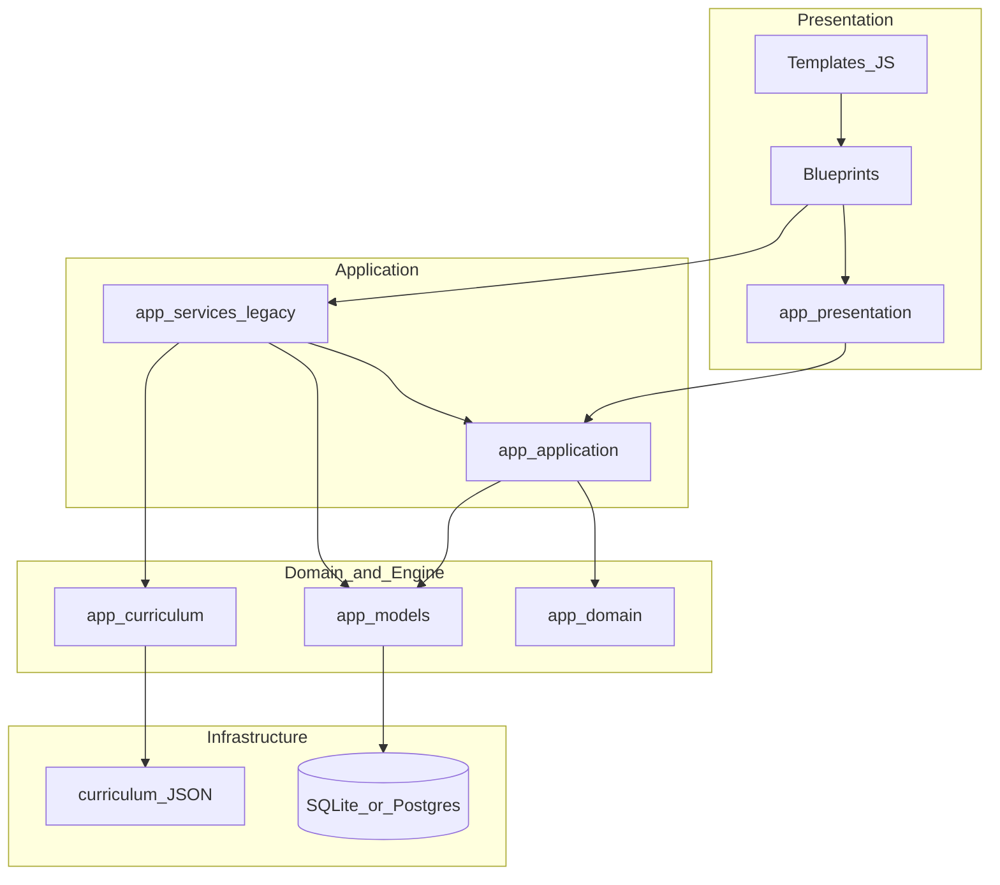

# Kwalitec — Chief Architect Briefing (Claude)

**Audience:** Claude as chief architect (zero prior product knowledge)  
**Implementation partner:** Cursor / Composer as project implementation engineer  
**As of:** 2026-08-24  
**Authority of this file:** Orientation only. It does **not** outrank Vision, Governance, Educational Constitution, Architecture Constitution, or living release trackers. When this briefing conflicts with a higher document, **stop**, cite the higher authority, and recommend amending the higher doc first.

**Staleness rule**

| Need | Prefer |
|------|--------|
| Deploy / version truth | `knowledge/evidence/releases/` + git tags + `VERSION` / `app/version.py` |
| Version 1 gate posture | `knowledge/VERSION_1_READINESS.md` + P-002.1 evidence packages |
| Educational Framework law | `EF001_EDUCATIONAL_FRAMEWORK_FREEZE.md` + Educational Constitution |
| Product “why” | `knowledge/product/vision/PRODUCT_VISION_2030.md` |

Several board trackers are dated **2026-07-26–28**. Post-August engineering (REL-001 Early Access, RO educational volume waves, EF-001 freeze) may not yet be fully reflected in every board. Prefer release evidence over stale prose for what is **live**.

**No secrets in this file.** Do not invent or request cohort PII, passwords, or `.env` values.

---

## 1. Role and operating contract

### 1.1 Division of labour

| Role | Owner | Owns |
|------|--------|------|
| **Chief architect** | Claude | Strategy fit to Vision/Governance; programme and milestone design; ADRs and structural decisions; reviews of plans/PRs against invariants; clear implementation briefs; gate/freeze compliance; completion-report structure when programmes require it |
| **Implementation engineer** | Cursor (Composer) | Code, tests, local commands, migrations when scoped, commits **only when the human asks**, applying Cursor rules under `.cursor/rules/` |

Claude does **not** need to write application code by default. Prefer briefs Cursor can execute literally. When Claude reviews diffs, check layering, curriculum V1/V2, EF-001, and student-facing intelligence gates—not style nits already covered by ruff.

### 1.2 Handoff format (Claude → Cursor)

Every non-trivial brief should include:

1. **Goal** — one paragraph; student or operator outcome.
2. **Non-goals** — explicit exclusions (especially “do not redesign Educational Framework”).
3. **Touch list** — packages/files Cursor may change; files Cursor must not touch.
4. **Invariants** — which of §6 apply; curriculum V1/V2 if relevant.
5. **Acceptance** — tests/commands, manual checks, docs/report artefacts.
6. **Migration / curriculum impact** — Alembic? JSON syllabus? Both formats still load?
7. **Programme notes** — EF-001 review if educational; estimated ΔKSI/ΔCRI if EP/P; explainability / recommendation checklists if student-facing intelligence.
8. **Commit** — only if the human/milestone mandates a message (use verbatim when mandated).

### 1.3 What Claude must not authorize

- New Educational Framework design programmes (EA / EO / TV / EJ / EW law) without EF-001 §2 unfreeze evidence.
- Declaring Version 1 **production-ready**, creating premature `v1.0.0` / `cri-*` tags, or green-lighting **public registration / marketing launch**.
- Putting external LLMs / black-box AI into core planning, readiness, or recommendation paths.
- Breaking V1 flat curriculum load/traversal for the sake of V2-only convenience.
- Lowering frozen educational quality exits (MG/LE/SS/TP, EJ hard rules, Trust criteria) to raise throughput.
- Claiming educational effectiveness, pass rates, or “Exam Ready” marketing without the governing evidence gates.

### 1.4 Final Test (always)

From Vision 2030: **Does this help students become better professionals?**  
Daily product expression: help the student take the **highest-value next action**.

---

## 2. What Kwalitec is

Kwalitec is a **commercial adaptive learning product** for demanding professional examinations (actuarial first: IFoA, SOA, and similar; other professions later).

**Thesis:** *Reduce decisions. Increase learning.*

Students preparing for multi-month syllabuses struggle less with content availability than with the daily question of **what to study next**. Kwalitec answers that deterministically from:

- official syllabus structure,
- the learner’s evidence (attempts, mastery, mistakes, time),
- available study time and exam deadline.

Kwalitec is **not**:

- a generic calendar planner,
- a gamified question bank,
- a black-box AI tutor,
- a pass-rate guarantee product.

Core recommendations are **explainable and reproducible**. Same inputs → same outputs in planning, readiness, and recommendation cores. There are **no external LLM APIs** in those cores.

### 2.1 Primary capabilities (product language)

| Capability | Role |
|---|---|
| Curriculum Intelligence | Official syllabuses as source of truth (JSON → engine → DB) |
| Study Plan Wizard | Exam-date-driven plans across available days |
| Daily Mission / Session | Prioritized study session from urgency, readiness, workload |
| Adaptive Learning | Mastery / spaced signals from real attempts |
| Exam Readiness | Coverage, pace, risk signals (deterministic) |
| Recommendations | Explainable “study next” (Decision Journal audits accept/dismiss) |
| Coach (supporting) | Presentation / trust surface — **not** ranking authority |
| Founder Command Centre | Operator / founder surfaces at `/founder` |

### 2.2 Users and access

| Audience | Role today |
|---|---|
| Students (professional exam candidates) | Primary; invite-only Early Access |
| Training providers / employers | Secondary; not the current access model |
| Founder / admin | CLI / startup admin; Founder OS |

**Registration is not public.** Accounts are created via controlled admin/bootstrap paths (`flask create-admin`, production `StartupService` from env, or explicit admin flows). Login view: `auth.login`.

Production host (Early Access): https://kwalitec.onrender.com

---

## 3. Vision and document hierarchy

Authority flows **downward**. Lower documents must not contradict higher ones.

| Rank | Document | Path | Owns |
|---:|---|---|---|
| 1 | Product Vision 2030 | `knowledge/product/vision/PRODUCT_VISION_2030.md` | Why; north star; never-build; Final Test |
| 2 | Product Blueprint | `PRODUCT_BLUEPRINT.md` (root only) | Strategy; audiences; model; promise |
| 2a | KSI (Product Success) | `knowledge/product/p001_1_ksi_baseline/PRODUCT_SUCCESS_FRAMEWORK.md` | Educational usefulness; V1 bar **KSI ≥ 80** |
| 2b | Explainability Standard | `knowledge/product/p001_2_explainability_standard/` | Student-facing intelligence speech; K8 gate |
| 2c | Recommendation Quality | `knowledge/product/p001_3_recommendation_quality_standard/` | Recommendation selection/priority; K2 gate |
| 2d | Version 1 Release Framework | `knowledge/product/p002_1_version_1_release_framework/` | Gates **G1–G12**; evidence; go/no-go |
| 2e | Version 1 Release Dossier | `knowledge/product/p003_1_version1_release_dossier/` | Board synthesis (**does not** declare V1) |
| 2f | Commercial Readiness (CRI) | `knowledge/product/cq001_commercial_readiness/` | CR1–CR9 commercial quality index |
| 3 | Educational Constitution | `knowledge/educational/KWALITEC_EDUCATIONAL_CONSTITUTION.md` | Educational law / truth |
| 4 | Educational Validation (EVF) | `knowledge/educational_validation/` | Whether quality is sufficient to release |
| 5 | Architecture | `docs/ARCHITECTURE_CONSTITUTION.md`, `docs/architecture/SYSTEM_ARCHITECTURE.md`, `ARCHITECTURE.md` | Structural law; one runtime |
| 6 | ADRs | `docs/adr/` | Accepted decisions |
| 7 | Engineering / Quality | `knowledge/ENGINEERING_STANDARDS.md`, `knowledge/QUALITY_MANUAL.md` | How we build and verify |
| 8 | PRDs | `knowledge/prd/` | Feature proposals |
| 9 | Release playbooks | `knowledge/RELEASE_PLAYBOOK.md`, `docs/process/RELEASE_PROTOCOL.md` | How we ship |
| 10 | Version 1 Readiness tracker | `knowledge/VERSION_1_READINESS.md` | Living statuses (must reflect P-002.1 evidence) |

**Also frozen as Version 1 Educational Law (EF-001):** Excellence (EA-001…EA-008), Operations (EO-001), Trust (TV-001), Justification (EJ-001), Editorial Workspace (EW-001). See §4.3.

Canonical governance text: `knowledge/GOVERNANCE.md`.

---

## 4. Current state (2026-08-24)

### 4.1 One-page posture

| Topic | Snapshot |
|---|---|
| **Live product** | Early Access **`2.0.0-beta.1`**, git tag **`rel-001`** (REL-001, 2026-08-04), host https://kwalitec.onrender.com |
| **Version 1 production-ready declaration** | **NO GO** |
| **Validated KSI** | **64** (bar ≥ **80**); Gate **G1 FAIL** (G1.1 KSI; G1.9 educational effectiveness) |
| **KSI categories (validated)** | K1 72 · K2 68 · K3 65 · K7 60 · K8 72 (G1.5 PASS) |
| **CRI** | Engineering **53% provisional**; Founder Validated **0%** (0 sessions); no `cri-*` tag |
| **EF-001 Educational Framework** | **FROZEN** since **2026-08-01** — operational stewardship |
| **Canonical runtime** | Education OS sole runtime: `/student`, `/session` (`KWALITEC_V2_SOLE_RUNTIME=1`); legacy shells redirect |
| **Educational volume** | CS1 inventory waves LIVE through **RO-015** (Wave 15; 130 approved packages asserted); volume production is top post-freeze priority |
| **Private Beta** | Stage 0 **GO**; Stage 1 **GO under C2** (analytics OFF) in rollout law; welcome + invite pack **ready**; **external N = 0** (invites not yet executed as a measured cohort) |
| **Founder Validation** | FV-001 instrumentation live; **0** dogfood sessions logged → Validated CRI still open at 0% |
| **Public launch** | **Forbidden** — no public registration, pricing, or marketing launch |

### 4.2 Critical distinctions (do not conflate)

| Concept A | Concept B | Rule |
|---|---|---|
| **Educational Framework freeze (EF-001)** | **Version 1 production-ready** | Freeze means law is complete for ops; it does **not** satisfy G1–G12 or KSI ≥ 80 |
| **REL-001 Early Access deploy** | **Version 1 declaration** | Operational beta on Render ≠ production-ready claim |
| **`p003_1`…`p003_8`** | **`p003_private_beta_welcome`** | Governance dossier / board programmes vs Founding Cohort welcome pack (PDF/HTML/email) |
| **Stage A services** | **Twin / Epic 2 domain packages** | Domain packages exist; **live student UX still primarily consumes Stage A** until an explicit Twin-first cutover |
| **Estimated ΔKSI** | **Validated KSI** | Estimates do **not** satisfy Gate G1 |

### 4.3 EF-001 — what architects prioritize

Effective **2026-08-01**. Engineering priority stack:

1. **Educational Volume production**
2. **Founder study** on the released product
3. **Private Beta preparation / execution**
4. **Evidence-driven** content and execution improvements
5. **Author tooling** that does not lower frozen quality exits

Before proposing any educational “fix,” complete `EF001_OPERATIONAL_REVIEW_TEMPLATE.md` (observation → classification EC/AW/RB/PI/EF → severity → evidence → smallest intervention → EF-001 check). Classification **EF** (framework deficiency) is exceptional.

### 4.4 Version 1 gates (summary)

Full law: `knowledge/product/p002_1_version_1_release_framework/VERSION_1_RELEASE_FRAMEWORK.md`.

- Any hard-gate **FAIL** → overall **NO GO**.
- Board dossier recommendation: **NO GO** (`knowledge/product/p003_1_version1_release_dossier/`).
- Current blockers include **G1.1** (KSI 64 &lt; 80), **G1.9** (effectiveness NO-GO; N_external = 0), incomplete evidence package for full G2–G12 claim class, G7 performance HOLD for high-traffic claims.

KSI improvement roadmap: `knowledge/product/p004_1_ksi_gap_analysis/ROADMAP.md`.

### 4.5 Private Beta / welcome materials

| Path | Role |
|---|---|
| `knowledge/product/ep004_private_beta/ROLLOUT.md` | Stage map; Stage 1 GO under **C2** |
| `knowledge/product/ep004_private_beta/GO_NO_GO_DECISION.md` | GO WITH CONDITIONS |
| `knowledge/product/private_beta/STAGE1_INVITE_PACK.md` | READY TO SEND (no PII in git) |
| `knowledge/product/p003_private_beta_welcome/` | Welcome PDF/HTML + accompanying email |
| `knowledge/product/op001_critical_evidence_closure/` | Critical evidence CE-01…CE-05 closure track |

**Forbidden claims while N_external = 0 and effectiveness gates open:** educationally effective; Version 1 production-ready; Pilot analytics ON (Stage 1 is C2 — analytics OFF).

### 4.6 Note on older “RC2 / 1.0.0” wording

`PROJECT_CONTEXT.md` still describes an Internal Alpha **RC2 / 1.0.0** fingerprint in places. **Live Early Access identity** after REL-001 is **`2.0.0-beta.1`** / tag `rel-001`. Treat release evidence + `app/version.py` / `VERSION` as deploy identity; treat Version 1 **declaration** as still NO GO regardless of marketing version string.

---

## 5. Architecture map

Canonical structural docs: `ARCHITECTURE.md`, `docs/ARCHITECTURE_CONSTITUTION.md`, `docs/architecture/SYSTEM_ARCHITECTURE.md`, `PROJECT_CONTEXT.md`.

### 5.1 Tech stack

| Layer | Choice |
|---|---|
| Language | Python 3.11+ |
| Web | Flask 3.1 (application factory only) |
| ORM | Flask-SQLAlchemy 3.1 |
| Migrations | Flask-Migrate / Alembic (`migrations/versions/`) |
| Auth | Flask-Login (invite-only) |
| Forms / CSRF | Flask-WTF + WTForms (CSRF on outside tests) |
| Templates | Jinja2 + Bootstrap 5.3 + `app/static/` |
| Local DB | SQLite (`instance/`) |
| Production DB | PostgreSQL (`DATABASE_URL`, `psycopg`) |
| WSGI | Waitress on Render (`wsgi.py`) |
| Deploy | `render.yaml` + `docs/production/` |
| Tests / lint | pytest + ruff; CI on Python 3.11–3.13 |

### 5.2 Layering



**Allowed dependency direction:** Templates/JS → Blueprints → Services / Application → Models + Curriculum Engine → DB/JSON.

- Routes: HTTP only — **no** planning/mastery/recommendation math.
- Services / application: business rules; **no** `flask.request` / session globals — take explicit args.
- Models: no blueprints/templates.
- Syllabus truth starts in `app/curriculum/data/` JSON + engine; DB is imported projection.

### 5.3 Code layout (mental model)

| Path | Role |
|---|---|
| `app/__init__.py` | `create_app()` — sole construction path |
| `app/services/startup_service.py` | Idempotent production migrate / admin / curriculum import |
| `app/presentation/student/` | Canonical Education OS (`/student`) |
| `app/presentation/session/` | Canonical Session Experience (`/session`) |
| `app/presentation/consolidation.py` | Sole-runtime redirects |
| `app/services/` | Stage A business logic (plans, missions, readiness, recommendations, curriculum traversal, …) |
| `app/application/` | Bounded contexts (student experience, twin, tutor, CIP, missions, …) |
| `app/domain/` | Domain packages for Epic 2 stack |
| `app/curriculum/` | In-memory engine (dataclasses ≠ ORM) |
| `app/models/` | SQLAlchemy ORM |
| `app/auth/` | Login / logout only |
| `app/study_plan/` | Wizard + plan list (shared workflow) |
| `app/dashboard/`, `app/mission/`, `app/analytics/` | **Legacy** — redirect under sole runtime; do not extend for new educational UX |
| `app/founder/` | Founder Command Centre |
| `tests/` | pytest suite |
| `knowledge/` | Permanent product/educational/release knowledge base |
| `.cursor/rules/` | Enforceable agent rules for Cursor |

### 5.4 Canonical student surfaces

| Surface | Endpoint area | Purpose |
|---|---|---|
| Home | `student.home` | Dashboard, Coach panel, today’s mission entry |
| Journey | `student.journey` | Progress / planning view |
| Revision | `student.revision` | Revision workspace |
| History | `student.history` | Past sessions / analytics history |
| Profile | `student.profile` | Student settings |
| Session | `/session/*` | Active study session |
| Study plan wizard | `/study-plan` | Exam selection → date → availability → baseline |

Coach is a **supporting** intelligence surface. Recommendation ranking authority remains deterministic recommendation services / Runtime A contracts — do not invent a separate opaque coach brain.

### 5.5 Curriculum V1 and V2 (hard constraint)

Both formats must remain loadable and traversable.

| | V1 (flat) | V2 (hierarchical) |
|---|---|---|
| Structure | Flat topics | Section → Topic → Learning Objective |
| Weights | Topic `syllabus_weight` | Section `exam_weight` |
| DB | No sections; `Topic.section_id` NULL | `Section` rows; `section_id` set |

**Canonical APIs only:**

- Engine: `CurriculumRepository.load_auto()` / `CurriculumEngineService.load_auto()`; flatten via `get_topics_flat()`.
- DB traversal: `CurriculumService.get_sections()`, `get_topics_for_section()`, `get_all_topics_ordered()`, `get_ordered_topics()`.

Never reimplement V1→V2 try/fallback or ordering in routes or planning math. Engine dataclasses are **not** ORM models. Rule file: `.cursor/rules/08-curriculum-v2.mdc`.

### 5.6 Bootstrap and deploy

`create_app()` → extensions → blueprints → health → **`StartupService.run(app)`**.

StartupService (production): Alembic upgrade if behind; create admin only if zero users (from `ADMIN_EMAIL` / `ADMIN_PASSWORD`); idempotent curriculum import. **Never** drops tables; never raises in a way that prevents app start; skips during `flask db *`.

Render: `releaseCommand: flask db upgrade` plus StartupService belt-and-braces. Details: `docs/production/DEPLOYMENT.md`, `ENVIRONMENT.md`, `RUNBOOK.md`.

### 5.7 Stage A vs Twin / Epic 2

Architecture Consolidation is **COMPLETE**: one Educational State / Education OS runtime.

Epic 2 packages (CIP, Student Digital Twin, Reasoning, Learning Graph, Adaptive Mission, Assessment, Tutor, …) live under `app/domain/` and `app/application/`. **Until an explicit cutover milestone**, assume live student paths still primarily depend on Stage A services (`RecommendationService`, `ReadinessService`, `MissionService` / optimizer, `PlanningService`, `StudyPlanService`, explainability services). Do not redesign Runtime A as “framework work.”

---

## 6. Hard invariants (architect review checklist)

1. **Single factory** — only `create_app()`; preserve StartupService safety (idempotent, no drops).
2. **Layering** — no business math in routes; no Flask request/session in services.
3. **Curriculum traversal** — only canonical CurriculumService / engine helpers.
4. **V1 + V2 coexistence** — both loadable; no global hard requirement for sections.
5. **Deterministic cores** — planning / readiness / recommendations reproducible; **no LLM** in those cores.
6. **Invite-only auth** — no public registration; safe local `next` after login; scope personal data to `current_user`.
7. **Schema via Alembic** — no `db.create_all()` in production paths; no ad-hoc DDL in request handlers.
8. **Secrets in env** — never commit `.env`, credentials, or default production `SECRET_KEY`.
9. **Sole runtime UX** — new educational UI on `student/` + `session/` templates, not legacy Contained shells.
10. **EF-001** — no new Educational Framework design without §2 conditions; operational review before educational interventions.
11. **Student-facing intelligence claims** — Explainability checklist for K8; Recommendation Quality checklist for K2 (`knowledge/GOVERNANCE.md` §4.2 / §4.3).
12. **One Educational State** — do not invent parallel educational architectures or competing runtimes.

---

## 7. How work gets done

### 7.1 Git and PRs

- Integrate on `main`. Prefer `milestone/<id>-<slug>`, `feature/<slug>`, `fix/<slug>`, `chore/<slug>`.
- Conventional Commits when natural (`feat:`, `fix:`, `docs:`, …); milestone briefs may mandate an exact message — use it verbatim.
- Never force-push `main`; never commit secrets; do not use `--no-verify` unless the human explicitly requests it.
- **Commit only when the human or milestone asks.**
- Docs-only milestones: stage **only** docs/rules/prompts — leave unrelated app WIP unstaged.
- PRs: summary, test plan, migration impact, curriculum/architecture notes when relevant. CI must be green (pytest + ruff) unless an exception is documented.

Full guide: `CONTRIBUTING.md`. Cursor git rules: `.cursor/rules/06-git.mdc`.

### 7.2 Tests and quality

```bash
python -m pytest tests/ -v
ruff check app/ tests/
```

Curriculum changes need **V1 regression** and **V2/section-aware** coverage where applicable. CI also runs educational-intelligence certification and dependency audit.

### 7.3 Completion reporting

When a milestone/programme requires a completion report, include all sections in `.cursor/rules/07-reporting.mdc`:

Summary · Files Created · Files Modified · Tests Executed · Migration Impact · Architecture Compliance · Technical Debt · Known Limitations

**EP / P programmes also require:** Student Impact Assessment · Estimated KSI contribution · Evidence collected · Lessons learned · Explainability / Recommendation reviews when in scope · Version 1 readiness residual when claiming V1 progress.

**Version 1 programmes also require:** CRI domains improved · Estimated CRI delta · Evidence · Remaining blockers · Provisional vs validated.

### 7.4 Educational observations

Use `EF001_OPERATIONAL_REVIEW_TEMPLATE.md` before proposing solutions. Prefer content, execution, volume, reachability, or tooling fixes over framework redesign.

### 7.5 Feature proposals

PRDs under `knowledge/prd/`. Student-facing intelligence must respect Explainability and Recommendation Quality standards. Architecture changes prefer additive shims over breaking rewrites.

---

## 8. Canonical deep-dive read order

After this briefing:

1. `PROJECT_CONTEXT.md` — developer/agent orientation, inventory
2. `ARCHITECTURE.md` — layers, services, Epic 2 packages
3. `knowledge/GOVERNANCE.md` — hierarchy and decision rules
4. `knowledge/product/vision/PRODUCT_VISION_2030.md` — why
5. `PRODUCT_BLUEPRINT.md` — strategy and model
6. `knowledge/educational/KWALITEC_EDUCATIONAL_CONSTITUTION.md` — educational law
7. `EF001_EDUCATIONAL_FRAMEWORK_FREEZE.md` + `EF001_OPERATIONAL_REVIEW_TEMPLATE.md`
8. `knowledge/VERSION_1_READINESS.md` + `knowledge/product/p003_1_version1_release_dossier/` + `knowledge/product/p003_8_version1_exit_criteria/CURRENT_RELEASE_POSITION.md`
9. Private beta: `knowledge/product/ep004_private_beta/ROLLOUT.md`, `knowledge/product/p003_private_beta_welcome/`, `knowledge/product/private_beta/STAGE1_INVITE_PACK.md`
10. Live evidence: `knowledge/evidence/releases/REL001/`, `knowledge/evidence/releases/RO015/`
11. Cursor enforcement: `.cursor/rules/00-engineering.mdc`, `01-architecture.mdc`, `08-curriculum-v2.mdc`, `10-security.mdc`, `11-educational-framework-freeze.mdc`, `07-reporting.mdc`
12. Deploy: `docs/production/DEPLOYMENT.md`, `render.yaml`

Master knowledge index: `knowledge/README.md`. Product programme index: `knowledge/product/README.md`.

---

## 9. Glossary

| Term | Meaning |
|---|---|
| **KSI** | Kwalitec Success Index (K1–K8 educational usefulness). V1 product-success bar = validated **≥ 80**. |
| **CRI** | Commercial Readiness Index (CR1–CR9). Living board under CQ-001. |
| **EF-001** | Educational Framework Freeze — EA/EO/TV/EJ/EW are Version 1 Educational Law. |
| **Education OS / EOS** | Canonical student runtime (`/student`, `/session`). |
| **Sole runtime** | Feature posture where legacy Contained shells redirect; V2 sole flag on. |
| **Stage A** | Live deterministic services path (plans, missions, readiness, recommendations). |
| **Twin / Epic 2** | Domain/application packages for Digital Twin–era intelligence; not yet sole live authority. |
| **G1–G12** | Version 1 Release Framework gates for production-ready declaration. |
| **MES** | Message / explainability surface quality (feeds K8). |
| **Decision Journal** | Audit of accepted/dismissed recommendations. |
| **Founding Cohort** | Invite-only Private Beta participants. |
| **REL-001** | Early Access baseline release evidence (`2.0.0-beta.1`, tag `rel-001`). |
| **RO-NNN** | Release Operations waves for educational inventory LIVE activation. |
| **CMP** | Curriculum / mastery / practice learning loop language used in educational law (help students use the CMP well). |
| **EVF** | Educational Validation Framework — release gate for educational quality. |
| **C2** | Stage 1 measurement condition: analytics **OFF**; manual/exploratory measurement. |

---

## 10. Anti-patterns and common mistakes

| Mistake | Correct posture |
|---|---|
| Redesign Excellence/Operations/Trust because “we can do better” | Produce volume; fix content/execution; EF-001 operational review |
| Declare V1 ready from estimated KSI, framework freeze, or REL-001 | Need validated KSI ≥ 80 + G1–G12 evidence package + signed go |
| Extend `dashboard/` / `mission/` / `analytics/` for new learning UX | Build on `presentation/student/` and `session/` |
| Treat engine dataclasses as ORM models | Convert explicitly on import; keep engine in-memory |
| Add public signup “for growth” | Invite-only until commercial gates and Founder/Board allow |
| Put LLM in recommendation core “for smarter coach” | Keep deterministic core; LLM only if ever allowed outside cores by explicit law |
| Duplicate topic ordering in a new service | Call `CurriculumService` helpers |
| Confuse `p003_*` dossier folders with `p003_private_beta_welcome` | Check which P-003 namespace you mean |
| Lower quality gates to ship more packages | Forbidden under EF-001 |
| Claim effectiveness with N_external = 0 | Effectiveness remains NO-GO / PENDING EVIDENCE |

---

## 11. Security posture (architect-level)

- Flask-Login; `@login_required` on authenticated views; login view `auth.login`.
- No public registration; admin via CLI or production StartupService.
- Reject open redirects on `next`.
- Scope personal resources to current user; 403/404 without leaking foreign resources.
- Prefer WTForms; CSRF enabled outside tests; preserve security headers/CSP behaviour in `create_app`.
- ORM / bound parameters only — never concatenate SQL.
- Secrets in environment; production rejects insecure default `SECRET_KEY`.
- Treat new third-party script CDNs / network calls as CSP-sensitive.

Rules: `.cursor/rules/10-security.mdc`, `docs/ga/SECURITY_REVIEW.md`.

---

## 12. Collaboration tips for Claude

1. Start every architectural answer by locating it on the **hierarchy** (Vision vs EF-001 vs V1 gates vs engineering).
2. Prefer **smallest effective intervention** consistent with EF-001 and sole runtime.
3. When unsure of live state, cite the **evidence path** you would verify rather than inventing board numbers.
4. Hand Cursor briefs that are **scoped and testable**; leave style and local execution to Cursor rules.
5. For student-facing intelligence changes, require explainability / recommendation review artefacts before claiming K8/K2 movement.
6. Never paste secrets, invitee emails, or production credentials into plans or commits.
7. If the Founder / human overrides a freeze or gate, require that override to be **written as evidence** in the governing programme folder — do not silently normalize exceptions.

---

## 13. Quick pointer index

| Concern | Start here |
|---|---|
| This briefing | `CLAUDE.md` (this file) |
| General agent orientation | `PROJECT_CONTEXT.md` |
| Structure | `ARCHITECTURE.md` |
| Governance | `knowledge/GOVERNANCE.md` |
| Vision | `knowledge/product/vision/PRODUCT_VISION_2030.md` |
| V1 readiness | `knowledge/VERSION_1_READINESS.md` |
| EF freeze | `EF001_EDUCATIONAL_FRAMEWORK_FREEZE.md` |
| KSI law | `knowledge/product/p001_1_ksi_baseline/PRODUCT_SUCCESS_FRAMEWORK.md` |
| CRI board | `knowledge/product/cq001_commercial_readiness/COMMERCIAL_READINESS_BOARD.md` |
| Live Early Access evidence | `knowledge/evidence/releases/REL001/` |
| Latest CS1 volume wave (as of briefing) | `knowledge/evidence/releases/RO015/` |
| Welcome pack | `knowledge/product/p003_private_beta_welcome/` |
| Contributing | `CONTRIBUTING.md` |
| Cursor rules | `.cursor/rules/` |

---

*End of chief architect briefing. Re-verify living trackers and `knowledge/evidence/releases/` when making go/no-go or claim-class decisions.*
