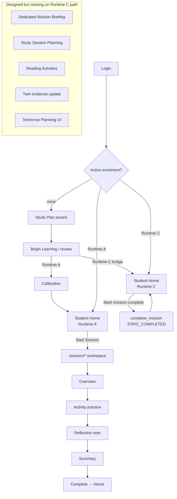

# SLJ-001 — Student Learning Journey Reconstruction Audit

**Programme:** SLJ-001 · Student Learning Journey Reconstruction Audit  
**Date:** 2026-07-30  
**Nature:** Architectural product audit (evidence only)  
**Predecessor:** MISSION-001 (Student Mission Engine & Presentation Audit)  
**Constraint:** No implementation, no fixes, no redesign — evidence and gap analysis only

---

## Executive Summary

Kwalitec was designed as a **guided educational operating system**: enrol, receive a coherent Mission brief, **start a Study Session**, work through structured Read → Practice → Reflect activities, capture evidence into the Student Digital Twin, complete the Mission, update progress, and return tomorrow with a clear next step.

What the product currently delivers for the **primary production path** (Runtime C / published curriculum, post–RCV-002) is a **much thinner loop**:

```
Enrol → Begin Learning → Home Mission Card → Mark mission complete → Progress → Return tomorrow
```

That loop matches the **PR-001B pilot write-back model** (study offline, then confirm). It does **not** match the Product Blueprint, LXP-002 Study Session Experience, EP-007.1 canonical `/session/*` journey, Mission Philosophy, Student Home Architecture (execution belongs in Study Session), or Digital Twin Philosophy (evidence before inference).

A fuller Study Session path **does exist** under Runtime A (`/session/*`), but it is:

1. **Not entered** from Runtime C Home (`can_start_session=False`; CTA = “Mark mission complete”).
2. **Not educationally substantive** when entered — default activities use placeholder topic “Core methods”, three generic free-text prompts, and presentation-only reading progress.
3. **Not the Dual Twin / Evidence Authority path** students need for intelligent adaptation on the published-curriculum track.

**Verdict:** The implemented Student Runtime is **technically able to enrol, generate a mission, and advance syllabus coverage**, but it does **not** faithfully implement the approved Student Learning Journey. The largest student-experience gaps are the missing in-product Study Session on the production path, incomplete learning guidance, weak practice→reflection linkage, insufficient Twin evidence, and product-consistency failures (including MISSION-001 node-ID / dual-topic presentation defects).

---

## Product Vision

### What product did we design?

Authoritative sources (design documents are law for this audit; code is not):

| Authority | Path |
|---|---|
| Product Blueprint | `PRODUCT_BLUEPRINT.md` |
| Educational Constitution | `knowledge/educational/KWALITEC_EDUCATIONAL_CONSTITUTION.md` |
| Educational Governance Constitution | `knowledge/governance/EDUCATIONAL_GOVERNANCE_CONSTITUTION.md` |
| Digital Twin Philosophy | `knowledge/version2/DIGITAL_TWIN_PHILOSOPHY.md` |
| Digital Twin Lifecycle | `knowledge/architecture/DIGITAL_TWIN_LIFECYCLE.md` |
| Study Session Experience | `knowledge/product/LXP-002_STUDY_SESSION_EXPERIENCE.md` |
| Mission Philosophy / Lifecycle | `knowledge/product/ILE-004/MISSION_PHILOSOPHY.md`, `MISSION_LIFECYCLE.md` |
| Student Home Architecture | `knowledge/design/dx005a_student_home/STUDENT_HOME_ARCHITECTURE.md` |
| Mission Model (Home) | `knowledge/design/dx005a_student_home/MISSION_MODEL.md` |
| Journey Consolidation | `knowledge/product/ep007_1_student_journey_consolidation/` |
| Unified Student Journey | `knowledge/architecture/UNIFIED_STUDENT_JOURNEY_ARCHITECTURE.md` |
| Reflection Architecture | `knowledge/governance/REFLECTION_ARCHITECTURE.md` |
| Planning Blueprint | `knowledge/educational/planning_blueprint/` |
| Assessment journey grammar | `knowledge/product/ILE-001/STUDENT_JOURNEYS.md` |

**Note on “Learning Constitution”:** No document with that exact title exists. The educational-law authority is `KWALITEC_EDUCATIONAL_CONSTITUTION.md` (EGI-001).

### Designed daily answers (north star)

From `PRODUCT_BLUEPRINT.md` and the Educational Constitution, every day the student should know:

1. What to study  
2. Why it matters  
3. Whether they understand it  
4. What they should do next  

Constitutional promise: *“Reduce decisions. Increase learning.”*

### Designed end-to-end Student Learning Journey

Composite of Blueprint + LXP-002 + EP-007.1 + Mission Philosophy + Twin Lifecycle (the **intended product**, not the pilot subset):

```
Student enrols
  → Begin Learning
  → Mission Briefing (Home L0: What / Why now / After completion)
  → Study Session Planning (objectives, duration, recommended activities)
  → Start Study Session
  → Guided Study Workspace
       → Reading Activities
       → Practice Activities
  → Reflection (session close; Decision Journal when memory-grade)
  → Knowledge Capture (Evidence Before Completion)
  → Student Digital Twin Update (after evidence succeeds)
  → Mission Completion
  → Progress Update
  → Tomorrow Planning (next Mission composition)
  → Dashboard Refresh (Student Home)
```

### Designed educational philosophy (binding constraints)

| Principle | Source |
|---|---|
| Outcomes over engagement | Product Blueprint §Operating principles |
| Evidence before opinion / assumption | Blueprint; Digital Twin Philosophy |
| Study ≠ understanding | Educational Constitution Art. II |
| One Educational State; One Runtime | Product Blueprint |
| Execution belongs in Study Session | Student Home Architecture §2 |
| One day · One primary mission · One educational reason | Mission Philosophy |
| Twin observes; it does not teach | Digital Twin Philosophy |
| Completing a Study Session means planned learning **occurred**, not mastery | LXP-002 |

### Designed tensions (documented, not resolved by this audit)

Design itself documents **coexisting** paths:

| Path | Intent | Session model |
|---|---|---|
| **LXP-002 / EP-007.1** | Canonical guided Study Session | Start → Overview → Activity → Reflection → Complete |
| **PR-001B Runtime C pilot** | First certified published-curriculum loop | Study **offline** → **Mark mission complete** (explicitly no Guided Session) |
| **Unified Journey** (`ENABLE_UNIFIED_JOURNEY`) | Optional day chrome | Guided session phases + optional non-persisted reflection |

**SLJ-001 treats the Product Blueprint + LXP-002 + Mission Philosophy + Twin Philosophy + Student Home as the product vision.** PR-001B is an intentional pilot subset that **diverges** from that vision and must not be mistaken for full product alignment.

---

## Implemented Journey

### What product did we actually build?

Two parallel student runtimes coexist. Under sole-runtime posture, entry is `/student/` (Student Home). Legacy `/dashboard/` and `/missions/` redirect away.

#### Path A — Runtime C (published curriculum / production Begin Learning)

```
Login
  → Study Plan wizard (Published Curriculum)
  → Begin Learning (review → FounderStudentEnrolmentBridge)
  → Student Home
       → Educational mission panel (title, why, duration, context)
       → Primary CTA: “Mark mission complete”
       → POST /student/mission/complete
  → TOPIC_COMPLETED events → progress advances
  → Home day-complete / return tomorrow
```

**No** `/session/*` entry from Home. Evidence: `educational_view_models.py` sets `can_start_session=False`, `session_control="complete_runtime_c"`.

#### Path B — Runtime A + Session Experience

```
Login
  → Wizard → Calibration (Twin birth) → Home
  → Start Session (POST /student/session/start)
  → /session/<id>/overview → activity → reflection → summary → complete
  → Home
```

Session content defaults to generic “Core methods” activities when engines do not supply syllabus-bound work (`app/infrastructure/session/defaults.py`).

### Implemented flow diagram



### Stage existence matrix (audit objective journey)

| Stage | Status | Evidence |
|---|---|---|
| Student enrols | **EXISTS** | `/study-plan/wizard/*`, bridge enrol |
| Begin Learning | **EXISTS** | `/study-plan/review` |
| Mission Briefing | **PARTIAL** | Embedded on Home only; no dedicated briefing; MISSION-001 presentation defects |
| Study Session Planning | **PARTIAL** | Session Overview (Runtime A); Home card only (Runtime C); planner not HTTP-wired |
| Start Study Session | **PARTIAL** | EXISTS Runtime A; **MISSING** as primary Runtime C CTA |
| Guided Study Workspace | **EXISTS** | `/session/*` — not reached from Runtime C Home |
| Reading Activities | **PARTIAL** | Prose + progress bar; no structured reader |
| Practice Activities | **EXISTS** | Session free-text Q&A (Runtime A path) |
| Reflection | **PARTIAL** | Session reflection note path; skipped on Runtime C complete |
| Knowledge Capture | **PARTIAL** | VP-001 hooks when SCI exists; Runtime C writes progress events only |
| Student Digital Twin Update | **PARTIAL** | Runtime A evidence/learning loop; Runtime C complete has no Twin update |
| Mission Completion | **EXISTS** | Multiple authorities (Runtime C button / session complete) |
| Progress Update | **EXISTS** | Journey + event-sourced / TopicProgress |
| Tomorrow Planning | **PARTIAL** | Next-day mission regen + copy; no planner UI |
| Dashboard Refresh | **EXISTS** | Redirect/reload `student.home` |

---

## Journey Comparison

| Designed stage | Intended behaviour | Implemented behaviour | Divergence |
|---|---|---|---|
| Enrol | Lawful intake into curriculum | Wizard + Runtime C bridge or Runtime A plan | **Aligned** (dual authority) |
| Begin Learning | Confirm and enter Home | Review confirm | **Aligned** |
| Mission Briefing | Clear What / Why now / After; educational language | Home panel; node IDs; dual-topic why-now (MISSION-001) | **Major** |
| Session Planning | Objectives, activities, duration, checklist | Overview or Home card; defaults generic | **Major** |
| Start Session | Explicit Start Study Session | Runtime C: Mark complete only | **Critical** |
| Guided Workspace | Focused study environment | `/session/*` exists off production CTA | **Critical** (unwired) |
| Reading | Specific sections / objectives | Placeholder supporting text | **Major** |
| Practice | Specific questions with feedback | 3 generic free-text prompts | **Major** |
| Reflection | Deliberate educational practice | Optional note or skipped | **Major** |
| Knowledge Capture | Evidence Before Completion | Progress events ≠ understanding evidence | **Critical** |
| Twin Update | Evidence-triggered Twin refresh | Absent on Runtime C complete | **Critical** |
| Mission Complete | After session / evidence | Confirm-without-session on production path | **Major** (pilot vs vision) |
| Progress | Syllabus position advances | Coverage advances on complete | **Partial** (coverage without competence signal) |
| Tomorrow | Explicit next-day plan | Implicit regen + messaging | **Moderate** |
| Home refresh | One decision → one action into Session | One decision → Mark complete | **Major** |

---

## Learning Workflow Audit

### Structured guidance (designed)

LXP-002 and Blueprint components expect:

- Read specific topic / sections  
- Specific learning objectives  
- Practice specific questions  
- Reflection prompts  
- Expected outcomes  
- Session checklist  
- Evidence-based study order  

### Structured guidance (implemented)

| Guidance element | Runtime C Home | Runtime A `/session/*` |
|---|---|---|
| Topic identity | Present (often with `node-*` code) | Present or default “Core methods” |
| Learning objectives | Educational context panel | Overview objective string |
| Estimated duration | Present | Present |
| Recommended activities (Read / Examples / Practice / Review) | **Absent** as actionable checklist | Supporting material one-liner only |
| Session checklist | **Absent** | Progress % presentation only |
| Specific syllabus reading refs | **Absent** | **Absent** (no reader route) |
| Specific practice items | **Absent** | Generic free-text prompts |
| Reflection prompts | Mission copy only | Default generated prompts |
| Expected outcomes / Done when | Partial (PR-001B fields when projected) | Completion summary topics |
| Evidence-based study order | Contested (MISSION-001: EI LO-count vs syllabus order) | Mission-topic threaded when adapter supplies topic |

**Finding:** The runtime does **not** provide the designed structured learning guidance on the production path. The session path provides a **shell** of guidance with placeholder educational content.

---

## Study Session Audit

### Does an actual Study Session exist?

| Layer | Finding |
|---|---|
| **Product concept (LXP-002)** | Designed and documented as Start → Session screen → Finish → Yes/Partially/No review |
| **HTTP surface** | `/session/*` Overview → Activity → Reflection → Summary → Complete **exists** |
| **Domain runtime** | `LearningSessionRuntime` + policies exist in `app/application/learning_session/` — used by Mission Engine internals, **not** the primary student HTTP path |
| **Persistence** | No dedicated student Session ORM as first-class educational entity; Runtime A often keys session by Mission id; Session Experience uses in-memory / document store handles |
| **Production CTA** | Runtime C Home **does not start** a Study Session |

**Verdict:** A Study Session **capability** exists in architecture and in the Runtime A presentation path. A Study Session **product experience** does **not** exist for the published-curriculum student who completes Begin Learning today.

### Capability checklist

| Capability | Status | Notes |
|---|---|---|
| Start Session | **PARTIAL** | Runtime A yes; Runtime C no |
| Session timer | **PARTIAL** | Client elapsed display; no server enforcement; LXP-002 Pause/Resume not the sole-runtime primary UX |
| Session state | **EXISTS** | Surface state machine on `/session/*` |
| Resources | **PARTIAL** | Supporting material string; Quick Check embed on Overview only |
| Notes | **EXISTS** | Optional `reflection_note` |
| Objectives | **PARTIAL** | Strings present; not syllabus-section bound |
| Completion | **EXISTS** | Session complete + Runtime C mark-complete |

### Where Study Session should exist

Per Student Home Architecture and LXP-002 / EP-007.1:

```
Student Home (Mission Briefing L0)
  → Primary: Start / Resume Study Session
  → /session/<id>/… guided workspace
  → Complete → Home
```

Per current Runtime C implementation, that Primary is replaced by **Mark mission complete**, which is the PR-001B pilot model — not the designed product OS.

---

## Mission Lifecycle Audit

### Designed lifecycle (ILE-004)

```
Created → Presented → Accepted → Completed | Deferred
  → Journal → Timeline → Next mission
```

Mission brief should include: title, purpose, why today, evidence, effort, expected outcome, after-completion, reflection prompt, confidence, explanation.

### Implemented lifecycle

#### Runtime C (`RuntimeMissionInstance`)

```
Enrol → generate_daily_mission → status "generated" on Home
  → POST complete → TOPIC_COMPLETED → next load regenerates
```

| Phase | Status | Gap |
|---|---|---|
| Creation | **EXISTS** | Selection/explanation coherence broken (MISSION-001) |
| Briefing | **PARTIAL** | Home-embedded; technical IDs; why-now mismatch |
| Launch / Accept | **MISSING** as session start | “Accepted” = mark complete without study workspace |
| Execution | **MISSING** in-product | Offline study assumed |
| Completion | **EXISTS** | Confirm button |
| Review | **MISSING** | No Yes/Partially/No session review; no mission review surface |
| Archival | **PARTIAL** | History / Journey show progress; Mission Engine v2 archive not student HTTP |

#### Runtime A (SQL `Mission`)

```
generate_today_mission → Pending → start_session → In Progress
  → finish / practice outcome → Completed → TopicProgress
```

Closer to designed lifecycle, but legacy `/missions/*` is redirected under sole runtime; session path is the residual execution surface.

### Mission presentation defects (carried from MISSION-001)

1. Titles embed Educational Intelligence `node-*` IDs.  
2. Mission topic ≠ Home “why this mission” topic (dual selectors).  
3. Runtime objects leak into learner UI.  
4. Rationale claims syllabus-order selection while certified engine scores uncovered LO count.

These defects mean even the **briefing** stage fails educational trust (CR3 / Constitution trust-before-optimisation).

---

## Reflection Audit

### Designed reflection

Governance (`REFLECTION_ARCHITECTURE.md`): reflection is deliberate educational practice, not surveillance. Categories include session reflection, commitment reflection, Sensei/Journal reflection, timeline prompts. Decision Journal is sole durable educational memory for memory-grade reflection. Reflection must not score or re-rank.

Mission completion prompts (ILE-004): Was the mission appropriate? What changed? Should tomorrow be different?

### Implemented reflection

| Component | Status | Location |
|---|---|---|
| Session reflection surface | **EXISTS** | `GET /session/<id>/reflection` + optional note |
| Confidence rating (student) | **MISSING** as structured capture | Defaults inject `concept_confidence` as **system prose**, not student rating |
| Difficulty rating | **MISSING** | — |
| Structured reflection questions | **PARTIAL** | Prompt string; free note only |
| Insights capture | **PARTIAL** | Optional note; default “key insight” is system-generated |
| Knowledge gaps | **MISSING** as student-declared gaps | — |
| Learning satisfaction | **MISSING** | — |
| Decision Journal write on Runtime C complete | **PARTIAL** | Fail-open mirror from mission complete |
| Commitment reflection ack | **EXISTS** | `POST /student/commitment/reflection/ack` |
| Runtime C path reflection | **SKIPPED** | Mark complete bypasses session reflection |

**Finding:** Reflection exists as a **presentation stage** on the session path and as light Home/Journal hooks, but the designed reflective practice (confidence, difficulty, insights, gaps, satisfaction → Journal) is **not** implemented as a coherent student workflow. On the production Runtime C path, reflection is effectively **absent**.

---

## Student Digital Twin Audit

### Designed Twin behaviour

Digital Twin Philosophy: every state change requires observable evidence (activities, assessments, reflection quality, recall, confidence, time-on-task, session completion, revision). Twin observes; does not teach. No assumption-driven updates.

Lifecycle triggers (`DIGITAL_TWIN_LIFECYCLE.md`): PlanActivated, **SessionCompleted** (after Evidence Before Completion), EvidenceCommitted, ProgressChanged, LifecycleStageChanged, GoalsChanged — Twin **after** evidence succeeds.

### Implemented Twin update trace

| Trigger moment | What happens | Twin updated? |
|---|---|---|
| Runtime A study-plan create + calibration | Twin birth / onboard | **Yes** (Runtime A) |
| Runtime C enrolment (bridge) | Enrolment + mission generation | **No** Twin activation (PR-001B non-goal) |
| `/session/*` activity answer / complete | `record_session_evidence` → `LearnerLifecycleOrchestrator.process_evidence` (when SCI present) | **Conditional** |
| Session start learning loop | `twin.apply_session_outcome` when completion bridge not wired | **Partial / opportunistic** |
| Runtime C `POST /student/mission/complete` | `complete_mission` → progress events | **No explicit Twin update** |
| Student Tutor | Reads Twin if present | **Read path**; empty Twin message if none |

### Evidence collected today (production path)

On Runtime C Mark-complete, evidence is essentially:

- Mission completed (coverage event)  
- Topic marked completed in event-sourced progress  

**Not collected:** reading completion, practice outcomes, confidence, difficulty, reflection quality, time-on-task, assessment results, knowledge-gap declarations.

### Adequacy for intelligent adaptation

**No.** Coverage events alone cannot lawfully support Twin Knowledge/Mastery adaptation under Constitutional evidence ranks. The production workflow does not provide enough evidence for the designed adaptive educational OS. PR-001B explicitly deferred Twin activation — which means the production Begin Learning path is **structurally incomplete** relative to Product Blueprint Digital Twin pillar.

---

## Dashboard Audit

### Designed Student Home (DX-005A)

- Name: **Student Home** (not Dashboard)  
- One question: *What should I study next?*  
- L0 Current Mission: subject + objective + one why-now + **one Primary into Session / Assessment / Findings**  
- Forbidden on L0: greeting theatre, multi-why stack, streaks, progress rings as primary  
- Execution belongs in Study Session  

### Implemented Home

| Expectation | Status | Notes |
|---|---|---|
| Mission | **PARTIAL** | Present; technical IDs / dual-topic (MISSION-001) |
| Purpose / Why now | **PARTIAL** | Present but may describe wrong topic |
| Progress | **PARTIAL** | Journey + coverage signals |
| Motivation | **PARTIAL** | Educational framing; not premium craft-consistent |
| Today's work | **PARTIAL** | Mission card; work itself off-platform on Runtime C |
| Completion | **EXISTS** | Mark complete / day-complete states |
| Next steps | **PARTIAL** | Unlock / return tomorrow copy |
| Premium educational experience | **WEAK** | Node IDs, “Not certified chrome” panel, developer terminology |

Primary CTA for Runtime C is **Mark mission complete**, which contradicts DX-005A’s designed Primary labels (Continue Session / Start Session / Start Assessment / Review Findings).

---

## Product Consistency

### Screens that support educational philosophy

| Surface | Assessment |
|---|---|
| Study Plan wizard | Educational; Begin Learning language |
| Student Home (intent) | Educational framing |
| `/session/*` shell | Educational chrome (Focus mode, calm CTAs) |
| Journey | Educational progress narrative |
| History | Archival / accomplishments |

### Prototype / legacy / unfinished / technical

| Item | Classification | Evidence |
|---|---|---|
| Runtime C Home Mark-complete loop | **Pilot subset**, not full product | PR-001B + `complete_runtime_c` |
| `/session/*` default activities | **Placeholder educational content** | `defaults.py` “Core methods” |
| Mission titles with `node-*` | **Developer / EI terminology leakage** | MISSION-001 |
| `educational_experience_panel` | **Unfinished / uncertified chrome** | Template flags |
| Session “Technical details” disclosure | **Technical UI** | `session_body.html` |
| Legacy `/missions/*`, `/dashboard/` | **Legacy contained** (redirect under sole runtime) | EP-007.1 |
| Unified Journey | **Flag-gated unfinished day chrome** | Default OFF |
| `LearningSessionRuntime` | **Application capability unwired to student HTTP** | mission_engine only |
| Founder Twin / console | **Operator surfaces**, not student journey | `/founder/*` |
| Dual Runtime A / C coexistence | **Architectural split** teaching two stories | coexistence + RI-001 |

---

## Gap Matrix

| # | Capability | Designed | Implemented | Status | Priority | Recommended Programme |
|---:|---|---|---|---|---|---|
| G01 | Single coherent student journey | One Runtime, one Educational State | Dual Runtime C confirm vs Runtime A session | **DIVERGENT** | **P0** | **SLJ-002** Journey Unification |
| G02 | Start Study Session from Home | Primary CTA starts session | Runtime C: Mark complete only | **MISSING** (prod path) | **P0** | **SLJ-002** / **LXP-003** Session Wiring |
| G03 | Guided Study Workspace on production path | Home → Session workspace | Workspace exists but unwired for Runtime C | **MISSING** (wiring) | **P0** | **SLJ-002** |
| G04 | Mission briefing quality | Educational What/Why/After | Node IDs; dual-topic why-now | **BROKEN** | **P0** | **MISSION-002** Presentation Coherence |
| G05 | Mission selection ↔ explanation coherence | One topic, one reason | EI LO selector ≠ progress current topic | **BROKEN** | **P0** | **MISSION-002** |
| G06 | Structured reading activities | Syllabus-section guided reading | Placeholder supporting text | **MISSING** | **P1** | **LXP-004** Reading Experience |
| G07 | Substantive practice workflow | Specific questions → feedback | Generic free-text ×3 | **WEAK** | **P1** | **LXP-005** Practice Substance |
| G08 | Learn → Practice → Feedback → Reflect chain | Continuous in-session | Broken on Runtime C; thin on Runtime A | **INCOMPLETE** | **P0** | **SLJ-002** + **LXP-005** |
| G09 | Session planning (objectives, checklist, order) | Explicit plan before start | Overview strings / Home card | **PARTIAL** | **P1** | **LXP-003** |
| G10 | Session timer / Pause-Resume as product | LXP-002 active study time | Presentation-only elapsed | **PARTIAL** | **P2** | **LXP-003** |
| G11 | Session reflection (structured) | Confidence, difficulty, insights, gaps | Optional note / skipped | **MISSING** | **P1** | **REF-001** Session Reflection |
| G12 | Mission review (Yes/Partially/No) | LXP-002 review | Absent on sole-runtime primary | **MISSING** | **P1** | **LXP-003** |
| G13 | Knowledge Capture / Evidence Authority | Evidence before completion | Coverage events only on Runtime C | **INSUFFICIENT** | **P0** | **EV-001** Evidence Wiring |
| G14 | Twin update on daily completion | SessionCompleted → Twin | No Twin on Runtime C complete | **MISSING** | **P0** | **SDT-004** Twin Activation |
| G15 | Twin evidence adequacy for adaptation | Rich session + assessment evidence | Coverage-only | **INSUFFICIENT** | **P0** | **EV-001** + **SDT-004** |
| G16 | Tomorrow Planning | Explicit next-day composition UX | Implicit regen + copy | **PARTIAL** | **P2** | **SLJ-003** Continuity |
| G17 | Student Home Primary into execution | Start/Resume Session | Mark complete | **DIVERGENT** | **P0** | **SLJ-002** |
| G18 | Premium learner language | Product Language Guide | EI codes, technical disclosures | **FAILING** | **P1** | **MISSION-002** + **DX-005** polish |
| G19 | LearningSessionRuntime as student authority | Designed session lifecycle | Unwired to `/session/*` | **ORPHANED** | **P1** | **SLJ-002** architecture bind |
| G20 | Reflection → Decision Journal memory | Governance chain | Partial fail-open mirrors | **PARTIAL** | **P2** | **REF-001** |
| G21 | Assessment journey grammar in daily loop | Frame→Check→Feedback→State→Bridge | Quick Check Overview-only; not daily default | **PARTIAL** | **P2** | **ILE** follow-on |
| G22 | Deferred / Accept mission semantics | ILE-004 Accepted / Deferred | Confirm-only primary | **PARTIAL** | **P2** | **MISSION-003** Lifecycle UX |

**Priority legend:** P0 blocks designed product identity; P1 blocks educational substance; P2 polish / continuity.

---

## Recommended Implementation Roadmap

Evidence-only recommendations — programmes named for planning, not scoped here.

### Phase 0 — Stop the dual story (foundation)

1. **MISSION-002 — Mission Presentation & Selection Coherence**  
   Fix node-ID leakage, unify mission topic with why-now / curriculum position, remove technical terminology from learner UI.  
   *Unblocks trust even before session wiring.*

2. **SLJ-002 — Journey Unification (Runtime C → Session)**  
   Make Student Home Primary **Start / Resume Study Session** for published-curriculum students. Bind Runtime C missions into `/session/*` (or successor). Retire Mark-complete as the sole primary once session completion writes lawful progress.  
   *This is the single largest student-experience restoration.*

### Phase 1 — Restore the learning loop

3. **LXP-003 — Study Session Product Completion**  
   Session planning checklist, timer semantics, Finish → review (Yes/Partially/No), bind `LearningSessionRuntime` or explicitly deprecate it in favour of one session authority.

4. **LXP-004 — Reading Experience**  
   Syllabus-section / objective-bound reading activities (not placeholder prose).

5. **LXP-005 — Practice Substance**  
   Replace generic free-text defaults with package-derived or authorised practice items + immediate feedback.

6. **REF-001 — Session Reflection**  
   Structured confidence / difficulty / insights / gaps; Decision Journal when memory-grade; never score Twin from reflection alone.

### Phase 2 — Intelligence substrate

7. **EV-001 — Evidence Wiring for Daily Loop**  
   Evidence Before Completion on session finish; coverage updates only when lawful.

8. **SDT-004 — Twin Activation for Runtime C**  
   Lawful Twin birth/update after evidence; enable adaptation without assumption.

### Phase 3 — Continuity & craft

9. **SLJ-003 — Tomorrow Continuity**  
   Explicit next-day mission presentation and missed-day recovery UX.

10. **DX-005 execution polish**  
    Premium Home craft after the loop is educationally true.

### Sequencing principle

> Do not polish Home chrome or Twin inference until the student can **Start a Study Session**, complete **substantive Read/Practice/Reflect**, and produce **lawful evidence**. Otherwise the product remains a syllabus tick-sheet with educational vocabulary.

---

## Architecture Assessment

### Layering

The codebase contains substantial **correct-layer** educational architecture:

- Educational Runtime Engine (enrolment, missions, progress events)  
- Session Experience presentation (`/session/*`)  
- Learning Session Runtime (domain lifecycle)  
- Mission Engine v2  
- Digital Twin / Learner Lifecycle / Evidence hooks  
- Unified Journey assemblers (flag-gated)

### Structural failure mode

**Composition failure, not absence of components.**

```
Designed:
  Vision → Architecture modules → Wired student journey → Experience

Actual:
  Vision → Architecture modules (many)
                ↘
                  Runtime C pilot shortcut (Mark complete)
                ↗
                  Runtime A session path (placeholder content)
```

The student experiences the **shortcut** and the **placeholder**, not the composed OS.

### Invariants at risk

| Invariant | Risk |
|---|---|
| One Educational State | Dual topic / dual why-now on Home |
| One Runtime | Runtime A vs C behavioural fork |
| Evidence before Twin | Twin skipped; coverage treated as progress |
| Study ≠ understanding | Mark-complete advances topics without competence evidence |
| Home → Session execution | Home → Confirm completion |

---

## Commercial Readiness Impact

Per CQ-001 Commercial Readiness Framework (`knowledge/product/cq001_commercial_readiness/`):

| Domain | Weight | Impact of SLJ-001 findings | Direction |
|---|---:|---|---|
| **CR1 Core Study Loop** | 18% | Production path lacks session start → substantive complete → clear next in designed form | **Severe drag** (remains Emerging/Broken band risk) |
| **CR2 Daily Habit Fit** | 14% | Mark-complete is low friction but not habit of *studying with* Kwalitec | **Mixed** — friction low, habit false |
| **CR4 Session Substance** | 14% | Placeholder activities; no reading; offline study | **Severe drag** |
| **CR3 Guidance Trust** | 12% | MISSION-001 dual-topic + node IDs | **Severe drag** |
| **CR5 Experience Cohesion** | 10% | Dual runtimes; pilot vs vision; orphaned session runtime | **Severe drag** |
| **CR6 Premium Craft** | 8% | Technical terminology; uncertified chrome | **Moderate drag** |
| **CR8 Evidence Confidence** | 10% | Cannot honestly claim adaptive Twin-guided study on Runtime C | **Severe drag** |
| **CR7 Operational Reliability** | 8% | Enrol/complete technically works post–RCV-002 | **Neutral / maintain** |
| **CR9 Commercial Envelope** | 6% | Out of scope | **N/A** |

**Provisional CRI reading:** SLJ-001 does not rescore the board, but it shows why **CR1 / CR4 / CR3 / CR5** cannot move to Strong while the production journey remains Mark-complete-without-session. Any claim that Begin Learning “restored the product” overstates commercial readiness: it restored **curriculum enrolment and coverage ticking**, not the **core study loop**.

---

## Final Verdict

### What product did we design?

A premium educational operating system in which the student receives one clear Mission, **enters a guided Study Session**, reads and practises with structured guidance, reflects, supplies evidence to a Digital Twin, completes the Mission, sees honest progress, and returns tomorrow — answering daily: what, why, whether I understand, and what next.

### What product did we actually build?

A **working curriculum enrolment and daily mission confirmation system** (Runtime C), plus a **separate guided session shell** (Runtime A / `/session/*`) with placeholder educational content, plus substantial unwired domain architecture (Learning Session Runtime, Twin lifecycle, Unified Journey).

### Where do they diverge?

Most critically at **Start Study Session → Guided Workspace → Evidence → Twin**. The production student never enters the designed learning workspace. Mission briefing and selection are incoherent (MISSION-001). Reflection and Twin adaptation are skipped or starved of evidence. Home’s Primary action confirms offline study rather than executing in-product learning.

### Which missing components most affect the student experience?

1. **No Study Session on the production Home path** (G02, G03, G17)  
2. **Broken mission presentation / selection coherence** (G04, G05)  
3. **No substantive Read → Practice → Reflect chain** (G06–G08, G11)  
4. **Insufficient evidence and Twin update** (G13–G15)  
5. **Dual-runtime product story** (G01, G19)

### What roadmap restores alignment?

**MISSION-002** (truthful briefing) → **SLJ-002** (wire Home to Session for Runtime C) → **LXP-003/004/005 + REF-001** (session substance) → **EV-001 + SDT-004** (lawful evidence and Twin) → **SLJ-003 + DX polish** (continuity and craft).

Until that composition is restored, Kwalitec’s Student Runtime remains **architecturally ambitious and product-incomplete**: it can enrol a student into a certified syllabus and advance coverage, but it does **not** yet deliver the Student Learning Journey the Product Blueprint and Educational Constitution describe.

---

## Appendix A — Authoritative sources consulted

- `PRODUCT_BLUEPRINT.md`  
- `knowledge/educational/KWALITEC_EDUCATIONAL_CONSTITUTION.md`  
- `knowledge/governance/EDUCATIONAL_GOVERNANCE_CONSTITUTION.md`  
- `knowledge/version2/DIGITAL_TWIN_PHILOSOPHY.md`  
- `knowledge/architecture/DIGITAL_TWIN_LIFECYCLE.md`  
- `knowledge/product/LXP-002_STUDY_SESSION_EXPERIENCE.md`  
- `knowledge/product/ILE-004/MISSION_PHILOSOPHY.md`  
- `knowledge/product/ILE-004/MISSION_LIFECYCLE.md`  
- `knowledge/design/dx005a_student_home/STUDENT_HOME_ARCHITECTURE.md`  
- `knowledge/design/dx005a_student_home/MISSION_MODEL.md`  
- `knowledge/product/ep007_1_student_journey_consolidation/STUDENT_JOURNEY_CONSOLIDATION.md`  
- `knowledge/product/ep007_1_student_journey_consolidation/JOURNEY_TRACEABILITY.md`  
- `knowledge/architecture/UNIFIED_STUDENT_JOURNEY_ARCHITECTURE.md`  
- `knowledge/architecture/JOURNEY_DATA_MODEL.md`  
- `knowledge/governance/REFLECTION_ARCHITECTURE.md`  
- `knowledge/educational/planning_blueprint/BLUEPRINT_PHASES.md`  
- `knowledge/educational/planning_blueprint/BLUEPRINT_COMPONENTS.md`  
- `knowledge/product/pr001b/STUDENT_JOURNEY_SPECIFICATION.md` (pilot subset — contrast, not full vision)  
- `knowledge/product/ILE-001/STUDENT_JOURNEYS.md`  
- `knowledge/product/cq001_commercial_readiness/COMMERCIAL_READINESS_FRAMEWORK.md`  
- `MISSION001_RUNTIME_AUDIT.md` (implementation presentation evidence)

## Appendix B — Key implementation evidence paths

| Claim | Path |
|---|---|
| Runtime C blocks session start | `app/presentation/student/educational_view_models.py` (`can_start_session=False`, `complete_runtime_c`) |
| Home Mark-complete primary | `app/presentation/student/services/student_home_service.py` |
| Runtime C complete route | `app/presentation/student/routes.py` (`/student/mission/complete`) |
| Session surfaces | `app/presentation/session/routes.py` |
| Placeholder session content | `app/infrastructure/session/defaults.py` |
| EP-007.1 canonical path | `knowledge/product/ep007_1_student_journey_consolidation/JOURNEY_TRACEABILITY.md` |
| PR-001B offline confirm model | `knowledge/product/pr001b/STUDENT_JOURNEY_SPECIFICATION.md` §7 |
| Mission presentation defects | `MISSION001_RUNTIME_AUDIT.md` |

---

*End of SLJ-001 Product Audit. No code was modified.*
