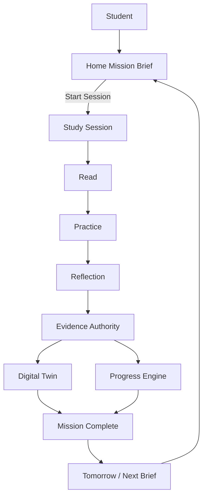

# SR-001 — Student Runtime Recomposition

**Programme:** SR-001 · Student Runtime Recomposition  
**Date:** 2026-07-30  
**Nature:** Architecture blueprint only — **no implementation**  
**Authority role:** Constitutional reference for every subsequent Student Runtime programme  
**Predecessors:** SLJ-001 (Student Learning Journey Reconstruction Audit) · MISSION-001 (Mission Engine & Presentation Audit) · RR-002.3 (Runtime Ownership) · RI-001 / RI-002 (Runtime Integration inventory)  
**Constraint:** Do not write code. Do not modify application architecture in this programme. Design only.

---

## Executive Summary

Kwalitec already possesses the major pieces of a Student Operating System: enrolment, mission composition, Study Session surfaces, progress derivation, Twin/evidence stacks, and Student Home. SLJ-001 proved the failure mode is **composition**, not absence.

Today the student is served by **multiple partially-connected runtimes**:

| Path | What it owns today | What it refuses |
|---|---|---|
| **Runtime C** (published curriculum / production Begin Learning) | Enrolment, certified mission generation, event-sourced progress, Home “Mark mission complete” | Study Session start, Twin update, substantive evidence |
| **Runtime A** (JSON curriculum / session path) | Calibration, `/session/*` workspace, legacy Mission + StudySessionService evidence loops | Certified Educational Intelligence package authority |
| **LearningSessionRuntime** | Domain session lifecycle (plan → active → evidence → reflection → complete) | Student HTTP authority (orphaned from primary UX) |
| **Unified Journey** | Day chrome assemblers (flag-gated, default OFF) | Persistence, evidence, educational decisions |

**Product law** already requires One Educational State and One Runtime (`PRODUCT_BLUEPRINT.md`, Vision 2030, Educational Constitution). Sole-runtime presentation (`/student/*` + `/session/*`) converged chrome but **did not unify educational execution**. PR-001B’s offline “Mark mission complete” pilot must not be mistaken for the product OS.

### Constitutional decision of SR-001

There shall be **one Student Runtime** — the sole execution path for every enrolled student.

That runtime is defined by seven singularities:

1. **One Runtime** — one enrolment → mission → session → evidence → twin → tomorrow pipeline  
2. **One Mission Lifecycle** — Created → Presented → Accepted → Executed → Completed | Deferred  
3. **One Study Session** — the only place planned learning occurs  
4. **One Progress Engine** — one syllabus-position truth per student/subject  
5. **One Student Digital Twin** — updated only after lawful evidence  
6. **One Evidence Pipeline** — Evidence Before Completion; coverage is not understanding  
7. **One Home Experience** — Mission Brief → one Primary into Session (never Mark-complete as sole primary)

This document is the blueprint every implementation programme must follow. Implementation programmes may refine interfaces; they may not reintroduce a second student execution story.

---

## Current Runtime Inventory

### Classification legend (SR-001)

| Class | Meaning |
|---|---|
| **AUTHORITY** | Owns educational truth or lawful student execution for its concern; subsequent programmes extend or bind — do not fork |
| **ADAPTER** | Translates between authorities / presentation; must not invent educational decisions |
| **LEGACY** | Still reachable or still writes educational state; superseded as primary; schedule Wrap → Retire |
| **PROTOTYPE** | Exists as capability or chrome but is not the student product path (flag-gated, placeholder, or unwired) |
| **RETIRED** | Already out of path or quarantined; no new features; remove only behind an explicit retirement gate |

### Inventory by concern

#### A. Presentation / navigation

| Component | Location | Class | Notes |
|---|---|---|---|
| Student Home (`student.home`) | `app/presentation/student/` | **AUTHORITY** (presentation) | Canonical daily decision surface (DX-005A / RR-002.3) |
| Session Experience HTTP (`/session/*`) | `app/presentation/session/` | **AUTHORITY** (presentation) | Canonical guided workspace; not entered from Runtime C Home today |
| Presentation consolidation / sole-runtime redirects | `app/presentation/consolidation.py` | **ADAPTER** | Gates legacy shells; does not unify educational engines |
| Educational view models / Runtime C session control | `educational_view_models.py` (`can_start_session=False`, `complete_runtime_c`) | **LEGACY** (pilot behaviour) | PR-001B confirm loop; must yield to Session Primary |
| Unified Journey package | `app/application/unified_journey/` | **PROTOTYPE** | Flag default OFF; presentation-only; no evidence writes |
| Legacy `/dashboard/`, `/missions/*`, `/analytics/` | `app/dashboard/`, `app/mission/`, `app/analytics/` | **LEGACY** → **RETIRED** candidate | Redirect under sole runtime; do not extend |
| EOS `src/` student home residual | `src/application/student_experience/` | **RETIRED** | Quarantined; not Flask sole-runtime authority |
| Latent recommendation / educational_experience chrome | templates under `student/components/` | **PROTOTYPE** | Flag-gated / reuse-risk (RR-002.3) |

#### B. Enrolment & curriculum authority

| Component | Location | Class | Notes |
|---|---|---|---|
| Published Curriculum Authority | `curriculum_studio_foundation/authority` | **AUTHORITY** | Certified package truth for published subjects |
| Educational Artefact Deriver | curriculum publishing / EI pipeline | **AUTHORITY** | Derives runtime educational artefacts from package |
| FounderStudentEnrolmentBridge / platform_integration | `app/application/platform_integration/` | **ADAPTER** | Routes wizard Begin Learning to Runtime A or C |
| RuntimeCoexistencePolicy | `educational_runtime_engine/coexistence.py` | **ADAPTER** (temporary) | Encodes dual authority; must shrink to cutover map then retire |
| Study Plan wizard | `app/study_plan/` | **AUTHORITY** (intake UX) | Shared enrolment surface |
| StudyPlanService (JSON Runtime A plans) | `app/services/` | **LEGACY** | Remains for non-published subjects until cutover |

#### C. Mission

| Component | Location | Class | Notes |
|---|---|---|---|
| EducationalRuntimeEngineService | `app/application/educational_runtime_engine/` | **AUTHORITY** (enrol / mission / progress for published path) | Production Begin Learning path |
| CertifiedMissionEngine | `app/application/curriculum_intelligence/` | **AUTHORITY** (selection) | LO-coverage scoring; MISSION-001 coherence defects |
| RuntimeMissionInstance | educational runtime engine DTOs | **AUTHORITY** (instance model for published path) | Status “generated” → complete without session |
| Mission Engine v2 | `app/application/mission_engine_v2/` | **PROTOTYPE** / partial **AUTHORITY** | Rich lifecycle; not primary student HTTP |
| Learning Journey / Mission Engine (application) | `learning_journey/`, `mission_engine/` | **LEGACY** / internal | Consumes LearningSessionRuntime internally |
| Daily Mission Intelligence / ILE-004 surfaces | `daily_mission_intelligence/`, Decision Journal mirrors | **ADAPTER** / **AUTHORITY** (journal) | Philosophy is law; Runtime C complete is thin relative to lifecycle |
| SQL `Mission` + MissionService (Runtime A) | `app/services/` + models | **LEGACY** | Session start/finish for JSON path |
| MissionOptimizer | `app/services/mission_optimizer.py` | **RETIRED** | Quarantined (RI-002) |

#### D. Study Session

| Component | Location | Class | Notes |
|---|---|---|---|
| LearningSessionRuntime | `app/application/learning_session/` | **AUTHORITY** (session execution domain) | Designed sole session engine; **orphaned** from student HTTP |
| Session Experience facade / services | `app/application/session_experience/` | **ADAPTER** → future bind to AUTHORITY | Owns `/session/*` application orchestration today |
| Session defaults (“Core methods”) | `app/infrastructure/session/defaults.py` | **PROTOTYPE** | Placeholder educational content |
| StudySessionService (Flask services) | `app/services/study_session_service.py` | **LEGACY** | Evidence path for Runtime A missions; protected for rollback |
| Presentation StudySessionService | `app/presentation/session/services/` | **ADAPTER** | HTTP-facing session helpers |
| LXP-002 legacy mission session routes | `/missions/<id>/session*` | **LEGACY** | Redirect under sole runtime; product design still normative |

#### E. Progress

| Component | Location | Class | Notes |
|---|---|---|---|
| Event-sourced `derive_progress` (Runtime C) | `app/domain/educational_runtime_engine/progress.py` | **AUTHORITY** (published path) | TOPIC_COMPLETED advances coverage |
| TopicProgress / journey projections (Runtime A) | models + Learning Journey | **LEGACY** / dual truth risk | Must converge under One Progress Engine |
| EducationalStateService | `app/application/educational_state/` | **ADAPTER** / read **AUTHORITY** | One snapshot for Experience projections; must not hide dual write paths |
| Curriculum position vs mission topic split | experience projection | **LEGACY** defect | MISSION-001 dual selectors |

#### F. Evidence & Twin

| Component | Location | Class | Notes |
|---|---|---|---|
| EducationalEvidenceAuthority | `app/services/educational_evidence_authority.py` | **AUTHORITY** | Gates mastery / lawful evidence |
| Learning Evidence / VP-001 hooks | `learning_evidence/`, session completion bridges | **AUTHORITY** (when wired) | Conditional on SCI / session path |
| Learner Lifecycle Orchestrator | `app/application/learner_lifecycle/` | **AUTHORITY** (lifecycle after evidence) | Session evidence → process_evidence |
| Student Digital Twin packages | `student_digital_twin/`, `twin/`, `twin_update/`, `twin_inference/` | **AUTHORITY** (observation) | Twin observes; does not teach |
| Twin birth on Runtime A calibration | calibration + twin initialise | **AUTHORITY** (A path) | Absent on Runtime C enrol (PR-001B) |
| Runtime C mission complete → Twin | — | **MISSING** | Coverage events only — not Twin authority path |
| Decision Journal | `decision_journal/` | **AUTHORITY** (educational memory) | Reflection memory-grade store |
| AP-002 DecisionGenerator | `app/application/reasoning/decisions` | **LEGACY** / parallel | Blocks retirement until consolidated (RI-002) |

#### G. Intelligence & recommendations

| Component | Location | Class | Notes |
|---|---|---|---|
| Educational Intelligence pipeline (EI-001…007) | `curriculum_intelligence/`, reasoning engines | **AUTHORITY** (curriculum / reasoning artefacts) | Package + certified mission inputs |
| Preferred Authority / RIS adapters | `runtime_integration/` | **ADAPTER** | Presentation mapping for Preferred Authority |
| RecommendationService / PlanningService | `app/services/` | **LEGACY** (compatibility) | Still active Temporary compatibility (RI-002) |
| Stage A DecisionEngine / Orchestrator | `app/application/orchestration/` | **LEGACY** | Flag-gated; prefer RIS |
| ReadinessService (+ EP readiness intelligence) | `app/services/` + readiness packages | **AUTHORITY** (readiness formula host) | Must consume Twin/evidence — not invent second truth |
| EOS `src/` recommendation engines | `src/domain/education/` | **RETIRED** | Out of Flask student path |

#### H. Founder / operator (non-student execution)

| Component | Location | Class | Notes |
|---|---|---|---|
| Founder dashboard / Feedback Hub / Twin consoles | `app/founder/` | **ADAPTER** (ops) | Not student execution; must not become a second student OS |
| Curriculum Studio / publishing | curriculum studio packages | **AUTHORITY** (authoring) | Upstream of Student Runtime; not in-session |

### Inventory verdict

```
AUTHORITY pieces exist for every singularity — but they are not composed into one path.
ADAPTER layers currently preserve dual stories (A vs C, Home vs Session, Progress vs Twin).
LEGACY and PROTOTYPE paths still teach students a thinner or placeholder product.
```

---

## Recommended Runtime Architecture

### Naming

| Term | Meaning |
|---|---|
| **Student Runtime** | The sole end-to-end execution system for enrolled students |
| **Student OS** | Product identity: guided educational operating system (Blueprint + Constitution) |
| **Runtime A / Runtime C** | Historical labels for dual engines — **not** future product vocabulary. Post-cutover docs say *Student Runtime* only; interim docs may say *JSON curriculum adapter* vs *Published curriculum adapter* |

### Constitutional singularities

```
┌─────────────────────────────────────────────────────────────────┐
│                     ONE STUDENT RUNTIME                         │
│                                                                 │
│  One Home ──► One Mission Lifecycle ──► One Study Session       │
│       │                                    │                    │
│       │                                    ▼                    │
│       │              Read → Practice → Reflection               │
│       │                                    │                    │
│       │                                    ▼                    │
│       │                         One Evidence Pipeline           │
│       │                                    │                    │
│       │                    ┌───────────────┴──────────────┐     │
│       │                    ▼                              ▼     │
│       │           One Progress Engine          One Digital Twin │
│       │                    │                              │     │
│       └────────────────────┴────────── Tomorrow ◄─────────┘     │
└─────────────────────────────────────────────────────────────────┘
```

### Layering (binding)

Preserve existing Kwalitec layering. Recomposition changes **wiring and authority**, not the rule that routes stay thin.

```
Templates / Presentation (`/student/*`, `/session/*`)
        ↓
Blueprints / presentation services (view models, CTAs)
        ↓
Student Runtime Coordinator (new logical authority — compose only)
        ↓
Domain authorities (Mission · Session · Progress · Evidence · Twin · Journey)
        ↓
Curriculum Authority (Published package preferred; JSON via temporary adapter)
        ↓
Persistence / event store
```

**Rules:**

1. Presentation never invents mission selection, progress math, or Twin beliefs.  
2. Adapters never become a second Progress or Twin.  
3. Home never completes a Mission without Session + Evidence (except explicitly deferred / assessment-only Primaries defined by DX-005A).  
4. Coverage (`TOPIC_COMPLETED`) may advance **only** when Evidence Authority accepts completion evidence for that topic’s intended completion contract.  
5. Twin updates **after** evidence succeeds — never from Mark-complete alone.

### One Runtime — module map

| Singularity | Canonical owner (target) | Consumes | Must not |
|---|---|---|---|
| **Home Experience** | Student Home + Educational State projections | Mission brief, session handle, day state | Host Mark-complete as sole Primary; leak `node-*` IDs |
| **Mission Lifecycle** | Single Mission Lifecycle service (compose EducationalRuntimeEngine mission + ILE-004 phases + Mission Engine v2 lifecycle semantics) | Curriculum artefacts, Progress, Twin read models | Dual topic selectors for brief vs why-now |
| **Study Session** | LearningSessionRuntime as execution AUTHORITY; Session Experience as HTTP ADAPTER | Mission brief, activity ports, evidence collector | Placeholder “Core methods” as production content |
| **Progress Engine** | One Progress Authority per enrolment (event-sourced model preferred for published; JSON TopicProgress wrapped then merged) | Lawful completion events | Parallel “current topic” disagreeing with mission topic |
| **Evidence Pipeline** | EducationalEvidenceAuthority + Learning Evidence Model | Session activities, reflection (non-scoring), assessments | Treat coverage confirm as understanding |
| **Student Digital Twin** | Single Twin aggregate / lifecycle orchestrator | Evidence commits, goals, progress signals | Update on assumption; teach; bypass evidence |
| **Tomorrow** | Mission composition on next load + continuity UX | Progress + Twin + journal | Implicit regen without student-visible next brief |

### Curriculum intake (temporary dual source, single runtime)

Published curriculum is the **preferred** educational structure authority. JSON-bundled curricula remain available only through a **Curriculum Source Adapter** that feeds the **same** Student Runtime pipeline (same Mission Lifecycle, Session, Evidence, Twin). Coexistence must not mean two student products.

```
Published package ─┐
                   ├──► Curriculum Source Adapter ──► Student Runtime
JSON bundled ──────┘         (temporary)
```

Cutover retires the JSON path per subject when a certified package is active and parity gates pass — without inventing Runtime C as a separate OS.

### Relationship to prior “One Runtime” declarations

| Prior declaration | What it achieved | What SR-001 adds |
|---|---|---|
| RR-002.3 / V2-023 sole runtime | One **presentation** shell (`/student`, `/session`) | One **execution** pipeline through that shell |
| EducationalStateService | One **read** snapshot for Experience | One **write** path feeding that snapshot |
| RI-001 / RI-002 | Intelligence adoption inventory | Forces retirement of dual educational *behaviour*, not only recommendation adapters |

---

## Component Disposition (Keep / Replace / Wrap / Retire / Merge)

Disposition verbs:

| Verb | Meaning |
|---|---|
| **Keep** | Remains AUTHORITY or certified surface; extend in place |
| **Replace** | Behaviour or API superseded; old path removed after parity |
| **Wrap** | Keep implementation behind adapter; student sees only Student Runtime |
| **Retire** | Remove from path; delete only after retirement gate |
| **Merge** | Fold capabilities into another AUTHORITY; delete duplicate surface |

### Disposition table

| Component | Disposition | Target |
|---|---|---|
| Student Home | **Keep** | Sole Home Experience; Primary = Start/Resume Session |
| `/session/*` Session Experience | **Keep** + **Wrap** LearningSessionRuntime | HTTP adapter over session AUTHORITY |
| LearningSessionRuntime | **Keep** (elevate) | Sole Study Session execution engine |
| EducationalRuntimeEngineService | **Keep** + **Merge** session completion contract | Enrolment, mission instance, progress events — completion only after session evidence |
| CertifiedMissionEngine | **Keep** + fix via MISSION-002 | Selection AUTHORITY; must align explanation/position |
| Published Curriculum Authority | **Keep** | Curriculum truth for published subjects |
| EducationalEvidenceAuthority | **Keep** | Sole evidence gate |
| Learner Lifecycle + Twin packages | **Keep** | Sole Twin observation path; activate for all enrolments |
| Decision Journal | **Keep** | Sole memory-grade reflection store |
| EducationalStateService | **Keep** | Sole Experience read model |
| FounderStudentEnrolmentBridge | **Wrap** → eventually **Merge** | Become Curriculum Source routing into one enrol API |
| RuntimeCoexistencePolicy | **Wrap** → **Retire** | Temporary; replace with subject cutover registry |
| Session Experience facade | **Merge** toward LearningSessionRuntime ports | Stop being a parallel session state machine long-term |
| StudySessionService (services) | **Wrap** then **Retire** | Compatibility evidence writer until Session AUTHORITY parity |
| SQL Mission / MissionService | **Wrap** then **Merge**/ **Retire** | Persistence adapter or migrate instances into unified mission store |
| Mission Engine v2 | **Merge** | Lifecycle/validator/scheduler semantics into One Mission Lifecycle |
| Unified Journey | **Merge** (chrome) / **Retire** (duplicate session controls) | Useful DayExperience presentation ideas fold into Home/Session VMs; do not keep second session FSM |
| Runtime C Mark-complete Primary | **Replace** | Session completion + Evidence; optional founder/pilot escape hatch only behind explicit flag |
| Session defaults (“Core methods”) | **Replace** | Package-derived Read/Practice activities |
| Legacy dashboard / missions / analytics UX | **Retire** | After parity evidence (already redirect) |
| MissionOptimizer | **Retire** | Already removable |
| EOS `src/` student/recommendation residual | **Retire** | Stay quarantined until delete WP |
| RecommendationService / Stage A / AP-002 parallel paths | **Wrap** → **Merge**/ **Retire** per RI programme | Prefer Preferred Authority; no second student tip story on Home |
| educational_experience_panel / latent cards | **Retire** or **Replace** with certified chrome | No uncertified developer panels on L0 |
| PR-001B offline confirm loop | **Retire** as product primary | May remain temporary accessibility mode — never default |

### Singularity bind summary

| Singularity | Keep as core | Absorb / wrap | Remove from student path |
|---|---|---|---|
| Runtime | Student Runtime Coordinator + published enrol | JSON via adapter | Dual A/C behavioural fork |
| Mission Lifecycle | ERE mission + ILE-004 phases + ME v2 rules | SQL Mission | Confirm-without-accept |
| Study Session | LearningSessionRuntime + `/session/*` | StudySessionService | Unified Journey session FSM as authority; Mark-complete |
| Progress | Event-sourced progress (published) | TopicProgress | Dual current-topic vs mission-topic |
| Twin | Twin + lifecycle orchestrator | — | Coverage-only “intelligence” |
| Evidence | Evidence Authority + session evidence | VP-001 bridges | Complete-without-evidence |
| Home | DX-005A Student Home | Unified Journey day chrome ideas | Mark-complete Primary; node-ID chrome |

---

## Final Execution Pipeline

This pipeline is the **only** lawful daily student execution path after SR-001 implementation programmes complete.

```
Student
  ↓
Enrol / Resume (Study Plan wizard or existing enrolment)
  ↓
Student Home — Mission Brief
      (What · Why now · After completion · effort · one Primary)
  ↓
Accept Mission → Start / Resume Study Session
  ↓
Study Session (LearningSessionRuntime)
  ├── Read     (syllabus-bound reading activities)
  ├── Practice (authorised practice items + feedback)
  └── Reflection (structured; Decision Journal when memory-grade)
  ↓
Evidence Pipeline
      (Evidence Before Completion → EducationalEvidenceAuthority)
  ↓
Student Digital Twin update
      (observe only; after evidence succeeds)
  ↓
Progress Engine update
      (lawful coverage / competence signals)
  ↓
Mission Complete
      (lifecycle: Completed; journal outcome)
  ↓
Tomorrow
      (next Mission composition + Home refresh)
```

### Stage contracts (normative)

| Stage | Student sees | System must | Forbidden |
|---|---|---|---|
| **Mission Brief** | Educational title, why now, after | One topic identity across title / why / position | `node-*` leakage; dual-topic why-now |
| **Study Session** | Overview → activities → reflection → summary | LearningSessionRuntime phase machine | Completing mission without session (default path) |
| **Read** | Specific sections / objectives | Package-derived or authorised reading refs | Placeholder supporting prose as sole content |
| **Practice** | Specific items + feedback | Activity port from curriculum/EI | Three generic free-text defaults as production |
| **Reflection** | Confidence / difficulty / insights / gaps as designed | Optional skip; never score Twin from reflection alone | Skipping silently on production path with no Journal opportunity |
| **Evidence** | Honest completion review (Yes / Partially / No) | Persist attempt/session evidence before Twin | Mark-complete as evidence |
| **Twin** | Indirect (better next guidance over time) | Update after evidence | Assumption-driven beliefs |
| **Mission Complete** | Clear done state | Lifecycle Completed + journal | Advancing topics without Evidence contract |
| **Tomorrow** | Next Mission brief on return | Deterministic composition from Progress + Twin + curriculum | Empty Home with no next action |

### Mermaid (target)



### Explicit non-pipeline paths (still allowed)

These are **not** alternate runtimes; they are Primaries defined by Home architecture when Mission is not the day’s action:

- Start Assessment / Review Findings (DX-005A)  
- Commitment Deferred (ILE-004)  
- Settings / Help / Choose Exam  

They must still share One Educational State and must not invent a second progress or Twin writer.

---

## Migration Strategy

### Principles

1. **Compose before polish** — wire Session + Evidence + Twin before premium Home craft.  
2. **One Primary cutover** — change Runtime C Home CTA to Start Session before deleting Mark-complete.  
3. **Adapters first** — wrap JSON and legacy writers; delete only after parity gates.  
4. **No silent dual write** — during transition, prefer single write + dual read projection over two writers.  
5. **Pilot escape hatch** — if offline confirm remains, it is flag-gated, labelled non-default, and cannot claim Twin-grade progress.  
6. **MISSION-002 before trust claims** — fix briefing coherence early; students must not start broken missions.

### Sequencing (no implementation in SR-001)

```
SR-001 (this blueprint)
  → MISSION-002 (briefing / selection coherence)
  → SR-002 (Session binding: Home → LearningSessionRuntime → /session/*)
  → LXP-003/004/005 + REF-001 (session substance)
  → EV-001 (Evidence Before Completion on daily loop)
  → SDT-004 (Twin activation for all enrolments)
  → SR-003 (Progress engine merge + coexistence retirement)
  → SR-004 (Legacy shell & dual-path deletion)
  → Continuity / DX polish (SLJ-003, DX-005 execution)
```

Names of follow-on programmes may be adjusted by the Board; **order of dependencies must not**.

### Cutover gates (conceptual)

| Gate | Requirement |
|---|---|
| G-Session | Published-curriculum Home Primary starts `/session/*` for ≥95% of enrolled test students |
| G-Evidence | Session complete blocked unless Evidence Authority accepts or explicit Partial/No recorded |
| G-Twin | Twin Active or Initialised after first lawful session evidence on published path |
| G-Progress | Mission topic ≡ progress current topic ≡ Home why-now topic |
| G-Single-CTA | Mark-complete not default Primary in production |
| G-Retire-A-shell | Legacy `/dashboard` `/missions` templates deletable |
| G-Retire-coexistence | RuntimeCoexistencePolicy reduced to cutover registry or removed |

---

## Retirement Plan

### Immediate do-not-extend (effective on SR-001 acceptance)

- Runtime C Mark-complete as product vision  
- New features on legacy dashboard / mission LXP / analytics presentation  
- New educational logic in Unified Journey controls  
- New callers of MissionOptimizer / EOS `src/` recommendation engines  
- New Home chrome that bypasses Session  

### Phase retirements

| Wave | Retire | Prerequisite |
|---|---|---|
| **R1** | Default Mark-complete Primary (behaviour) | G-Session |
| **R2** | Session placeholder defaults in production | LXP-004/005 |
| **R3** | Unified Journey flag as alternate day OS | Home/Session VMs absorb needed chrome |
| **R4** | StudySessionService as student writer | LearningSessionRuntime + Evidence parity |
| **R5** | SQL Mission as parallel lifecycle | Unified mission store / adapter complete |
| **R6** | RuntimeCoexistencePolicy dual OS semantics | Per-subject published cutover |
| **R7** | Legacy blueprint templates + latent panels | G-Retire-A-shell |
| **R8** | RI Temporary compatibility recommendation hosts | Preferred Authority hard cutover (RI-005 lineage) |

### Retention (never “retire” casually)

Protected until Board waiver: curriculum JSON/packages, Evidence Authority, Twin schemas, Decision Journal epistemology, readiness calculators, Alembic history, Founder ops surfaces.

---

## Implementation Phases

Architecture sequencing only. Each phase is a future programme (or programme set). **SR-001 delivers none of these.**

### Phase 0 — Constitution & briefing trust

| ID | Programme intent | Outcome |
|---|---|---|
| SR-001 | This blueprint | Single architectural law |
| MISSION-002 | Mission presentation & selection coherence | One topic, educational language, no node-ID leakage |

### Phase 1 — Bind the execution spine

| ID | Programme intent | Outcome |
|---|---|---|
| SR-002 | Journey / Session binding | Home Primary → Study Session for published enrolments; LearningSessionRuntime is session AUTHORITY behind `/session/*` |
| SR-002a | Mission accept semantics | Accepted = session start; Deferred preserved |

**Exit criteria:** Production Begin Learning students can Start Session; Mark-complete is not the sole Primary.

### Phase 2 — Educational substance

| ID | Programme intent | Outcome |
|---|---|---|
| LXP-003 | Session product completion | Plan checklist, finish review Yes/Partially/No, pause/resume semantics |
| LXP-004 | Reading experience | Syllabus-bound Read activities |
| LXP-005 | Practice substance | Package/EI-derived practice + feedback |
| REF-001 | Session reflection | Structured reflection → Journal when memory-grade |

**Exit criteria:** Placeholder “Core methods” gone from production path; Read→Practice→Reflect continuous in-session.

### Phase 3 — Intelligence substrate

| ID | Programme intent | Outcome |
|---|---|---|
| EV-001 | Evidence wiring | Evidence Before Completion on daily loop |
| SDT-004 | Twin activation | Twin birth/update for published-curriculum students |
| SR-003 | Progress singularity | One Progress Engine; mission ≡ position ≡ why-now |

**Exit criteria:** G-Evidence, G-Twin, G-Progress.

### Phase 4 — Collapse dual paths

| ID | Programme intent | Outcome |
|---|---|---|
| SR-003b | Curriculum source adapter finalisation | JSON subjects use same pipeline |
| SR-004 | Legacy retirement | Delete Contained shells, retire coexistence dual OS, remove pilot Primary |

**Exit criteria:** G-Single-CTA, G-Retire-A-shell, G-Retire-coexistence.

### Phase 5 — Continuity & craft

| ID | Programme intent | Outcome |
|---|---|---|
| SLJ-003 | Tomorrow continuity | Explicit next-day / missed-day UX |
| DX-005 execution | Home craft | Premium L0 after educational truth is real |

**Sequencing law (from SLJ-001, restated):** Do not polish Home or Twin inference theatre until Start Session → substantive Read/Practice/Reflect → lawful Evidence is true.

---

## Risk Assessment

| ID | Risk | Severity | Likelihood | Mitigation |
|---|---|---|---|---|
| R1 | Treating sole-runtime chrome as “already One Runtime” | High | High | SR-001 distinguishes presentation vs execution; programmes measured on pipeline gates |
| R2 | Replacing Mark-complete before Session substance ready | High | Medium | Phase 1 binds session; Phase 2 fills content; keep flagged pilot confirm if needed |
| R3 | Two writers during transition (session complete + mark complete) | High | High | Single write authority; Mark-complete delegates or disabled |
| R4 | Elevating LearningSessionRuntime without persistence story | Medium | High | Explicit persistence adapter programme inside SR-002 |
| R5 | Twin activation without evidence adequacy | High | Medium | EV-001 before or with SDT-004; Constitution evidence ranks |
| R6 | Mission Engine v2 merge scope creep | Medium | Medium | Merge lifecycle semantics only; no UI rewrite inside merge |
| R7 | Unified Journey merge conflicts with Session Experience | Medium | Medium | Journey contributes VMs only; Session AUTHORITY stays LearningSessionRuntime |
| R8 | JSON subject regression during published-first work | Medium | Medium | Curriculum Source Adapter; coexistence shrinks subject-by-subject |
| R9 | Founder/ops tools mistaken for student runtime | Low | Low | Explicit non-student classification in inventory |
| R10 | Commercial readiness claims before G-Session | High | Medium | CR1 Core Study Loop gated on pipeline, not enrolment success alone |

### Invariants at risk if SR-001 is ignored

| Invariant | Failure mode |
|---|---|
| One Educational State | Dual topic / dual why-now persists |
| One Runtime | A vs C behavioural fork persists |
| Evidence before Twin | Coverage treated as intelligence |
| Study ≠ understanding | Mark-complete advances syllabus |
| Home → Session execution | Home → Confirm completion |

---

## Final Verdict

**SR-001 declares:** the Student Runtime is recomposed as a single educational operating system. The work ahead is **binding existing authorities into one pipeline**, not inventing a parallel stack.

| Question | Answer |
|---|---|
| Are major components missing? | **No** (SLJ-001) |
| Is the product one coherent Student OS today? | **No** |
| What is the constitutional fix? | **One Runtime · One Mission Lifecycle · One Study Session · One Progress Engine · One Twin · One Evidence Pipeline · One Home** |
| What is the sole daily execution path? | **Brief → Session → Read → Practice → Reflect → Evidence → Twin → Mission Complete → Tomorrow** |
| What must die as the default student story? | **Runtime C Mark-complete without Study Session** |
| What becomes session AUTHORITY? | **LearningSessionRuntime** (HTTP via `/session/*`) |
| What remains curriculum AUTHORITY for production subjects? | **Published Curriculum Authority + CertifiedMissionEngine** (coherence-fixed) |
| May implementation begin in SR-001? | **No** — blueprint only |

### Authority of this document

Until superseded by a later SR programme amendment:

1. No new student feature may introduce a second execution path.  
2. No programme may designate Mark-complete as the designed product Primary.  
3. No programme may update Twin without Evidence Authority success on the daily loop.  
4. Follow-on programmes implement phases in dependency order unless the Board explicitly waives a gate with written residual risk.  

**End of SR-001.**

---

## Appendix A — Evidence sources

| Source | Contribution |
|---|---|
| `SLJ001_PRODUCT_AUDIT.md` | Journey gaps, dual path map, Study Session / Twin / reflection findings |
| `MISSION001_RUNTIME_AUDIT.md` | Mission selection vs presentation incoherence |
| `PRODUCT_BLUEPRINT.md` | One Educational State / One Runtime product law |
| `knowledge/design/dx005a_student_home/STUDENT_HOME_ARCHITECTURE.md` | Home Primary into Session |
| `knowledge/product/LXP-002_STUDY_SESSION_EXPERIENCE.md` | Study Session product workflow |
| `knowledge/product/ILE-004/MISSION_LIFECYCLE.md` | Mission lifecycle phases |
| `knowledge/version2/LEARNING_SESSION_RUNTIME.md` | LearningSessionRuntime AUTHORITY specification |
| `knowledge/architecture/UNIFIED_STUDENT_JOURNEY_ARCHITECTURE.md` | Prototype day chrome boundaries |
| `knowledge/release/RR-002/RR002_3_RUNTIME_OWNERSHIP.md` | Presentation ownership / legacy Contained |
| `docs/architecture/SYSTEM_ARCHITECTURE.md` | Sole-runtime presentation map |
| `knowledge/runtime_integration/ri002_*/RUNTIME_INVENTORY.md` | Legacy recommendation / coexistence inventory |
| `app/application/educational_runtime_engine/coexistence.py` | Dual Runtime A/C policy as-written |

## Appendix B — Traceability to SLJ-001 gaps

| SLJ gap | SR-001 response |
|---|---|
| G01 Dual journey | One Runtime singularity |
| G02–G03 Session unwired | Phase 1 SR-002 |
| G04–G05 Mission coherence | Phase 0 MISSION-002 |
| G06–G08 Substance | Phase 2 LXP / REF |
| G13–G15 Evidence / Twin | Phase 3 EV-001 / SDT-004 |
| G17 Home Primary | Home Experience singularity |
| G19 Orphaned LearningSessionRuntime | Elevate to Study Session AUTHORITY |

## Appendix C — Document control

| Field | Value |
|---|---|
| Status | **Accepted as architecture blueprint** (implementation not started) |
| Supersedes | Competing informal “Runtime A vs C product” narratives for student execution |
| Does not supersede | Educational Constitution, Vision 2030, Product Blueprint philosophy, curriculum certification law |
| Next authorised action | Schedule MISSION-002 / SR-002 — **do not implement inside SR-001** |
