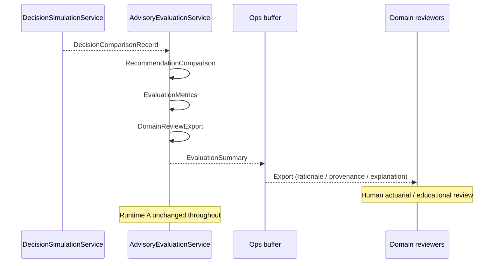

# Programme II — Advisory Evaluation Framework Architecture

**Milestone:** P2-MS012 — Advisory Evaluation Framework  
**Directive:** Engineering Directive 001 (Advisory Evaluation Framework)  
**Status:** Implemented (evaluation / review only)  
**Package:** `app/infrastructure/adapters/advisory_evaluation/`  
**Service:** `AdvisoryEvaluationService`  
**Feature flag:** `KWALITEC_ADVISORY_EVALUATION` → `ENABLE_ADVISORY_EVALUATION` (**default OFF**)  
**Contract version:** `p2.ms012.1` (`EVALUATION_VERSION`)  
**Companions:** `DECISION_SIMULATION_ARCHITECTURE.md`, `EVIDENCE_ADVISORY_ARCHITECTURE.md`, `RECOVERY_PLANNER_ARCHITECTURE.md`

---

## 0. Purpose

Introduce an **evaluation framework** that scores and analyses simulated recommendation differences **without modifying Runtime A behaviour**.

> Measure educational impact before enabling educational influence.

| In scope | Out of scope |
|---|---|
| Immutable `RecommendationComparison` | Runtime recommendation changes |
| Immutable `EvaluationMetrics` | Student-facing behaviour |
| `AdvisoryEvaluationService` | Adaptive Engine changes |
| Immutable `DomainReviewExport` | Strategy changes |
| `ENABLE_ADVISORY_EVALUATION` | Recovery optimisation |
| Explainable operational summaries | Automatic rollout |

**Stop condition:** Stop after the Advisory Evaluation Framework. Await architecture review before permitting advisory-informed Runtime A decisions.

---

## 1. Components

| Component | Location | Responsibility | Non-responsibility |
|---|---|---|---|
| `RecommendationComparison` | `advisory_evaluation/contracts.py` | Freeze production vs simulated delta | Ranking / student ids |
| `EvaluationMetrics` | `contracts.py` | Operational rates & counts | Educational scoring authority |
| `DomainReviewExport` | `contracts.py` | Actuarial / educational review payload | Student-facing UX |
| `EvaluationSummary` | `contracts.py` | Cohort summary envelope | Persistence (this milestone) |
| `AdvisoryEvaluationService` | `advisory_evaluation/service.py` | Ingest → aggregate → export | Mutating Runtime outputs |

Naming note: this `RecommendationComparison` is distinct from Adaptive Engine soak’s `RecommendationComparison` monitor DTO and from P2-MS011’s `DecisionComparisonRecord`. Evaluation comparisons are derived from simulation artefacts and deliberately omit student identifiers.

---

## 2. Evaluation lifecycle

```
DecisionSimulationService (P2-MS011)
        │
        └── DecisionComparisonRecord (operational_only=True)
                │
                ▼ (optional, ENABLE_ADVISORY_EVALUATION)
        AdvisoryEvaluationService.ingest_simulation
                │
                ├── RecommendationComparison (no student ids)
                │
                ├── aggregate_metrics → EvaluationMetrics
                │
                ├── generate_export → DomainReviewExport
                │
                └── generate_summary / evaluate_simulation_batch
                        └── EvaluationSummary (metrics + comparisons + exports)
```

Lifecycle rules:

1. Consume simulation outputs only — never rewrite production recommendations.
2. Strip student identifiers from evaluation artefacts.
3. Classify differences with an operational taxonomy (`difference_type`).
4. Aggregate rates over an in-memory cohort (process-local for this milestone).
5. Emit review exports suitable for actuarial / educational review — never student UX.

---

## 3. Comparison methodology

Each `RecommendationComparison` contains:

| Field | Meaning |
|---|---|
| `comparison_id` | Deterministic evaluation id (`adveval-…`) |
| `production_recommendation` | Runtime A snapshot (student ids stripped) |
| `simulated_recommendation` | Simulation snapshot (student ids stripped) |
| `differs` | Whether any evaluated field diverged |
| `difference_type` | Operational taxonomy (see below) |
| `advisory_sources` | Evidence / recovery source refs considered |
| `generated_at` | ISO timestamp from simulation when present |

### Difference taxonomy

| `difference_type` | Meaning |
|---|---|
| `unchanged` | No divergence |
| `rationale_annotation` | Rationale / reason differs only (typical MS011 structural mode) |
| `priority` | Priority field alone differs |
| `title` | Title field alone differs |
| `category` | Category field alone differs |
| `multi_field` | More than one field differs |
| `structural` | Divergence without a finer field classification |
| `unknown` | Invalid / unrecognised type coerced for safety |

Classification is **operational**, not a ranking decision. It does not assert educational benefit by itself — benefit judgement remains a human review step.

### Metrics (operational only)

| Metric | Definition |
|---|---|
| `comparison_count` | Size of evaluation cohort |
| `difference_rate` | Share of comparisons with `differs=True` |
| `unchanged_rate` | Share with `differs=False` |
| `advisory_usage_frequency` | Share that carried advisory sources |
| `explainability_completeness` | Share with provenance + coherent difference typing |

Empty cohorts yield `0.0` for all rates.

---

## 4. Review workflow



### Domain review export fields

| Field | Purpose |
|---|---|
| `production_rationale` | Runtime A reason / rationale |
| `simulated_rationale` | Simulated rationale |
| `provenance` | Authority chain + service metadata |
| `explanation` | Human-readable difference narrative |

Binding invariants:

- `review_only=True`
- `student_facing=False`
- No student identifiers on the export envelope

---

## 5. Authority boundaries

1. Educational authority remains exclusively within Runtime A.
2. Evaluation **may** read Decision Simulation artefacts.
3. Evaluation **must not** modify production recommendation outputs.
4. Evaluation artefacts are always `operational_only=True` (exports: `review_only=True`).
5. Disabling `ENABLE_ADVISORY_EVALUATION` removes construction / service use immediately.
6. Evaluation does **not** authorise advisory-informed Runtime A decisions.

---

## 6. Feature flags

| Environment | Resolved field | Default |
|---|---|---|
| `KWALITEC_ADVISORY_EVALUATION` | `ENABLE_ADVISORY_EVALUATION` | OFF |

| Evaluation flag | Evaluation DI | Student-facing recommendations |
|---|---|---|
| OFF | Not wired | Unchanged |
| ON | `AdvisoryEvaluationService` DI | Unchanged |

Dual-run ops field: `DualRunStatus.advisory_evaluation`.

Independence: enabling/disabling this flag does not alter Decision Simulation, Recovery Planner, Evidence Advisory, Experience Feedback, Adaptive, Strategy, Twin, or Evidence Platform flags.

---

## 7. Rollback guarantees

1. **Flag OFF** → service not constructed (`build_advisory_evaluation_service(enabled=False)` returns `None`).
2. **Evaluation exceptions** on ingest are caught and returned as `INVALID_STATE` — callers keep production paths intact.
3. **No persistence** of evaluation artefacts in this milestone (process-local buffer only).
4. **No student UX** surfaces consume `RecommendationComparison`, `EvaluationMetrics`, or `DomainReviewExport`.
5. Turning the flag off restores prior behaviour with zero dependence on evaluation.

---

## 8. Future rollout criteria (not implemented)

Advisory-informed Runtime A decisions remain **blocked** until architecture review. Suggested future gates (documentation only):

| Gate | Intent |
|---|---|
| Stable difference taxonomy | Reviewers agree difference types are interpretable |
| Explainability completeness | High share of comparisons carry provenance + explanation |
| Domain review of exports | Actuarial / educational reviewers accept sample exports |
| Explicit cutover ADR | Separate milestone authorises influence — never this one |
| Independent flag | Keep evaluation separable from any future authority flag |

This milestone implements **measurement only**. Automatic rollout is explicitly out of scope.

---

## 9. Tests

| Suite | Coverage |
|---|---|
| `tests/.../advisory_evaluation/test_contracts.py` | Immutability, metrics clamps, export invariants |
| `tests/.../advisory_evaluation/test_service.py` | Ingest, aggregation, export, summary, flag isolation, DI |
| `tests/application/config/test_v2_flags.py` | Flag default OFF + dual-run field |

---

## 10. Explicit non-goals (binding)

- Runtime recommendation changes / student-facing behaviour
- Adaptive Engine / Strategy / Recovery optimisation
- Automatic rollout / authority transfer away from Runtime A
- Ranking decisions inside evaluation artefacts
- Student identifiers on evaluation DTOs
