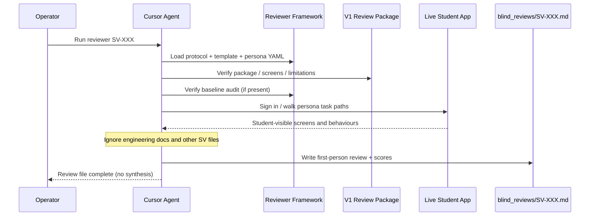
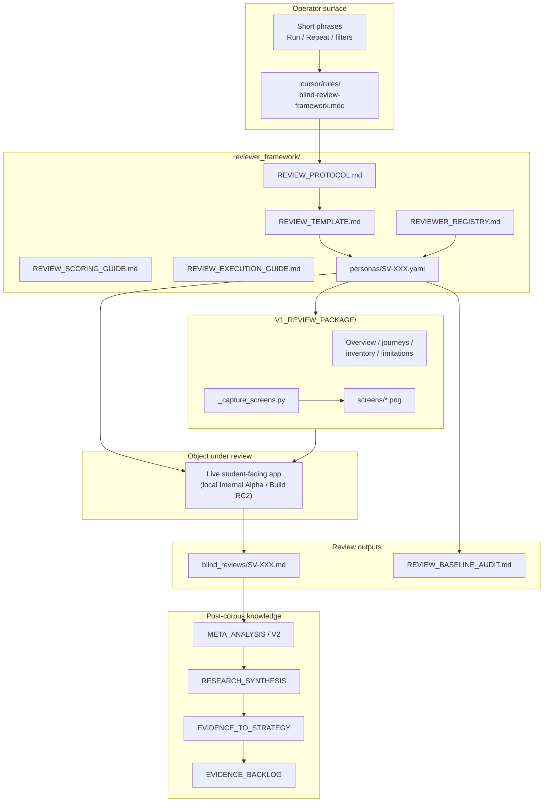

# Blind Review Subsystem — Current State Audit

**Document type:** Architectural audit (as-built)  
**Programme origin:** EP-004 Private Beta Blind Review  
**Audit date:** 25 July 2026  
**Scope:** Document the existing Blind Review implementation only  
**Constraint:** No code changes; no proposed improvements; no new functionality

---

## Boundary clarification (read first)

Kwalitec’s **Blind Review** subsystem is **not** an application runtime scoring engine over Study Plans, Missions, or Recovery Plans.

It is a **permanent qualitative research infrastructure** that:

1. Defines independent simulated IFoA student personas (`SV-001` … `SV-020`)
2. Executes persona-bound reviews of the **student-facing product experience**
3. Stores first-person review transcripts as Markdown
4. Synthesises findings in separate meta-analysis / strategy documents

A separate code package — `app/infrastructure/adapters/evidence_review/` (**Educational Evidence Review Workspace**, P4-MS003) — provides read-only inspection of longitudinal educational evidence. That package is **not** Blind Review. This audit records the relationship under §14 without conflating the two.

| Concern | Blind Review (this subsystem) | Educational Evidence Review (sibling) |
|---|---|---|
| Primary location | `knowledge/product/ep004_private_beta/` + `knowledge/reviews/V1_REVIEW_PACKAGE/` | `app/infrastructure/adapters/evidence_review/` |
| Executor | Cursor agent under `.cursor/rules/blind-review-framework.mdc` | `EvidenceQueryService` (Python) |
| What is reviewed | Student-visible UX / educational experience | Stored longitudinal evidence records |
| Scoring | Persona-specific 1–10 qualitative scores | None (query / timeline / export only) |
| Runtime A influence | None by protocol | None by design (read-only) |

---

## 1. Purpose

### 1.1 Problem solved

Blind Review answers a product-research question that automated metrics and engineering inspection cannot:

> How do independent actuarial exam candidates experience the student-facing private beta as an **educational study tool**, when they cannot see how it is built?

The subsystem replaces one-off mega-prompts with a permanent, re-runnable reviewer framework so the same twenty educational hypotheses can be executed consistently against the current student experience.

### 1.2 Educational decisions validated

Each registered reviewer validates **exactly one** educational hypothesis (YAML `educational_hypothesis` + `central_question`). Across the frozen cohort, the programme validates whether the student-facing product:

| Decision / capability under review | Primary reviewers |
|---|---|
| First-use clarity / ability to begin studying | SV-001 |
| Weeknight time efficiency | SV-002 |
| Value against a mature study system | SV-003 |
| Restart after missed days | SV-004 |
| Explainability / trust of recommendations | SV-005, SV-014 |
| Late-revision adoption value | SV-006 |
| Habit retention after novelty | SV-007 |
| Emotional recovery after failure | SV-008 |
| Substitution against existing tools | SV-009 |
| Error recoverability | SV-010 |
| Improvement awareness / educational feedback | SV-011 |
| Adaptation after poor performance | SV-012 |
| Calibration / overconfidence safety | SV-013 |
| Study decision quality | SV-015 |
| Cognitive load / organisational burden | SV-016 |
| Deliberate practice vs busywork | SV-017 |
| Workflow essentiality after sustained use | SV-018 |
| Exam performance transfer | SV-019 |
| Bounded commitment as study companion | SV-020 |

Meta-analysis additionally assesses educational capabilities thematically (study planning, mission quality, feedback, personalisation, adaptation, progress tracking, exam preparation, workflow support, cognitive load, deliberate practice, explainability, calibration, learning transfer) — always from transcript evidence, not from Runtime A APIs.

### 1.3 Parts of Kwalitec that participate

| Participant | Role in Blind Review |
|---|---|
| Live student-facing application (local running app in the completed corpus) | Primary object of evaluation |
| `knowledge/reviews/V1_REVIEW_PACKAGE/` | Companion student package (overview, journeys, screens, limitations) |
| `reviewer_framework/` | Protocol, template, scoring guide, registry, persona YAML |
| `blind_reviews/SV-*.md` | Review outputs |
| Cursor agent + `.cursor/rules/blind-review-framework.mdc` | Execution operator |
| Facilitator baseline (`REVIEW_BASELINE_AUDIT.md`) | Hygiene check that reviews share a consistent app baseline |
| Downstream knowledge artefacts | Meta-analysis, research synthesis, evidence-to-strategy, evidence backlog |
| Student product surfaces (Dashboard, Home, Session, Mission, Coach, Journey, Readiness, Analytics, Study Plan, Practice Outcome, Settings, Help, Feedback) | **Review content** — not Blind Review domain objects |

**Not participants (by protocol):** application source, engineering docs, RCA notes, Twin / Educational State internals, recommendation algorithms, curriculum engine docs.

---

## 2. Domain model

Discovered objects below. Names such as `StudyPlan`, `Mission`, `RecoveryPlan`, and `Evaluation` are **product surfaces or sibling subsystems**, not Blind Review domain types.

### 2.1 ReviewerPersona (`personas/SV-XXX.yaml`)

| Aspect | Current implementation |
|---|---|
| **Responsibility** | Structured parameters for one independent student reviewer: identity, exam context, hypothesis, task, questions, scoring dimensions, output path |
| **Lifecycle** | Created as YAML → registered in `REVIEWER_REGISTRY.md` → loaded on each run → may be re-run (overwrite output unless archived) |
| **Relationships** | 1:1 with Review output file; references Review Package path and Baseline Audit path; indexed by Registry |
| **Immutability** | Cohort SV-001–SV-020 declared **frozen** as canonical; schema is stable; re-runs reload YAML rather than mutating it |
| **Storage** | Filesystem YAML under `reviewer_framework/personas/` |

**Schema fields (actual):**  
`id`, `name`, `age`, `country`, `exam`, `attempt`, `weeks_to_exam`, `occupation`, `educational_hypothesis`, `central_question`, `primary_dimension`, `background[]`, `task[]`, `evaluation_focus[]`, `questions[]`, `scoring[]`, `filter_tags[]`, `review_package`, `baseline_audit`, `output`.

### 2.2 ReviewerRegistry (`REVIEWER_REGISTRY.md`)

| Aspect | Current implementation |
|---|---|
| **Responsibility** | Master index of the twenty reviewers; exam / attempt / dimension / filter slices |
| **Lifecycle** | Updated when a new reviewer ID is added; SV-001–SV-020 frozen |
| **Relationships** | Points to persona YAML (by convention) and review Markdown paths |
| **Immutability** | Document; counts and primary-dimension index are maintained by hand |
| **Storage** | Markdown |

### 2.3 ReviewProtocol / ReviewTemplate / ScoringGuide / ExecutionGuide

| Object | Responsibility | Storage |
|---|---|---|
| `REVIEW_PROTOCOL.md` | Methodological law (independence, student-only, one hypothesis, no synthesis-in-run) | Markdown |
| `REVIEW_TEMPLATE.md` | Canonical output skeleton | Markdown |
| `REVIEW_SCORING_GUIDE.md` | Dimension definitions and 1–10 band meanings | Markdown |
| `REVIEW_EXECUTION_GUIDE.md` | Operator phrases, load order, batch filters | Markdown |
| `reviewer_framework/README.md` | Framework entry + extension steps | Markdown |

Lifecycle: permanent research infrastructure; loaded every run. No database persistence.

### 2.4 BlindReview (`blind_reviews/SV-XXX.md`)

| Aspect | Current implementation |
|---|---|
| **Responsibility** | First-person interview transcript answering the persona’s questions and scoring table |
| **Lifecycle** | Written by agent after package/baseline verification → may be overwritten on Repeat → consumed later by meta-analysis |
| **Relationships** | Produced from one Persona; cites Review Package / live app observations; never references other SV files during writing |
| **Immutability** | File content is mutable on repeat; programme treats completed corpus as research evidence once synthesised |
| **Storage** | Markdown under `knowledge/product/ep004_private_beta/blind_reviews/` |

Required sections (template): header metadata → package/baseline confirmation → “How I used it” → Answers → Scoring table → Central question.

### 2.5 Score (table rows inside BlindReview)

| Aspect | Current implementation |
|---|---|
| **Responsibility** | Integer 1–10 judgement on a persona-listed dimension, plus notes citing observed behaviour |
| **Lifecycle** | Created with the review; no separate score entity |
| **Relationships** | Belongs to one BlindReview; dimensions subset of Scoring Guide vocabulary |
| **Immutability** | Overwritten when review is repeated |
| **Storage** | Markdown table inside the review file |

**Overall** is a separate row: holistic answer to `central_question`, **not** a mean of other dimensions.

### 2.6 EducationalHypothesis / CentralQuestion / PrimaryDimension

| Aspect | Current implementation |
|---|---|
| **Responsibility** | Research framing for one persona; one hypothesis per reviewer |
| **Lifecycle** | Defined in YAML; answered in review; indexed in registry |
| **Relationships** | Bound to Persona; used for batch filters (`primary_dimension`, `educational_hypothesis`) |
| **Immutability** | Fixed in YAML for the frozen cohort |
| **Storage** | YAML + registry Markdown |

### 2.7 ReviewPackage (`knowledge/reviews/V1_REVIEW_PACKAGE/`)

| Aspect | Current implementation |
|---|---|
| **Responsibility** | Student-facing companion documentation and screenshots of the current application for reviewers |
| **Lifecycle** | Regenerated via `_capture_screens.py` against a running local app; docs updated by facilitators |
| **Relationships** | Referenced by every persona (`review_package`); verified before judging; live app wins if package diverges |
| **Immutability** | Regenerable; historical error screens may be retained and labelled superseded |
| **Storage** | Markdown + PNG screenshots + Playwright capture script |

Contents: `APPLICATION_OVERVIEW.md`, `FEATURE_INVENTORY.md`, `USER_JOURNEYS.md`, `SCREEN_INVENTORY.md`, `CLICK_PATHS.md`, `APPLICATION_WALKTHROUGH.md`, `KNOWN_LIMITATIONS.md`, `BETA_EXPECTATIONS.md`, `REVIEW_PACKAGE_REPORT.md`, `screens/`, `_capture_screens.py`.

### 2.8 BaselineAudit (`REVIEW_BASELINE_AUDIT.md`)

| Aspect | Current implementation |
|---|---|
| **Responsibility** | Facilitator check that reviews share a consistent application baseline before meta-analysis |
| **Lifecycle** | Produced for the SV-001–SV-020 programme day; records git hash, package mtimes, pre/post fix splits |
| **Relationships** | Referenced by personas; informs which reviews are valid for consistent-baseline synthesis |
| **Immutability** | Historical audit record |
| **Storage** | Markdown |

### 2.9 ReviewCorpus / MetaAnalysis / ResearchSynthesis / EvidenceToStrategy

| Object | Responsibility | Storage |
|---|---|---|
| ReviewCorpus | Set of completed `SV-*.md` transcripts | Directory of Markdown |
| `BLIND_REVIEW_META_ANALYSIS.md` | Qualitative thematic organisation of corpus evidence | Markdown |
| `BLIND_REVIEW_META_ANALYSIS_V2.md` | Research-quality revision (methodology + classification); does not overwrite foundation | Markdown |
| `BLIND_REVIEW_RESEARCH_SYNTHESIS.md` | Interpretive synthesis for leadership (still research-scoped) | Markdown |
| `EVIDENCE_TO_STRATEGY.md` | Strategy bridge from synthesis corpus (not a Blind Review run artefact) | Markdown |
| `EVIDENCE_BACKLOG.md` | Product backlog items traced to supporting reviewers | Markdown |

Meta-analysis / synthesis explicitly forbid inspecting application code. They are **programme reporting layers**, not runtime services.

### 2.10 OperatorInstruction (Cursor rule)

| Aspect | Current implementation |
|---|---|
| **Responsibility** | Bind short phrases (`Run reviewer SV-011`, `Run only trust reviewers`, …) to mandatory load order |
| **Lifecycle** | Always-available agent rule when requested |
| **Storage** | `.cursor/rules/blind-review-framework.mdc` |

### 2.11 Objects that are **not** Blind Review domain types

| Name | Actual status |
|---|---|
| StudyPlan / Mission / Session / Coach / Journey / Readiness / RecoveryPlan | Student-visible product artefacts **reviewed by** Blind Review |
| Recommendation (engine) | Product behaviour observed in UX; not a Blind Review entity |
| Explanation | Observed Coach / “why” copy; not a stored Blind Review type |
| Evaluation (engine) | Not present in Blind Review |
| EvidenceTimeline / EvidenceReviewExport | Belong to **Evidence Review** adapter (`evidence_review`) |

---

## 3. Workflow

### 3.1 Single-reviewer lifecycle

```
Operator phrase
  ("Run reviewer SV-XXX" / "Repeat SV-XXX")
        │
        ▼
Load REVIEW_PROTOCOL.md
        │
        ▼
Load REVIEW_TEMPLATE.md
        │
        ▼
Load personas/SV-XXX.yaml
        │
        ▼
Verify V1_REVIEW_PACKAGE (+ REVIEW_BASELINE_AUDIT when present)
        │
        ▼
(Optional) Compare package to live student app;
 record divergence; prefer live experience
        │
        ▼
Inhabit persona: perform realistic study behaviour
 (task-bound; not exhaustive QA)
        │
        ▼
Answer every persona question
        │
        ▼
Score only YAML scoring dimensions (1–10) + Overall
        │
        ▼
Write / overwrite blind_reviews/SV-XXX.md
        │
        ▼
STOP (no meta-analysis, no product recommendations,
      no cross-reviewer comparison)
```

### 3.2 Batch lifecycle

```
Operator filter
  (all / CM1 / workflow / trust / exam / dimension)
        │
        ▼
Resolve ID list from REVIEWER_REGISTRY + persona YAML
        │
        ▼
For each ID sequentially:
     clear prior persona context
     run full single-reviewer lifecycle
        │
        ▼
STOP without averaging or synthesis
  (unless a separate meta-analysis task is requested)
```

### 3.3 Post-corpus reporting lifecycle (separate tasks)

```
Completed corpus (SV-001 … SV-020)
        │
        ▼
REVIEW_BASELINE_AUDIT (facilitator)
        │
        ▼
BLIND_REVIEW_META_ANALYSIS.md
        │
        ▼
BLIND_REVIEW_META_ANALYSIS_V2.md
        │
        ▼
BLIND_REVIEW_RESEARCH_SYNTHESIS.md
        │
        ▼
EVIDENCE_TO_STRATEGY.md  →  EVIDENCE_BACKLOG.md
```

### 3.4 Sequence diagram (execution)



There is **no** automated “generate recommendation → prepare review package → assign reviewer → aggregate scores” pipeline in application code. Package generation is a facilitator Playwright script; assignment is operator phrase → persona YAML; aggregation is explicitly forbidden inside review runs.

---

## 4. Review content

Blind Review evaluates the **student-facing educational experience**, not isolated engine DTOs.

### 4.1 Reviewable artefact classes (as experienced)

From the review package feature inventory and completed transcripts, reviewers currently judge:

| Artefact / surface | Examples of what is judged |
|---|---|
| Authentication / onboarding | Login, invite-only access, Alpha onboarding, welcome modal |
| Study Plan | Wizard, supported vs unsupported papers, plan list/view/edit, roadmap |
| Learning Workspace Dashboard | Today’s session card, progress vs Estimated Knowledge, recommendations |
| Student Home | Today’s Mission, readiness, journey teaser, Coach insight, dual-home friction |
| Session / Mission briefing | Topic naming, duration, “why”, success criteria, activity checklist |
| Active Study Session | Checklist, pause/finish, learning-objective / selection rule copy |
| Session Overview (Home start path) | Thin overview quality (“Core methods”, activities listed or not) |
| Practice Outcome Capture | Attempted/correct logging, honesty ritual |
| Journey | Progress map / completeness signalling |
| Coach insight | Explainability, evidence claims, restatement vs derivation |
| Readiness / Analytics | Empty-state honesty, charts, completion ≠ understanding language |
| Revision / History | Availability and usefulness when empty or populated |
| Profile / Settings | Exam field consistency, preferences, data export |
| Help / Alpha feedback / Product Check-in | Non-learning product feedback surfaces |
| Error / recovery paths | 404/403, resume/pause, wrong-nav recoverability |
| Cross-surface consistency | Dual homes, duration mismatch (e.g. 30 vs 90), conflicting “continue” language |

### 4.2 What is not reviewed as a first-class Blind Review artefact

- Internal Recovery Plans / Adaptive Engine decisions / Twin snapshots / Strategy traces (engineering-invisible by protocol)
- Longitudinal evidence repository records
- Educational trial assignment tables
- Source code or architecture docs

Reviewers may **perceive** recommendation quality, adaptation, or recovery behaviour only insofar as those appear in student-visible UI.

---

## 5. Scoring model

### 5.1 Scale and bands

| Property | Current rule |
|---|---|
| Scale | Integer **1–10** (unless a persona YAML states otherwise — none currently do) |
| Band 1–2 | Fails dimension; would actively avoid relying on it |
| Band 3–4 | Weak; occasional signal, mostly noise/friction |
| Band 5–6 | Mixed / conditional |
| Band 7–8 | Solid for persona hypothesis; clear positive with caveats |
| Band 9–10 | Strongly earns trust or behaviour change |

Notes must cite **observed** product behaviour.

### 5.2 Categories (dimensions)

Dimensions are **persona-selected**, not a single global rubric. The Scoring Guide defines families; each YAML lists an ordered subset (typically 5–8 rows including Overall).

Across SV-001–SV-020, **87 distinct dimension labels** appear (including near-synonyms such as `Daily Use Potential` / `Daily Utility` / `Daily Value`). Families include:

- Overall / First Impression / Clarity / Ease of Starting / Navigation
- Return / Daily use / Recommendation likelihood / Commitment / Long-term value
- Educational value / trust / confidence / motivation / safety
- Time efficiency / urgency / session clarity / cognitive load
- Workflow integration / replacement / practical usefulness
- Transparency / credibility of recommendations / Coach / Evidence
- Feedback / adaptation / personalisation / calibration
- Decision support / deliberate practice / exam relevance / recoverability

Exact lists always come from the active persona YAML.

### 5.3 Weighting

**None.** Dimensions are not weighted. Overall is not a weighted sum.

### 5.4 Pass / fail thresholds

**None.** There is no automated pass/fail gate, promotion threshold, or acceptance score. Meta-analysis records observed Overall range (**2–7** in the completed corpus) without converting scores into release decisions inside the review subsystem itself.

### 5.5 Aggregation

| Layer | Aggregation behaviour |
|---|---|
| Inside a single review | **No** averaging of dimension rows into Overall |
| Across reviewers during a run | **Forbidden** (protocol §8–9) |
| Meta-analysis | **Non-aggregative**: thematic coding by recurrence/specificity; Overall scores listed individually; **no mean/median** |
| Evidence strength (meta V2) | Qualitative hierarchy: Universal / Near Universal / Strong / Emerging / Persona Specific — **not** score-based |

### 5.6 Overall score calculation

```
Overall = persona’s single holistic judgement against central_question
```

Not:

```
Overall ≠ mean(dimension_scores)
Overall ≠ weighted_sum(...)
```

---

## 6. Reviewers

### 6.1 Representation

Reviewers are **named simulated student personas**, not database users or RBAC roles.

Identity is carried by:

- Reviewer ID (`SV-001` … `SV-020`)
- Persona YAML
- Registry row
- Output Markdown file

### 6.2 Metadata (actual fields)

Demographics / context: `name`, `age`, `country`, `exam`, `attempt`, `weeks_to_exam`, `occupation`.

Research metadata: `educational_hypothesis`, `central_question`, `primary_dimension`, `filter_tags`, `background`, `task`, `evaluation_focus`, `questions`, `scoring`.

Paths: `review_package`, `baseline_audit`, `output`.

### 6.3 Specialisation

**Yes.** Specialisation is the core design:

- One hypothesis and one primary evaluation dimension per reviewer
- Exam specialisation (CS1 / CM1 / CS2)
- Sitting specialisation (first vs second / results-day)
- Filter tags for programme slices (`workflow`, `trust`, `adoption`, …)

Reviewers are **not** interchangeable generic users.

### 6.4 Multiple scenarios

| Capability | Current state |
|---|---|
| One persona reviews multiple product surfaces in one session | **Yes** — task typically walks several screens |
| One persona owns multiple independent hypotheses | **No** — one hypothesis per reviewer |
| Same ID re-run against updated baseline | **Yes** — Repeat overwrites unless archive requested |
| One human/agent voice merging multiple personas | **Forbidden** |

There is no multi-scenario assignment queue, workload balancer, or scenario ID object.

---

## 7. Randomisation

Blindness is **methodological**, not statistical randomisation of recommendation artefacts.

### 7.1 How blindness is currently achieved

| Mechanism | Implementation |
|---|---|
| Engineering blindness | Reviewers must ignore source code, engineering docs, RCA, architecture |
| Cross-reviewer blindness | Must not read/cite/reconcile other `SV-*.md` files while writing |
| Synthesis blindness during runs | No averaging, rankings, or product recommendations inside persona runs |
| Student-only lens | Judge educational usefulness from what a student can see/do |
| Package vs internals | Review package deliberately omits internal architecture discussion |

### 7.2 Anonymisation

| Aspect | Current state |
|---|---|
| Reviewer anonymity toward product builders during judgement | Personas are fictional named students; transcripts are labelled by SV-ID |
| Student PII in review outputs | Reviews use coordinator-provided Alpha accounts; transcripts discuss product behaviour, not personal data stores |
| Hashing / privacy transforms | **Not part of Blind Review** (those appear in longitudinal evidence / evidence review) |

### 7.3 Ordering

| Aspect | Current state |
|---|---|
| Cohort ID order | SV-001 → SV-020 progressive hypothesis tightening (documented in meta-analysis) |
| Batch execution order | Sequential by resolved filter list; not shuffled by an RNG |
| Random presentation of artefacts to reviewers | **Not implemented** |

### 7.4 Randomisation

**No randomisation subsystem** exists (no seed, shuffle, A/B assignment of review packages, or randomised artefact order).

### 7.5 Duplicate prevention

| Rule | Implementation |
|---|---|
| Unique reviewer IDs | Registry + YAML filenames |
| Unique hypothesis ownership | Protocol: new reviewers need a new hypothesis unless deliberate replication is documented |
| One output path per ID | YAML `output` |
| No merged multi-persona files | Protocol §2 |
| Repeat handling | Overwrite same path unless operator asks to archive |

Baseline audit separately prevents **invalid corpus duplication** by flagging reviews taken against superseded app behaviour (SV-001 / SV-002 pre-fix vs post-fix).

---

## 8. Storage

### 8.1 Repositories

| Store | Technology | Contents |
|---|---|---|
| Persona repository | Git filesystem (`personas/*.yaml`) | Reviewer parameters |
| Framework docs | Git filesystem (`reviewer_framework/*.md`) | Protocol / template / guides / registry |
| Review corpus | Git filesystem (`blind_reviews/*.md`) | Completed reviews |
| Review package | Git filesystem (`knowledge/reviews/V1_REVIEW_PACKAGE/`) | Student docs + screens |
| Downstream reports | Git filesystem (`ep004_private_beta/`, `product_management/`) | Meta-analysis, synthesis, strategy, backlog |
| Application DB | **Not used** by Blind Review | — |
| `evidence_review` exports | Separate Python DTOs | Not Blind Review storage |

There is **no** Blind Review ORM model, Alembic migration, or repository class.

### 8.2 Persistence

Persistence is **git-versioned Markdown/YAML/PNG**. Repeat runs overwrite review files by default.

### 8.3 Contracts

Contracts are document conventions, not frozen Python DTOs:

- Persona YAML schema (fields listed in §2.1)
- Review Template skeleton
- Operator phrase → load-order contract in Execution Guide + Cursor rule
- Scoring Guide dimension vocabulary (soft contract; personas may use synonyms)

### 8.4 Exports

| Export | Current state |
|---|---|
| Per-review Markdown | Primary artefact |
| Meta-analysis tables (evidence matrix, Overall distribution) | Manual research documents |
| JSON/CSV Blind Review export API | **Does not exist** |
| Evidence Review JSON/CSV | Exists in sibling `evidence_review` package only |

### 8.5 Reports

See §9.

---

## 9. Reporting

### 9.1 Reports that currently exist

| Report | Path | Role |
|---|---|---|
| Per-persona reviews | `blind_reviews/SV-001.md` … `SV-020.md` | Primary qualitative evidence |
| Baseline audit | `REVIEW_BASELINE_AUDIT.md` | Corpus validity / baseline consistency |
| Meta-analysis (foundation) | `BLIND_REVIEW_META_ANALYSIS.md` | Thematic evidence organisation |
| Meta-analysis V2 | `BLIND_REVIEW_META_ANALYSIS_V2.md` | Strengthened methodology/classification |
| Research synthesis | `BLIND_REVIEW_RESEARCH_SYNTHESIS.md` | Interpretive research meaning |
| Evidence to strategy | `EVIDENCE_TO_STRATEGY.md` | Leadership strategy bridge |
| Evidence backlog | `knowledge/product_management/EVIDENCE_BACKLOG.md` | Actionable backlog traced to reviewers |
| Review package report | `V1_REVIEW_PACKAGE/REVIEW_PACKAGE_REPORT.md` | Package coverage for facilitators |
| EP-004 programme reports | `VERSION_1_BETA_REPORT.md`, `GO_NO_GO_DECISION.md`, `WEEKLY_SCORECARD.md`, `FEEDBACK_REGISTER.md`, … | Broader private-beta programme (adjacent; not Blind Review runtime) |

### 9.2 Statistics generated

Blind Review statistics are **qualitative / tabular**, not computed by a service:

- Evidence matrix: finding × supporting reviewers × count × strength × classification
- Overall score distribution table (individual Overalls; **no average**)
- Cohort counts (exam, sitting, workflow/trust tags) in the registry
- Evidence-strength hierarchy (V2)
- Recurring positive/negative theme catalogues
- Educational capability assessment sections
- Score range note: Overalls observed **2–7** in the completed corpus

Not generated: means, confidence intervals, inter-rater reliability coefficients, automated dashboards, or Runtime A KPIs derived from Blind Review scores.

### 9.3 Exports

Primary export form is **Markdown in git**. No Blind Review CSV/JSON exporter. Downstream humans convert findings into strategy and backlog documents.

---

## 10. Architecture

### 10.1 Component diagram



### 10.2 Layering relative to the application

```
Templates/JS → Blueprints → Services → Models/Engine → DB
        ▲
        │  (student-visible behaviour only)
        │
Blind Review observes here — does not call services as a client API
```

Blind Review sits **outside** the application layering as a research operator loop. It does not register a Flask blueprint, feature flag, or DI service for reviews.

### 10.3 Participating components (inventory)

1. Cursor rule (`blind-review-framework.mdc`)
2. Reviewer Framework documents + personas
3. V1 Review Package (+ capture script)
4. Live student application (evaluation subject)
5. Blind review Markdown corpus
6. Baseline audit
7. Meta-analysis / synthesis / strategy / backlog documents
8. EP-004 programme context (cohort, ops, go/no-go) as surrounding programme, not execution engine

---

## 11. Extension points

Places where the system can be extended **without redesigning the core protocol**:

| Extension point | How it works today |
|---|---|
| New reviewer (`SV-021+`) | New YAML from schema → registry row → `Run reviewer SV-0XX` |
| New hypothesis | New persona owning a distinct `educational_hypothesis` (or documented replication) |
| New scoring dimension | Add label to persona `scoring` + document in Scoring Guide |
| New questions | Extend persona `questions[]` |
| New filter tags / slices | Add `filter_tags` + Execution Guide filter phrase |
| New exam / sitting contexts | Persona `exam` / `attempt` fields + registry counts |
| Repeat runs on new baselines | Reload YAML; re-verify package; overwrite or archive |
| Batch filters | Exam / workflow / trust / dimension / hypothesis phrases |
| Review package regeneration | Re-run `_capture_screens.py`; refresh package Markdown |
| Post-corpus analysis | New meta-analysis / synthesis tasks after corpus completion |
| Downstream strategy / backlog | Separate documents consuming synthesis (already practiced) |
| Cursor rule | Operator entry for automatic load order |

Hard boundaries that are **not** current extension hooks inside Blind Review: HTTP APIs, DB repositories, score aggregators, Runtime A hooks, Evidence Review service methods.

---

## 12. Limitations

### 12.1 Technical limitations

- No application service, API, or persistent Blind Review schema
- Execution depends on Cursor agent discipline + human operator phrases
- Package/live-app drift is possible; protocol prefers live app but corpus can split baselines (observed SV-001/SV-002 vs SV-003–SV-020)
- Screenshot capture requires a local running app and Playwright credentials
- No automated inter-reviewer independence enforcement beyond protocol text
- No machine-checkable persona YAML schema validation in CI (discovered by convention)
- Synonymous scoring labels reduce cross-persona numeric comparability

### 12.2 Educational limitations

- Simulated personas / simulated multi-week use — not longitudinal real-student outcomes
- No exam pass-rate or mark-transfer measurement
- No population statistics
- Scores are hypothesis-relative, not a universal educational quality index
- Unsupported papers (e.g. CS2 in SV-003) constrain generalisation
- Reviewers judge perceptible experience, not hidden adaptive correctness
- Meta-analysis confidence is lower for long-horizon educational claims than for recurring interaction observations

### 12.3 Architectural limitations

- Blind Review is knowledge/process infrastructure, not an Educational OS runtime component
- No formal integration contract with Runtime A, Recommendation Service, Trials, Longitudinal Evidence, or Evidence Review beyond optional `RESEARCH_EVENT` linkage in the Evidence Model
- Reporting chain (meta → synthesis → strategy) is manual document workflow
- Blindness is protocol-enforced, not cryptographically or systemically enforced
- “Blind Review” naming can be confused with `evidence_review` (P4-MS003)

---

## 13. File map

### 13.1 Core Blind Review framework

| Path |
|---|
| `.cursor/rules/blind-review-framework.mdc` |
| `knowledge/product/ep004_private_beta/reviewer_framework/README.md` |
| `knowledge/product/ep004_private_beta/reviewer_framework/REVIEWER_REGISTRY.md` |
| `knowledge/product/ep004_private_beta/reviewer_framework/REVIEW_PROTOCOL.md` |
| `knowledge/product/ep004_private_beta/reviewer_framework/REVIEW_TEMPLATE.md` |
| `knowledge/product/ep004_private_beta/reviewer_framework/REVIEW_EXECUTION_GUIDE.md` |
| `knowledge/product/ep004_private_beta/reviewer_framework/REVIEW_SCORING_GUIDE.md` |
| `knowledge/product/ep004_private_beta/reviewer_framework/personas/SV-001.yaml` … `SV-020.yaml` |

### 13.2 Review outputs

| Path |
|---|
| `knowledge/product/ep004_private_beta/blind_reviews/SV-001.md` … `SV-020.md` |

### 13.3 Review package

| Path |
|---|
| `knowledge/reviews/V1_REVIEW_PACKAGE/README.md` |
| `knowledge/reviews/V1_REVIEW_PACKAGE/APPLICATION_OVERVIEW.md` |
| `knowledge/reviews/V1_REVIEW_PACKAGE/FEATURE_INVENTORY.md` |
| `knowledge/reviews/V1_REVIEW_PACKAGE/USER_JOURNEYS.md` |
| `knowledge/reviews/V1_REVIEW_PACKAGE/SCREEN_INVENTORY.md` |
| `knowledge/reviews/V1_REVIEW_PACKAGE/CLICK_PATHS.md` |
| `knowledge/reviews/V1_REVIEW_PACKAGE/APPLICATION_WALKTHROUGH.md` |
| `knowledge/reviews/V1_REVIEW_PACKAGE/KNOWN_LIMITATIONS.md` |
| `knowledge/reviews/V1_REVIEW_PACKAGE/BETA_EXPECTATIONS.md` |
| `knowledge/reviews/V1_REVIEW_PACKAGE/REVIEW_PACKAGE_REPORT.md` |
| `knowledge/reviews/V1_REVIEW_PACKAGE/_capture_screens.py` |
| `knowledge/reviews/V1_REVIEW_PACKAGE/screens/*.png` |

### 13.4 Programme / analysis artefacts belonging to Blind Review research

| Path |
|---|
| `knowledge/product/ep004_private_beta/REVIEW_BASELINE_AUDIT.md` |
| `knowledge/product/ep004_private_beta/BLIND_REVIEW_META_ANALYSIS.md` |
| `knowledge/product/ep004_private_beta/BLIND_REVIEW_META_ANALYSIS_V2.md` |
| `knowledge/product/ep004_private_beta/BLIND_REVIEW_RESEARCH_SYNTHESIS.md` |
| `knowledge/product/ep004_private_beta/EVIDENCE_TO_STRATEGY.md` |
| `knowledge/product/ep004_private_beta/README.md` (programme entry; links framework) |
| `knowledge/product_management/EVIDENCE_BACKLOG.md` (downstream consumer) |
| `knowledge/architecture/BLIND_REVIEW_CURRENT_STATE.md` (this audit) |

### 13.5 Related but **not** Blind Review implementation

| Path | Why listed |
|---|---|
| `app/infrastructure/adapters/evidence_review/*` | Sibling Educational Evidence Review Workspace |
| `knowledge/architecture/EDUCATIONAL_EVIDENCE_REVIEW_ARCHITECTURE.md` | Architecture for that sibling |
| `knowledge/architecture/EVIDENCE_MODEL.md` | Allows Blind Review corpus as `RESEARCH_EVENT` only |
| `knowledge/product/ep004_private_beta/screens/*` | EP-004 screenshots adjacent to programme; not the V1 package canonical set |
| Other EP-004 ops files (`BETA_COHORT.md`, `ROLLOUT.md`, …) | Private beta programme context |

---

## 14. Dependencies

### 14.1 Dependency direction (as-built)

```
Blind Review
  ├── requires: Reviewer Framework docs + persona YAML
  ├── requires: V1_REVIEW_PACKAGE (companion)
  ├── requires: Live student-facing application experience
  ├── requires: Cursor agent execution discipline
  ├── optionally uses: REVIEW_BASELINE_AUDIT
  └── feeds (downstream, one-way): Meta-analysis → Synthesis → Strategy → Backlog

Blind Review does NOT call:
  Runtime A APIs
  Recommendation Service APIs
  Educational Trial Service
  Longitudinal Evidence Repository
  EvidenceQueryService
```

### 14.2 Named subsystems

| Subsystem | Dependency relationship to Blind Review |
|---|---|
| **Runtime A** | **No direct dependency.** Blind Review observes student-visible outcomes that Runtime A may power, but protocol forbids engineering inspection. Evidence Model forbids using Blind Review corpus as Runtime A substitute (may link only as `RESEARCH_EVENT`). |
| **Recommendation Service** | **No direct dependency.** Recommendation quality is judged only as perceived in UI (mission selection, Coach, Dashboard cards). |
| **Educational Trials** | **No direct dependency.** Trial IDs are not Blind Review domain objects. Evidence Review can query by `trial_id`; Blind Review cannot. |
| **Longitudinal Evidence** | **No direct dependency.** Blind Review does not read or write longitudinal records. |
| **Evidence Review** (`EvidenceQueryService`) | **Sibling, not a dependency.** Both are human-inspection research/ops concerns; different artefacts and stacks. Blind Review does not invoke Evidence Review. |
| **Student Experience / Mission / Study Plan surfaces** | **Evaluation subject** (runtime dependency of the review session, not a library import). |
| **EP-003 / EP-004 programme docs** | Surrounding private-beta measurement and go/no-go context. |
| **Playwright** | Dependency of review-package screen capture only. |

### 14.3 Inbound consumers

| Consumer | How it uses Blind Review |
|---|---|
| Meta-analysis / synthesis | Reads `SV-*.md` corpus only |
| Evidence to strategy / backlog | Traces strategic items to supporting reviewer IDs |
| Evidence Model | Conceptual class `RESEARCH_EVENT` for qualitative corpus linkage |
| Future operators | Re-run framework via Cursor phrases |

---

## 15. Overall assessment

### Strengths

- Clear permanent research infrastructure replacing ad-hoc mega-prompts
- Strong independence protocol (one persona, one hypothesis, no in-run synthesis)
- Rich, specialised cohort covering adoption through exam transfer
- Student-only evaluation lens aligned with educational product questions
- Stable output contract (template + YAML instantiation)
- Completed twenty-review corpus with multi-layer reporting (meta → synthesis → strategy)
- Explicit separation from engineering inspection and from Runtime A authority
- Re-runnable via short operator phrases and Cursor rule

### Weaknesses

- Not a software subsystem with typed contracts, tests, or CI enforcement
- Methodological blindness depends on agent/operator compliance
- Scoring vocabulary is large and partly synonymous; Overalls are not comparable as a single index
- No pass/fail or automated aggregation model (by design, but limits operational gating)
- Baseline splits can contaminate corpus consistency if package/app change mid-programme
- Easy naming collision with Educational Evidence Review Workspace

### Risks

- Treating qualitative Overall scores as quantitative product KPIs
- Confusing Blind Review outputs with Evidence Review / longitudinal facts
- Re-using outdated reviews after student-facing behaviour changes
- Simulated long-horizon personas overstating adaptation / exam-transfer conclusions
- Silent protocol drift if future runs recreate mega-prompts instead of loading the framework

### Architectural maturity

| Dimension | Maturity (as-built) |
|---|---|
| Research protocol maturity | High — documented, permanent, executed |
| Cohort / persona maturity | High — frozen SV-001–SV-020 with registry |
| Execution automation maturity | Medium — Cursor-rule driven; not an app service |
| Storage / contract maturity | Medium — filesystem conventions; no schema CI |
| Integration with Educational OS runtime | Low / intentionally isolated |
| Reporting maturity | High for qualitative research documents |
| Confusion risk with sibling Evidence Review | Material |

### Readiness for Version 1.0

**As a Version 1 qualitative educational validation instrument:** the Blind Review subsystem is **ready and already used**. The permanent framework, completed corpus, baseline audit, and downstream synthesis/strategy chain constitute a working research capability for private-beta educational judgement.

**As a Version 1.0 runtime Educational OS component** (API, repository, score aggregation, recommendation validation engine): Blind Review is **not that system** and does not currently claim to be. Version 1 readiness in the product sense relies on Blind Review as **external research evidence**, not as an in-process validator wired to Runtime A.

---

## Appendix A — Completed corpus Overall scores (reference)

From `BLIND_REVIEW_META_ANALYSIS.md` §9 (individual Overalls; no average computed by the subsystem):

| ID | Overall |
|---|---:|
| SV-001 | 7 |
| SV-002 | 6 |
| SV-003 | 2 |
| SV-004 | 5 |
| SV-005 | 3 |
| SV-006 | 3 |
| SV-007 | 6 |
| SV-008 | 5 |
| SV-009 | 3 |
| SV-010 | 7 |
| SV-011 | 5 |
| SV-012 | 4 |
| SV-013 | 5 |
| SV-014 | 6 |
| SV-015 | 6 |
| SV-016 | 7 |
| SV-017 | 5 |
| SV-018 | 7 |
| SV-019 | 5 |
| SV-020 | 6 |

Observed range: **2–7**.

---

## Appendix B — Distinction checklist

| Question | Blind Review answer |
|---|---|
| Does it score StudyPlan/Mission engine objects in code? | No |
| Does it randomise recommendation packages for reviewers? | No |
| Does it aggregate scores into a release gate? | No |
| Does it persist to SQL? | No |
| Does it inspect longitudinal evidence? | No |
| Does it validate educational decisions via student perception? | Yes |
| Can it be re-run with `Run reviewer SV-XXX`? | Yes |

---

*End of current-state audit. No improvements proposed.*
