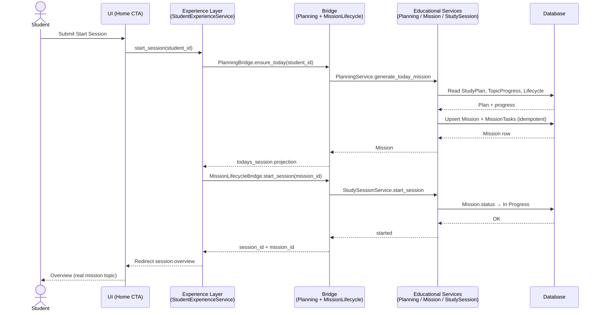
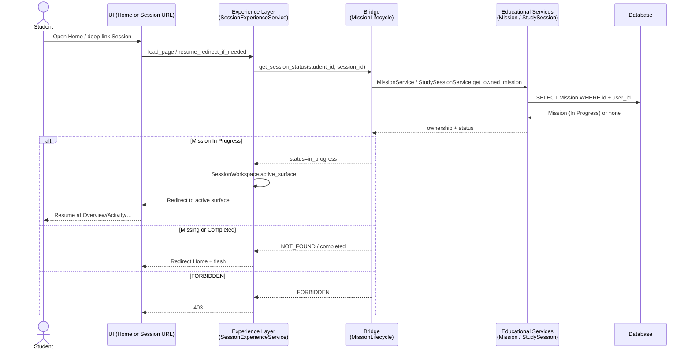
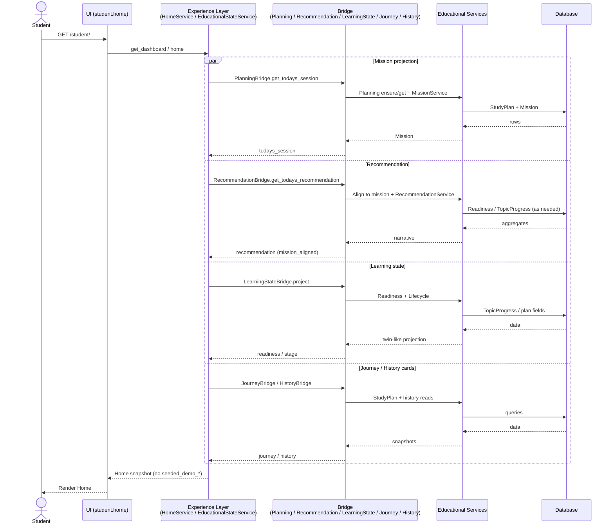

# MS-001 — Bridge Sequence Diagrams

**Milestone:** MS-001 — Foundational Trust  
**Directive:** Engineering Directive 002  
**Status:** Architecture Design  
**Parent:** `EDUCATIONAL_RUNTIME_BRIDGE.md`  
**Interfaces:** `BRIDGE_INTERFACE_SPECIFICATION.md`

All flows show: **UI → Experience Layer → Bridge → Educational Services → Database**.

---

## 1. Start Study

Primary path: Student Home CTA → Session Overview.



**Notes**

- No `seeded_demo_mission`.  
- If ensure/start fails closed → flash + stay Home.  
- SessionWorkspace open happens in Experience after redirect (UX), keyed to bridged `session_id`.

---

## 2. Resume Study

Student returns with an in-progress mission / open workspace.



**Notes**

- Workspace cannot invent a mission if SQL Mission is missing.  
- Durable store required for multi-worker resume of `active_surface` (migration phase).

---

## 3. Load Dashboard (Student Home)



**Notes**

- Parallel reads are logical; implementation may sequentialize.  
- Empty authentic state beats demo fabrication.

---

## 4. Complete Session

```mermaid
sequenceDiagram
    actor Student
    participant UI as UI (session.complete POST)
    participant Exp as Experience Layer<br/>(SessionExperienceService)
    participant Bridge as Bridge<br/>(MissionLifecycle + EvidenceParity)
    participant Edu as Educational Services<br/>(StudySession + Evidence + Adaptive)
    participant DB as Database

    Student->>UI: Finish session
    UI->>Exp: complete_session(session_id, outcome?)
    Exp->>Bridge: MissionLifecycleBridge.complete_session
    Bridge->>Bridge: EvidenceParityBridge.map_outcome
    Bridge->>Edu: StudySessionService.finish_session / record_practice_outcome
    Edu->>Edu: EducationalEvidenceAuthority gate
    alt Evidence accepted
        Edu->>DB: Mission Completed + StudyAttempt + TopicProgress
        DB-->>Edu: OK
        Edu-->>Bridge: educational_complete=true
        Bridge-->>Exp: success projection
        Exp->>Exp: Close SessionWorkspace
        Exp-->>UI: Redirect student.home
    else Evidence rejected / invalid
        Edu-->>Bridge: EVIDENCE_REJECTED / INVALID_STATE
        Bridge-->>Exp: failure
        Exp-->>UI: Flash + stay / guided fix
    else Transitional flag (pre–Bridge Complete)
        Bridge-->>Exp: UX complete, educational_complete=false
        Note over Bridge: Telemetry alarm; not allowed at Bridge Complete
    end
```

**Notes**

- Mastery writes only through Evidence Authority.  
- Orchestrator must not become a second mastery writer.

---

## 5. Recommendation Request

Triggered on Home load or explicit Adaptive port refresh.

```mermaid
sequenceDiagram
    actor Student
    participant UI as UI (Home recommendation card)
    participant Exp as Experience Layer<br/>(HomeService / Adaptive port consumer)
    participant Bridge as Bridge<br/>(RecommendationBridge)
    participant Edu as Educational Services<br/>(Planning mission + RecommendationService)
    participant DB as Database

    Student->>UI: View Home (or refresh)
    UI->>Exp: get_todays_recommendation(student_id)
    Exp->>Bridge: RecommendationBridge.get_todays_recommendation
    Bridge->>Edu: MissionService.get_today_mission / PlanningBridge cache
    Edu->>DB: Mission for user/date/plan
    DB-->>Edu: Mission or none
    alt Mission exists
        Bridge->>Edu: RecommendationService.generate_today_recommendation
        Edu->>DB: Readiness / weak topics / lifecycle
        DB-->>Edu: aggregates
        Edu-->>Bridge: recommendations list
        Bridge->>Bridge: Align primary label to mission topic
        Bridge-->>Exp: mission_aligned=true DTO
    else No mission
        Bridge->>Edu: RecommendationService (optional narrative)
        Edu->>DB: reads
        DB-->>Edu: data
        Edu-->>Bridge: empty or setup guidance
        Bridge-->>Exp: mission_aligned=false; CTA disabled
    end
    Exp-->>UI: Recommendation + explanation
    UI-->>Student: Card (same topic as Start Session when mission exists)
```

**Invariant:** When a mission exists, recommendation primary topic **equals** mission topic (AC-2).

---

## 6. Cross-flow identity map

```
ExperienceSessionId  ←→  MissionId (SQL)
StudentId            ←→  User.id
StudyPlanId          ←→  active StudyPlan
TopicProgress        ←→  mastery SoT (via Evidence)
SessionWorkspace     ←→  UX step only (not topic SoT)
```

---

## Stop condition

Sequence diagrams complete for Start Study, Resume Study, Load Dashboard, Complete Session, and Recommendation Request. **No production code.**
