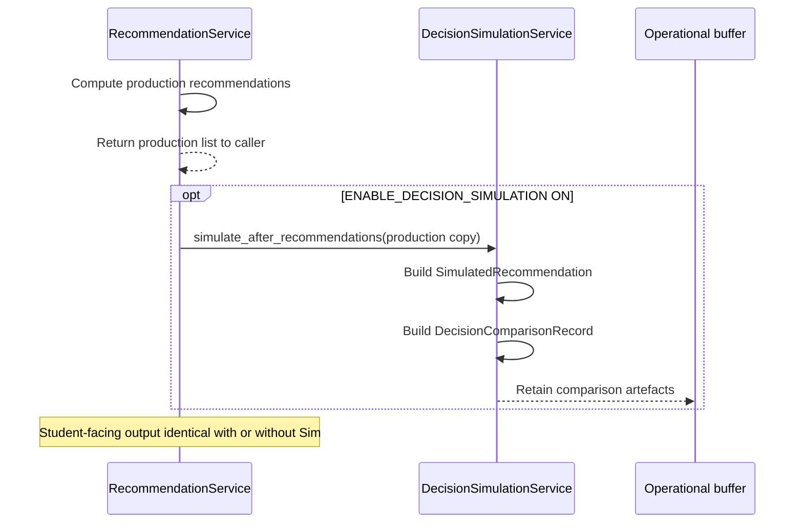

# Programme II — Advisory Decision Simulation Architecture

**Milestone:** P2-MS011 — Advisory Decision Simulation  
**Directive:** Engineering Directive 001 (Advisory Decision Simulation)  
**Status:** Implemented (framework / comparison only)  
**Package:** `app/infrastructure/adapters/decision_simulation/`  
**Service:** `DecisionSimulationService`  
**Runtime A hook:** `RecommendationService.generate_recommendations(..., simulation_service=)`  
**Feature flag:** `KWALITEC_DECISION_SIMULATION` → `ENABLE_DECISION_SIMULATION` (**default OFF**)  
**Contract version:** `p2.ms011.1` (`SIMULATION_VERSION`)  
**Companions:** `EVIDENCE_ADVISORY_ARCHITECTURE.md`, `RECOVERY_PLANNER_ARCHITECTURE.md`, `ADVISORY_EVALUATION_ARCHITECTURE.md`

---

## 0. Purpose

Introduce a **parallel simulation path** that evaluates how Runtime A recommendations would differ if advisory inputs were considered.

> Measure before modifying.  
> Understand before optimising.

| In scope | Out of scope |
|---|---|
| Immutable `DecisionSimulationContext` | Runtime recommendation changes |
| Immutable `SimulatedRecommendation` (`simulation_only=True`) | Student-facing differences |
| `DecisionSimulationService` | Adaptive behaviour |
| Immutable `DecisionComparisonRecord` | Recovery optimisation |
| `ENABLE_DECISION_SIMULATION` | Strategy changes / AI coaching |
| Explainable differences | Recommendation ranking updates |

**Stop condition:** Stop after the Decision Simulation Framework. Await architecture review before allowing advisory information to influence Runtime A decisions.

---

## 1. Components

| Component | Location | Responsibility | Non-responsibility |
|---|---|---|---|
| `DecisionSimulationContext` | `decision_simulation/contracts.py` | Freeze Runtime + advisory inputs | Ranking / optimisation |
| `SimulatedRecommendation` | `contracts.py` | Simulated output snapshot | Student-facing serve |
| `DecisionDifference` | `contracts.py` | Field-level explainable delta | Authority transfer |
| `DecisionComparisonRecord` | `contracts.py` | Operational comparison artefact | Persistence (this milestone) |
| `DecisionSimulationService` | `decision_simulation/service.py` | Parallel simulate + compare | Mutating Runtime outputs |
| `RecommendationService._run_decision_simulation` | `services/recommendation_service.py` | Post-production hook | Changing returned list |

---

## 2. Simulation lifecycle

```
Production RecommendationService.generate_recommendations
        │
        ├── (optional) Evidence Advisory injection — document only
        ├── (optional) Recovery injection — document only
        │
        ▼
immutable production recommendations  ← returned to student UNCHANGED
        │
        ▼ (optional, ENABLE_DECISION_SIMULATION)
DecisionSimulationService.simulate_after_recommendations
        │
        ├── DecisionSimulationContext (runtime_inputs + advisory snapshots)
        ├── SimulatedRecommendation (simulation_only=True)
        └── DecisionComparisonRecord (operational_only=True)
```

Structural mode for this milestone (`structural_mirror_with_advisory_annotation`):

1. Mirror production **priority** and **title**.
2. Annotate **rationale** with advisory sources considered (explainability).
3. Emit field-level `DecisionDifference` rows for any divergence.
4. Never rewrite the production recommendation list.

---

## 3. Authority boundaries



### Boundary rules

1. Educational authority remains exclusively within Runtime A.
2. Simulation **may** read production recommendations and advisory snapshots.
3. Simulation **must not** modify production recommendation outputs.
4. Simulated outputs are always `simulation_only=True`.
5. Comparison records are always `operational_only=True`.
6. Disabling `ENABLE_DECISION_SIMULATION` removes the parallel path immediately.

---

## 4. Comparison process

Each `DecisionComparisonRecord` contains:

| Field | Meaning |
|---|---|
| `production_recommendation` | Snapshot of Runtime A output |
| `simulated_recommendation` | Structural simulation with advisory annotation |
| `differences` | Explainable field deltas (`DecisionDifference`) |
| `advisory_sources_considered` | Evidence advisory / recovery candidate refs |

Provenance on every simulated recommendation records:

- simulation mode,
- service version,
- authority chain (`runtime_a` production vs `decision_simulation`),
- advisory / recovery ids considered.

---

## 5. Feature flags

| Environment | Resolved field | Default |
|---|---|---|
| `KWALITEC_DECISION_SIMULATION` | `ENABLE_DECISION_SIMULATION` | OFF |

| Simulation flag | Parallel path | Student-facing recommendations |
|---|---|---|
| OFF | Not wired | Unchanged |
| ON | `DecisionSimulationService` DI + optional hook | Unchanged |

Dual-run ops field: `DualRunStatus.decision_simulation`.

Independence: enabling/disabling this flag does not alter Recovery Planner, Evidence Advisory, Experience Feedback, Adaptive, Strategy, Twin, or Evidence Platform flags.

---

## 6. Rollback guarantees

1. **Flag OFF** → service not constructed; hook is a no-op when service is `None`.
2. **Simulation exceptions** are caught and logged at debug — production return path continues.
3. **No persistence** of comparison artefacts in this milestone (process-local buffer only).
4. **No student UX** surfaces consume `SimulatedRecommendation`.
5. Turning the flag off restores prior behaviour with zero dependence on simulation.

---

## 7. Future extension points

| Extension | Guidance |
|---|---|
| Advisory-informed ranking simulation | **Stop** — requires architecture review |
| Serving simulated recommendations | Forbidden until cutover review |
| Durable comparison store | Keep contracts stable; add persistence later |
| Adaptive / Strategy simulation consumers | Out of scope |

---

## 8. Tests

| Suite | Coverage |
|---|---|
| `tests/.../decision_simulation/test_contracts.py` | Immutability, `simulation_only`, comparison records |
| `tests/.../decision_simulation/test_service.py` | Service, determinism, flag isolation, DI |
| `tests/services/test_decision_simulation.py` | Production output unchanged, explainability |
| `tests/application/config/test_v2_flags.py` | Flag default OFF + dual-run field |

---

## 9. Explicit non-goals (binding)

- Runtime recommendation changes / student-facing differences
- Adaptive behaviour / Recovery optimisation / Strategy changes
- AI coaching / recommendation ranking updates
- Transfer of educational authority away from Runtime A
