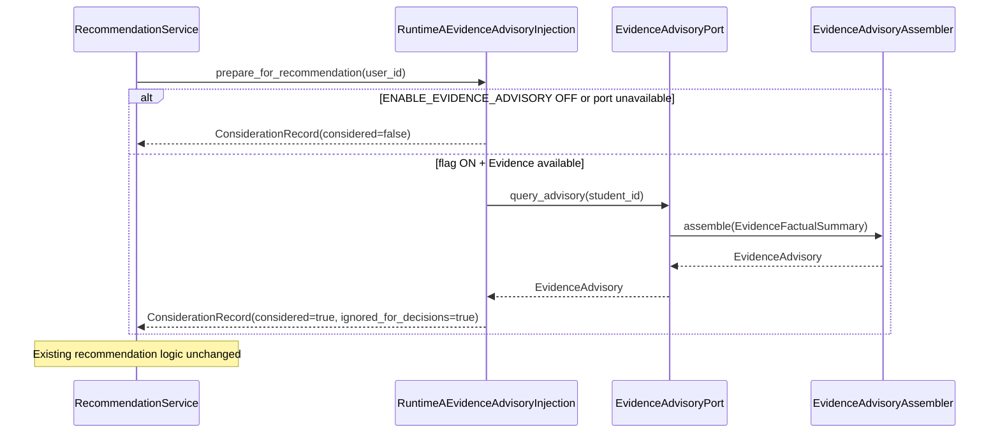

# Programme II — Evidence Advisory Layer Architecture

**Milestone:** P2-MS009 — Evidence Advisory Layer  
**Directive:** Engineering Directive 001 (Evidence Advisory Layer)  
**Status:** Implemented (integration point only)  
**Package:** `app/infrastructure/adapters/evidence_platform/` (+ Runtime A injection in `app/services/`)  
**Advisory surface:** `EvidenceAdvisoryPort.query_advisory`  
**Runtime A injection:** `RuntimeAEvidenceAdvisoryInjection`  
**Feature flag:** `KWALITEC_EVIDENCE_ADVISORY` → `ENABLE_EVIDENCE_ADVISORY` (**default OFF**)  
**Companion flags:** `KWALITEC_EVIDENCE_PLATFORM` (independently controllable; required for non-empty reads)  
**Contract version:** `p2.ms009.1` (`EVIDENCE_VERSION_ADVISORY`)  
**Companions:** `EXPERIENCE_FEEDBACK_ARCHITECTURE.md`, `LEARNING_EVIDENCE_PLATFORM_ARCHITECTURE.md`

---

## 0. Purpose

Introduce an advisory interface through which the Learning Evidence Platform can provide **factual, explainable advisory inputs** to Runtime A.

> Evidence answers: **"What has been observed?"**  
> Runtime A answers: **"What should the student do next?"**

| In scope | Out of scope |
|---|---|
| Immutable `EvidenceAdvisory` DTO | Recommendation behaviour changes |
| `EvidenceAdvisoryAssembler` | Adaptive / Strategy / Twin changes |
| Public `EvidenceAdvisoryPort` | Predictions / scoring / mastery |
| Runtime A injection point | AI coaching / automatic adaptation |
| Provenance on every field | Educational interpretation |
| `ENABLE_EVIDENCE_ADVISORY` | Authority transfer to Evidence |

**Stop condition:** Stop after establishing the Evidence Advisory Layer. Await architecture review before allowing advisory inputs to influence Runtime A decision-making.

---

## 1. Components

| Component | Location | Responsibility | Non-responsibility |
|---|---|---|---|
| `EvidenceAdvisory` | `evidence_platform/contracts.py` | Immutable advisory DTO | Recommendations, predictions |
| `ObservedPattern` / `EngagementSummary` / `ConsistencySummary` / `FactualConstraint` | `contracts.py` | Nested factual structures | Educational meaning |
| `EvidenceAdvisoryAssembler` | `evidence_platform/advisory_assembler.py` | Evidence read-model → advisory | Interpretation / scoring |
| `EvidenceAdvisoryPort` | `contracts.py` | Public Runtime A read contract | Repository access |
| `EvidencePlatformAdapter.query_advisory` | `adapter.py` | Port implementation | Educational writes |
| `RuntimeAEvidenceAdvisoryInjection` | `services/evidence_advisory_injection.py` | Read + document consideration | Ranking / selection changes |
| `RecommendationService.generate_recommendations(..., advisory_injection=)` | `services/recommendation_service.py` | Optional injection hook | Behavioural change from advisory |

---

## 2. Advisory lifecycle

```
EvidenceRecords (from prior Experience Observation / collection intake)
        │
        ▼
EvidencePlatformAdapter.query_factual_summary   ← factual counts only
        │
        ▼
immutable EvidenceFactualSummary
        │
        ▼
EvidenceAdvisoryAssembler.assemble
        │
        ▼
immutable EvidenceAdvisory (+ field provenance + period source text)
        │
        ▼
EvidenceAdvisoryPort.query_advisory
        │
        ▼
RuntimeAEvidenceAdvisoryInjection.prepare_for_recommendation
        │
        ├── documents AdvisoryConsiderationRecord (explainability)
        └── ignores advisory for decisions (this milestone)
```

Observations enter Evidence through the existing public intake (`collect_event`).  
Advisory reads reuse the process-local observational buffer (same as P2-MS008 factual reads). Callers may also supply explicit `evidence_records`.

---

## 3. Runtime A integration boundary



### Boundary rules

1. Runtime A consumes **only** `EvidenceAdvisoryPort` — no repository / collector / aggregator bypass.
2. Runtime A **may** read advisory inputs.
3. Runtime A **may** ignore advisory inputs.
4. Runtime A **must** document any advisory data it consumes (`AdvisoryConsiderationRecord`).
5. Runtime A remains **solely** responsible for recommendations.
6. This milestone: `ignored_for_decisions=True` always — integration point only.

---

## 4. Provenance model

Every advisory field retains traceable provenance.

| Field | Provenance |
|---|---|
| `advisory_id` | Deterministic hash of material factual fields (`evadv-…`) |
| `reporting_period` | Copied from Evidence factual summary |
| `observed_patterns` | Event tallies from factual summary + period source description |
| `engagement_summary` | Mission / session / reflection counts from factual summary |
| `consistency_summary` | `active_streak` from factual summary |
| `factual_constraints` | Explicit absences / empty-window statements (factual only) |
| `provenance` | Assembler version, evidence summary id, evidence refs, field-level source text |
| `generated_at` | Caller `as_of` or latest retained observation timestamp |
| `source_description` | Period-aware human text, e.g. *"Derived from recorded study activity between 1–7 August."* |

Authority chain:

1. Evidence Platform owns factual advisory content (`authority=evidence_platform`).
2. Runtime A owns educational decisions (`authority=runtime_a`).
3. Consideration records document what Runtime A read without transferring authority.

---

## 5. Authority model

| Layer | Authority | May | Must not |
|---|---|---|---|
| Evidence Platform | Observational facts | Aggregate recorded activity into advisory DTOs | Recommend, predict, infer mastery, write Runtime A |
| Runtime A | Educational decisions | Read / ignore advisory; document consideration | Treat Evidence as decision authority |
| Adaptive / Strategy / Twin | Unchanged | — | Consume this advisory surface in this milestone |

**Invariant:** Educational authority remains exclusively within Runtime A.

---

## 6. Feature flags

| Environment | Resolved field | Default |
|---|---|---|
| `KWALITEC_EVIDENCE_ADVISORY` | `ENABLE_EVIDENCE_ADVISORY` | OFF |
| `KWALITEC_EVIDENCE_PLATFORM` | `ENABLE_EVIDENCE_PLATFORM` | OFF (required for non-empty advisory reads) |

Behaviour matrix:

| Advisory | Evidence | Runtime A injection | Decision behaviour |
|---|---|---|---|
| OFF | * | Not wired | Unchanged |
| ON | OFF | Wired; port None / empty reads | Unchanged |
| ON | ON | Wired to Evidence adapter | Unchanged (documented only) |

Dual-run ops field: `DualRunStatus.evidence_advisory`.

Independence: enabling/disabling `ENABLE_EVIDENCE_ADVISORY` does not alter Experience Feedback, Observation, Diagnostics, Unified Journey, Adaptive, Strategy, Twin, or Evidence Platform flags.

---

## 7. Future extension points

| Extension | Guidance |
|---|---|
| Advisory-informed ranking | **Stop** — requires architecture review before any decision influence |
| Durable Evidence store | Keep `EvidenceAdvisoryPort` stable; swap buffer for persistence-backed reads |
| Richer factual constraints | Extend assembler from factual summaries only — no interpretation |
| Adaptive / Strategy consumption | Out of scope — Runtime A remains the sole advisory consumer for now |
| Predictions / mastery / coaching | Forbidden |

---

## 8. Tests

| Suite | Coverage |
|---|---|
| `tests/.../evidence_platform/test_advisory_contracts.py` | Immutability, required fields, no recommendation fields |
| `tests/.../evidence_platform/test_advisory_assembler.py` | Mapping, provenance, period source text, determinism |
| `tests/.../evidence_platform/test_advisory_port.py` | Port implementation, DI, flag isolation |
| `tests/services/test_evidence_advisory_injection.py` | Injection, provenance, recommendation output unchanged |
| `tests/application/config/test_v2_flags.py` | Flag default OFF + dual-run field |

---

## 9. Explicit non-goals (binding)

- Recommendation changes / Runtime A behavioural changes
- Adaptive Engine / Strategy Engine / Digital Twin changes
- New scoring / predictions / AI coaching / automatic adaptation
- Treating Evidence advisory as educational authority
- Bypassing `EvidenceAdvisoryPort` from Runtime A
