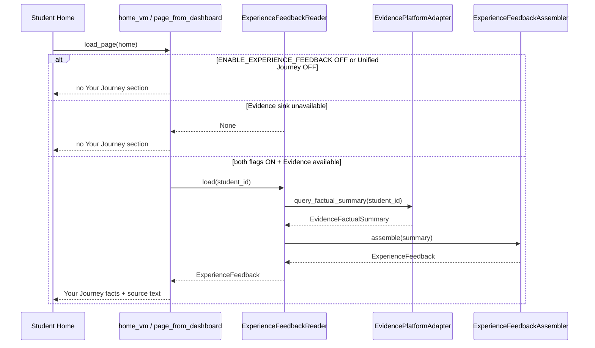

# Programme II — Experience Feedback Loop Architecture

**Milestone:** P2-MS008 — Experience Feedback Loop  
**Directive:** Engineering Directive 001 (Experience Feedback Loop)  
**Status:** Implemented  
**Package:** `app/infrastructure/adapters/experience_feedback/`  
**Evidence read surface:** `EvidenceReadPort.query_factual_summary`  
**Feature flag:** `KWALITEC_EXPERIENCE_FEEDBACK` → `ENABLE_EXPERIENCE_FEEDBACK` (**default OFF**)  
**Companion flags:** `KWALITEC_UNIFIED_JOURNEY`, `KWALITEC_EVIDENCE_PLATFORM` (independently controllable)  
**Contract version:** `p2.ms008.1`  
**Companions:** `EXPERIENCE_OBSERVATION_ARCHITECTURE.md`, `UNIFIED_STUDENT_JOURNEY_ARCHITECTURE.md`, `LEARNING_EVIDENCE_PLATFORM_ARCHITECTURE.md`

---

## 0. Purpose

Close the end-to-end experience loop by surfacing **previously observed, non-interpretive facts** from the Learning Evidence Platform back into the Experience Layer.

> The platform reports facts.  
> It does not yet draw conclusions.

| In scope | Out of scope |
|---|---|
| Immutable `ExperienceFeedback` DTO | Educational adaptation |
| `ExperienceFeedbackAssembler` | Recommendation changes |
| Evidence public read integration | Behavioural optimisation |
| Home "Your Journey" factual display | Runtime A / Strategy / Adaptive / Twin changes |
| Explainability source descriptions | Evidence scoring / predictive analytics |
| `ENABLE_EXPERIENCE_FEEDBACK` | AI coaching / gamification / notifications |

**Stop condition:** Stop after the Experience Feedback Loop. Await architecture review before introducing any Evidence-informed behavioural adaptation.

**Related (do not confuse):** EP-003.4 Learning Feedback (`LEARNING_FEEDBACK_ARCHITECTURE.md`) records Runtime A plan / recommendation / study **interaction** evidence. It is also record-only and does not authorise adaptation. Experience Feedback remains the Home factual **display** loop from Evidence counts.

---

## 1. Components

| Component | Location | Responsibility | Non-responsibility |
|---|---|---|---|
| `EvidenceFactualSummary` | `evidence_platform/contracts.py` | Immutable Evidence read-model | Interpretation, scoring |
| `EvidenceReadPort` | `evidence_platform/contracts.py` | Public factual query contract | Repository access |
| `build_factual_summary` | `evidence_platform/factual_query.py` | Count delivery events → summary | Educational meaning |
| `ExperienceFeedback` | `experience_feedback/contracts.py` | Immutable Experience DTO | Adaptation |
| `ExperienceFeedbackAssembler` | `experience_feedback/assembler.py` | Map Evidence → presentation facts | New metric calculation |
| `ExperienceFeedbackReader` | `experience_feedback/reader.py` | Flag-gated Evidence read → feedback | Direct collector / repo access |
| Home projection | `presentation/student/view_models.py` + `home.html` | "Your Journey" display | Mission prioritisation |

---

## 2. Read lifecycle

```
EvidenceRecords (from prior Experience Observation intake)
        │
        ▼
EvidencePlatformAdapter.query_factual_summary   ← public EvidenceReadPort only
        │
        ▼
immutable EvidenceFactualSummary
        │
        ▼
ExperienceFeedbackAssembler.assemble
        │
        ▼
immutable ExperienceFeedback (+ presentation facts + source descriptions)
        │
        ▼
Home "Your Journey" (when ENABLE_UNIFIED_JOURNEY + ENABLE_EXPERIENCE_FEEDBACK)
```

Observations enter Evidence through the existing public intake (`collect_event`).  
This milestone adds a **process-local observational buffer** on the Evidence adapter so reads can return previously collected facts without repositories or durable persistence.

Callers may also supply explicit `evidence_records` to `query_factual_summary` (tests / future persistence adapters).

---

## 3. Experience feedback pipeline



---

## 4. Provenance model

| Field | Source |
|---|---|
| `evidence_summary_id` | Evidence `EvidenceFactualSummary.summary_id` |
| `evidence_refs` | Evidence record ids counted in the reporting window |
| `provenance.evidence_provenance` | Evidence factual query provenance (counting rules, record_count) |
| `provenance.via` | `experience_feedback_assembler` |
| `feedback_id` | Deterministic hash of factual material fields (`expfb-…`) |

Authority chain:

1. Evidence Platform owns factual counts (`authority=evidence_platform`).
2. Experience Feedback maps those counts for display (`authority=experience_feedback`).
3. Home never invents or re-scores values.

---

## 5. Explainability requirements

Every displayed fact includes a source description, defaulting to:

> Based on your recorded study activity.

Rules:

- No opaque statistics or composite scores.
- No mastery / readiness / recommendation language in feedback facts.
- Period label (e.g. "This week") is presentation framing only — counts remain Evidence facts.

---

## 6. Counting rules (Evidence authority)

| Feedback field | Evidence event tally |
|---|---|
| `completed_missions` | `session_completed` in reporting window |
| `study_sessions` | `session_completed` in reporting window |
| `completed_reflections` | `reflection_completed` in reporting window |
| `active_streak` | Consecutive calendar days ending at `as_of` / latest observed day with ≥1 `session_completed` |

ExperienceFeedbackAssembler **copies** these integers and formats labels. It must not recalculate streak or invent educational meaning.

---

## 7. Feature flags

| Environment | Resolved field | Default |
|---|---|---|
| `KWALITEC_EXPERIENCE_FEEDBACK` | `ENABLE_EXPERIENCE_FEEDBACK` | OFF |
| `KWALITEC_UNIFIED_JOURNEY` | `ENABLE_UNIFIED_JOURNEY` | OFF (required for Home display) |
| `KWALITEC_EVIDENCE_PLATFORM` | `ENABLE_EVIDENCE_PLATFORM` | OFF (required for non-empty reads) |

Behaviour matrix:

| Feedback | Unified Journey | Evidence | Home "Your Journey" |
|---|---|---|---|
| OFF | * | * | Hidden |
| ON | OFF | * | Hidden |
| ON | ON | OFF | Hidden (reader has no sink) |
| ON | ON | ON | Shown (facts from Evidence read) |

Dual-run ops field: `DualRunStatus.experience_feedback`.

---

## 8. Home integration

When Unified Journey is enabled and feedback loads successfully, Home renders a small **Your Journey** section **beneath the Daily Mission** (hero) and above the secondary readiness/coach panels.

Displayed lines:

- Missions completed this week
- Study sessions completed
- Reflection consistency
- Current study streak

Mission prioritisation, recommendation cards, and CTAs are **unchanged**.

---

## 9. Extension points

| Extension | Guidance |
|---|---|
| Durable Evidence store | Replace process-local buffer with a persistence-backed `EvidenceReadPort` implementation — keep public contract stable |
| Additional factual counters | Extend Evidence factual query counting rules first; Assembler only maps |
| Richer period filters | Expand Evidence reporting periods; do not invent period maths in Experience |
| Evidence-informed adaptation | **Stop** — await architecture review (explicitly out of scope) |
| Notifications / gamification | Forbidden in this milestone |

---

## 10. Tests

| Suite | Coverage |
|---|---|
| `tests/.../experience_feedback/test_contracts.py` | Immutability, required fields, deterministic ids |
| `tests/.../experience_feedback/test_assembler.py` | Mapping, explainability, provenance, no new metrics |
| `tests/.../experience_feedback/test_reader.py` | Evidence read integration, flag isolation, DI |
| `tests/.../experience_feedback/test_home.py` | Home rendering, explainability text, recommendation unchanged |
| `tests/application/config/test_v2_flags.py` | Flag default OFF + dual-run field |

---

## 11. Explicit non-goals (binding)

- Recommendation changes / Adaptive behaviour / Runtime A modifications
- Strategy / Digital Twin modifications
- Evidence scoring / predictive analytics
- AI-generated coaching / gamification / notifications
- Bypassing Evidence public contracts or accessing repositories from Experience
