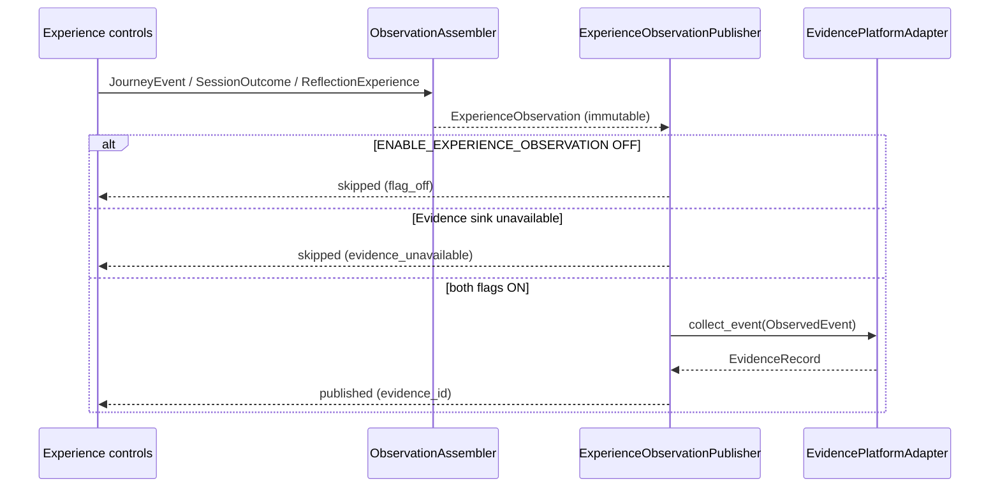

# Programme II — Experience Observation Bridge Architecture

**Milestone:** P2-MS006 — Experience Observation Bridge  
**Directive:** Engineering Directive 001 (Experience Observation Bridge)  
**Status:** Implemented  
**Package:** `app/infrastructure/adapters/experience_observation/`  
**Feature flag:** `KWALITEC_EXPERIENCE_OBSERVATION` → `ENABLE_EXPERIENCE_OBSERVATION` (**default OFF**)  
**Companion flag:** `KWALITEC_EVIDENCE_PLATFORM` → `ENABLE_EVIDENCE_PLATFORM` (**default OFF**, independently controllable)  
**Contract version:** `p2.ms006.1`  
**Companions:** `UNIFIED_STUDENT_JOURNEY_ARCHITECTURE.md`, `LEARNING_EVIDENCE_PLATFORM_ARCHITECTURE.md`

---

## 0. Purpose

Introduce a **one-way observation bridge** from the Experience Layer to the Learning Evidence Platform.

> Experience reports what happened.  
> Evidence decides what it means.

This milestone connects Experience to Evidence through **immutable observation contracts only**.

| In scope | Out of scope |
|---|---|
| Immutable `ExperienceObservation` DTO | Educational interpretation |
| `ObservationAssembler` (factual translation) | Recommendation generation |
| `ExperienceObservationPublisher` | Authority changes / UX cutover |
| Evidence public intake integration | Evidence scoring / analytics |
| Feature-flag isolation | Persistence / repositories |
| Journey presentation event mapping | Runtime A / Adaptive / Strategy / Twin changes |

**Stop condition:** Stop after the Experience Observation Bridge. Await architecture review before enabling Evidence-driven behavioural adaptation.

---

## 1. Components

| Component | Location | Responsibility | Non-responsibility |
|---|---|---|---|
| `ExperienceObservation` | `contracts.py` | Immutable factual observation | Educational conclusions |
| `ObservationAssembler` | `assembler.py` | JourneyEvent / SessionOutcome / ReflectionExperience → observation | Interpretation, enrichment |
| `observation_to_observed_event` | `evidence_mapper.py` | Observation → Evidence `ObservedEvent` | Scoring, claim elevation |
| `ExperienceObservationPublisher` | `publisher.py` | Publish via Evidence public API | Persistence, direct repository access |
| DI helper | `build_experience_observation_publisher` | Construct when flag ON | Auto-wiring into UX controls |

---

## 2. Observation lifecycle

```
JourneyEvent | SessionOutcome | ReflectionExperience
        │
        ▼
ObservationAssembler.assemble_from_*  (factual projection only)
        │
        ▼
immutable ExperienceObservation
        │
        ▼
ExperienceObservationPublisher.publish
        │
        ├─ flag OFF              → skip (REASON_FLAG_OFF)
        ├─ event not observable  → skip (REASON_NOT_OBSERVABLE)
        ├─ Evidence sink None    → skip (REASON_EVIDENCE_UNAVAILABLE)
        │
        ▼
observation_to_observed_event
        │
        ▼
EvidenceObservationPort.collect_event   ← public Evidence interface only
        │
        ▼
immutable EvidenceRecord (Evidence authority)
```

Observations are assembled with an explicit `timestamp` (no wall-clock invent).  
`observation_id` is a deterministic hash of material factual fields.

---

## 3. Publisher responsibilities

The publisher:

1. Accepts an already-assembled `ExperienceObservation`, or assembles one from Journey / Session / Reflection artefacts.
2. Respects `ENABLE_EXPERIENCE_OBSERVATION`.
3. Forwards only through Evidence’s public observation interface (`collect_event` on `EvidencePlatformAdapter` / `EvidenceObservationPort`).
4. Returns an immutable `ObservationPublishResult` (`published` / `skipped` / `failed`).
5. Never raises into Experience control flows on Evidence intake failure (failures are captured as `failed` results).

The publisher **does not**:

- write to persistence / repositories
- call Evidence collector / factory / assembler internals
- interpret mastery, scores, or learning outcomes
- mutate Runtime A, Twin, Adaptive, Strategy, or Experience educational state
- generate recommendations or student feedback

---

## 4. Experience → Evidence sequence



Mapped presentation events (directive §6):

| Experience event | Journey stage (typical) |
|---|---|
| `mission_started` | `daily_mission` |
| `session_started` | `study_session` |
| `session_completed` | `study_session` |
| `reflection_started` | `session_reflection` |
| `reflection_completed` | `session_reflection` |
| `reflection_skipped` | `session_reflection` |

Other JourneyEvent types (e.g. `wrap_up_started`, `weekly_review_available`) may be assembled but are **not published** (`REASON_NOT_OBSERVABLE`).

---

## 5. Authority boundaries

| Layer | Authority | Role in this bridge |
|---|---|---|
| Experience | Presentation / journey orchestration | Emits factual observations only |
| Observation Bridge | Transport / projection | No educational authority |
| Evidence Platform | Observational measurement | Receives observations; decides meaning later |

Invariants:

- No educational authority crosses layers.
- Evidence intake uses claim boundary `organisation` and evidence class `DELIVERY_EVENT` — presentation delivery facts, not learning-depth claims.
- Experience DTOs remain the presentation boundary; Evidence never writes back into Experience UX authority in this milestone.
- `ENABLE_EXPERIENCE_OBSERVATION` and `ENABLE_EVIDENCE_PLATFORM` remain **independently controllable**.

---

## 6. Feature flags

| Environment | Resolved field | Default |
|---|---|---|
| `KWALITEC_EXPERIENCE_OBSERVATION` | `ENABLE_EXPERIENCE_OBSERVATION` | OFF |
| `KWALITEC_EVIDENCE_PLATFORM` | `ENABLE_EVIDENCE_PLATFORM` | OFF |

Behaviour matrix:

| Observation | Evidence | Publisher constructed? | Publish result |
|---|---|---|---|
| OFF | * | No (`None`) | N/A |
| ON | OFF | Yes (sink `None`) | `skipped` / `evidence_unavailable` |
| ON | ON | Yes (Evidence injected) | `published` on success |

Dual-run ops field: `DualRunStatus.experience_observation`.

---

## 7. Failure handling

| Condition | Status | Reason code |
|---|---|---|
| Observation flag OFF | `skipped` | `experience_observation_flag_off` |
| Event outside observable set | `skipped` | `experience_event_not_observable` |
| Evidence port not injected | `skipped` | `evidence_platform_unavailable` |
| Evidence intake raises | `failed` | `evidence_intake_rejected` |
| Successful `collect_event` | `published` | — |

Failures are logged at warning level and returned as structured results. Experience presentation continues unaffected.

---

## 8. Extension points

| Extension | Guidance |
|---|---|
| Wire into session / reflection controls | Call `publisher.publish_journey_event(result.event, …)` **after** pure controls return — keep controls free of Evidence imports |
| Additional JourneyEvent types | Expand `OBSERVABLE_EXPERIENCE_EVENTS` explicitly; do not silently publish everything |
| Correlation propagation | Pass `correlation_id` explicitly or rely on `CorrelationContext` |
| Evidence-driven adaptation | **Stop** — await architecture review (out of scope for P2-MS006) |
| Persistence of observations | Belongs to a future Evidence persistence milestone — not this bridge |
| Elevating claim boundaries | Forbidden here — keep `organisation` / delivery facts |

---

## 9. Composition / DI

`build_production_experience()` constructs the publisher when `ENABLE_EXPERIENCE_OBSERVATION` is ON and injects `composition.evidence_platform` as the Evidence sink (may be `None`).

```python
experience_observation = build_experience_observation_publisher(
    enabled=True,
    evidence=evidence_platform,  # EvidenceObservationPort | None
)
```

Dependency injection is supported for tests and custom wiring:

- `evidence: EvidenceObservationPort | None`
- `assembler: ObservationAssembler | None`

---

## 10. Tests

| Suite | Coverage |
|---|---|
| `tests/.../experience_observation/test_contracts.py` | Immutability, required fields, deterministic ids |
| `tests/.../experience_observation/test_assembler.py` | Journey / Session / Reflection assembly; no educational fields |
| `tests/.../experience_observation/test_publisher.py` | Publisher behaviour, flag isolation, Evidence integration, DI |

---

## 11. Explicit non-goals (binding)

- Educational interpretation
- Runtime A changes
- Strategy / Adaptive / Digital Twin changes
- Evidence scoring / analytics
- Persistence
- Recommendation updates
- Student feedback generation
- Evidence-driven behavioural adaptation
