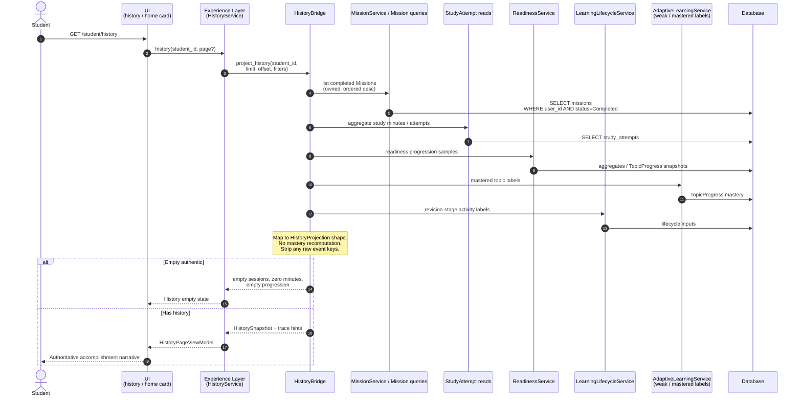
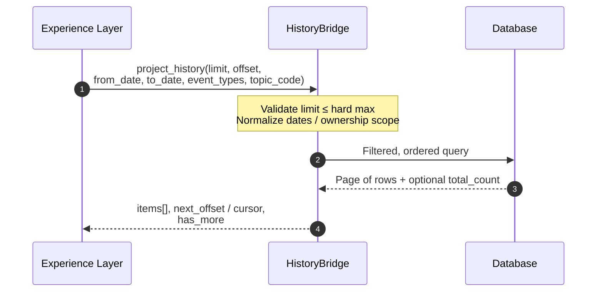
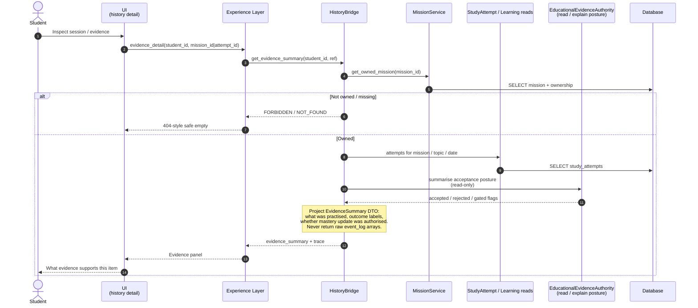

# MS-002 — History Sequence Diagrams

**Milestone:** MS-002 — Educational Continuity  
**Directive:** Engineering Directive 001 / 003  
**Status:** Architecture Design; **History Read Bridge (J2) — Implemented**  
**Parent:** `EDUCATIONAL_JOURNEY_ARCHITECTURE.md`  
**Companion:** `JOURNEY_SEQUENCE_DIAGRAM.md`

---

## Conventions

Layer order in every diagram:

**UI → Experience Layer → Bridge → Educational Services → Database**

| Participant | Meaning |
|---|---|
| UI | History templates / Home history card |
| Exp | `HistoryService` / Twin insights consumer |
| Bridge | `HistoryAdapter` (`HistoryBridge`) |
| Services | Runtime A: Mission, StudyAttempt / Evidence, Readiness, Lifecycle |
| DB | SQLAlchemy models |

Bridges are **read-only**. History never surfaces raw event dumps (`events` / `raw_events` / `event_log`).

---

## 1. Load History

Student opens History page (or Home loads history card).

### Pagination / filter application

### Notes

- When `ENABLE_HISTORY_BRIDGE` is off, HistoryService may still read Twin demo insights — not shown.  
- Home card uses `limit` small (e.g. 3–5 sessions) against the same Bridge.  
- Failure: empty authentic + telemetry; never fabricate sessions.

---

## 2. Inspect Evidence

Student opens a History item to see supporting educational evidence (attempt / acceptance), without dumping raw logs.

### Notes

- Inspect is **read-only**. It must not re-run Evidence Authority writes or “repair” mastery.  
- If evidence cannot be summarised, return honest empty / `unavailable` — do not invent correctness scores.  
- Pair with Journey “View Recommendation Change” when the same `event_id` carries recommendation delta (see `JOURNEY_SEQUENCE_DIAGRAM.md` §2).

---

## 3. Cross-reference

| Flow | Location |
|---|---|
| Load Journey | `JOURNEY_SEQUENCE_DIAGRAM.md` §1 |
| View Recommendation Change | `JOURNEY_SEQUENCE_DIAGRAM.md` §2 |
| Load History | This file §1 |
| Inspect Evidence | This file §2 |

---

## Stop condition

Diagrams are design artefacts only. Do not implement adapters from this document alone.
