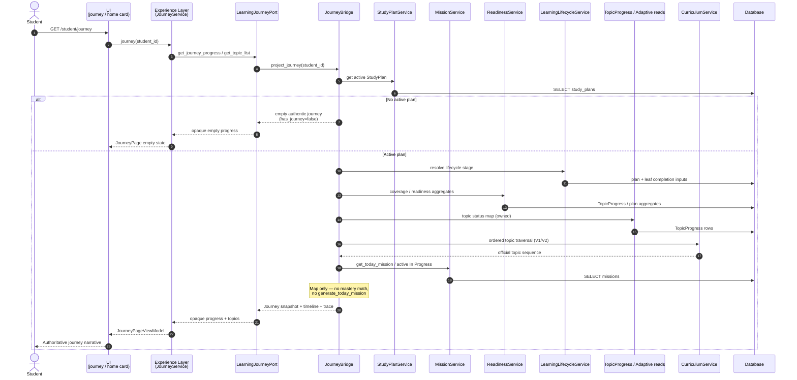
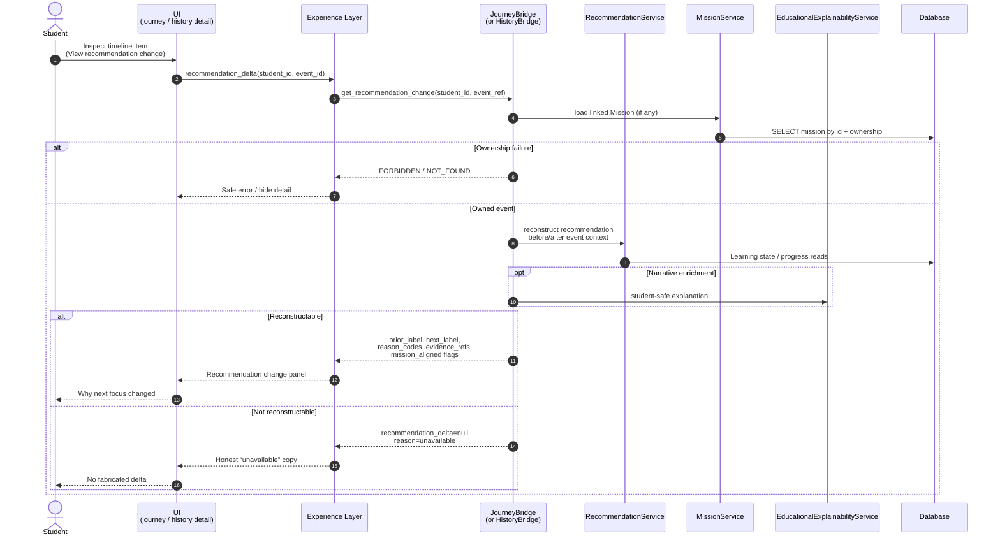

# MS-002 — Journey Sequence Diagrams

**Milestone:** MS-002 — Educational Continuity  
**Directive:** Engineering Directive 001  
**Status:** Architecture Design  
**Parent:** `EDUCATIONAL_JOURNEY_ARCHITECTURE.md`  
**Companion:** `HISTORY_SEQUENCE_DIAGRAM.md`

---

## Conventions

Layer order in every diagram:

**UI → Experience Layer → Bridge → Educational Services → Database**

| Participant | Meaning |
|---|---|
| UI | Journey templates / Home journey card |
| Exp | `JourneyService` / `StudentExperienceService` |
| Port | `LearningJourneyPort` |
| Bridge | `JourneyAdapter` (`JourneyBridge`) |
| Services | Runtime A: StudyPlan, Mission, TopicProgress/Readiness, Lifecycle, Recommendation |
| DB | SQLAlchemy models / Curriculum JSON |

Bridges are **read-only**. No educational writes appear in these flows.

---

## 1. Load Journey

Student opens Journey page (or Home loads journey card snippet).

### Notes

- When `ENABLE_JOURNEY_BRIDGE` is off, Port uses prior Experience projection path (demo/seed possible) — not shown.  
- Failure (`UNAVAILABLE`, `FORBIDDEN`): Bridge returns empty authentic + telemetry; never `seeded_demo_journey`.  
- Home card uses the same Bridge method with a snippet field subset (no second SoT).

---

## 2. View Recommendation Change

Student inspects a Journey (or History) timeline item that claims a recommendation delta — “what changed in my next focus because of this event?”

### Notes

- Bridge **never recalculates** a new authoritative recommendation for “today” as a side effect of inspect (that remains Recommendation Read Bridge / RecommendationService on Home).  
- Reconstructability policy is ADR-MS002-003 territory: prefer explicit `unavailable` over invention.  
- Trace fields on the timeline item should already carry `prior_recommendation_id` / `next_recommendation_id` when known at projection time.

---

## 3. Cross-reference

| Flow | Location |
|---|---|
| Load History | `HISTORY_SEQUENCE_DIAGRAM.md` §1 |
| Inspect Evidence | `HISTORY_SEQUENCE_DIAGRAM.md` §2 |
| Load Journey | This file §1 |
| View Recommendation Change | This file §2 |

---

## Stop condition

Diagrams are design artefacts only. Do not implement adapters from this document alone.
