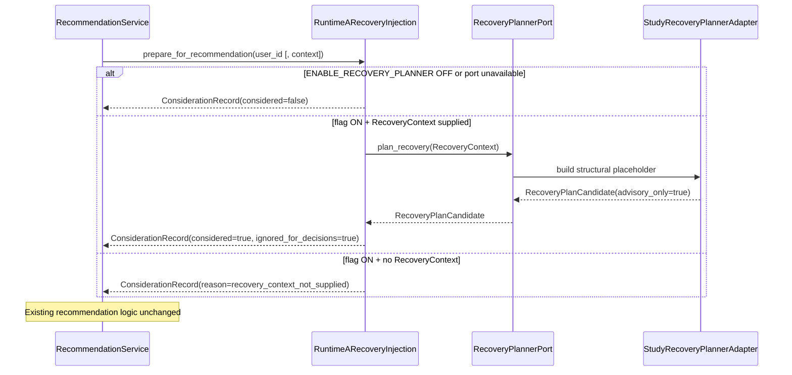

# Programme II — Study Recovery Planner Architecture

**Milestone:** P2-MS010 — Study Recovery Engine  
**Directive:** Engineering Directive 001 (Study Recovery Engine)  
**Status:** Implemented (architecture / advisory capability only)  
**Package:** `app/infrastructure/adapters/recovery_planner/` (+ Runtime A injection in `app/services/`)  
**Public surface:** `RecoveryPlannerPort.plan_recovery`  
**Runtime A injection:** `RuntimeARecoveryInjection`  
**Feature flag:** `KWALITEC_RECOVERY_PLANNER` → `ENABLE_RECOVERY_PLANNER` (**default OFF**)  
**Contract version:** `p2.ms010.1` (`RECOVERY_VERSION`)  
**Companions:** `EVIDENCE_ADVISORY_ARCHITECTURE.md`, `LEARNING_STRATEGY_ENGINE_ARCHITECTURE.md`

---

## 0. Purpose

Introduce a Recovery Planning capability that enables Runtime A to request recovery options after detected study disruption while preserving existing authority boundaries.

This is the first Educational Optimisation milestone. It establishes the **architecture** for recovery planning **without** altering recommendation behaviour.

> Recovery answers: **"What disruption facts are known, and what structural recovery options exist as advisory placeholders?"**  
> Runtime A answers: **"What should the student do next?"**

| In scope | Out of scope |
|---|---|
| Immutable `RecoveryContext` DTO | Recovery algorithms |
| Immutable `RecoveryPlanCandidate` DTO | Schedule optimisation |
| Public `RecoveryPlannerPort` | Recommendation behaviour changes |
| Runtime A injection point | Runtime A behavioural changes |
| Provenance on every candidate | Adaptive / Strategy / Twin changes |
| `ENABLE_RECOVERY_PLANNER` | Evidence scoring / AI coaching |
| All candidates `advisory_only=True` | Authority transfer away from Runtime A |

**Stop condition:** Stop after establishing the Recovery Planning architecture. Await architecture review before allowing recovery planning to influence educational decisions.

**Naming note:** Strategy Engine's internal `RecoveryPlanner` (MS-005 intervention advice) is a separate concern. This package owns Educational Optimisation recovery planning for Runtime A via `RecoveryPlannerPort`.

---

## 1. Components

| Component | Location | Responsibility | Non-responsibility |
|---|---|---|---|
| `RecoveryContext` | `recovery_planner/contracts.py` | Immutable factual disruption context | Recommendations / optimisation |
| `DisruptionSummary` / `MissedSessionFact` / `StudyCapacityFact` | `contracts.py` | Nested factual structures | Educational meaning |
| `RecoveryPlanCandidate` | `contracts.py` | Immutable advisory placeholder | Decision authority |
| `StudyRecoveryPlannerAdapter` | `recovery_planner/adapter.py` | Port implementation (structural placeholder) | Algorithms / schedule writes |
| `RecoveryPlannerPort` | `contracts.py` | Public Runtime A planning contract | Repository access |
| `RuntimeARecoveryInjection` | `services/recovery_injection.py` | Read + document consideration | Ranking / selection changes |
| `RecommendationService.generate_recommendations(..., recovery_injection=)` | `services/recommendation_service.py` | Optional injection hook | Behavioural change from recovery |

---

## 2. Recovery lifecycle

```
Detected study disruption (caller-assembled factual inputs)
        │
        ▼
immutable RecoveryContext
  (recovery_id, reporting_period, disruption_summary,
   missed_sessions, available_study_capacity,
   current_plan_version, evidence_provenance, generated_at)
        │
        ▼
RecoveryPlannerPort.plan_recovery
        │
        ▼
StudyRecoveryPlannerAdapter (structural placeholder only)
        │
        ▼
immutable RecoveryPlanCandidate
  (candidate_id, strategy_type=structural_placeholder,
   affected_period, rationale, provenance, advisory_only=True)
        │
        ▼
RuntimeARecoveryInjection.prepare_for_recommendation / plan_recovery
        │
        ├── documents RecoveryConsiderationRecord (explainability)
        └── ignores candidate for decisions (this milestone)
```

No optimisation loop runs. The adapter returns a deterministic structural placeholder derived from factual context fields.

---

## 3. Runtime A integration boundary



### Boundary rules

1. Runtime A consumes **only** `RecoveryPlannerPort` — no adapter-internal bypass.
2. Runtime A **may** retrieve `RecoveryPlanCandidate` objects.
3. Runtime A **must ignore** them in this milestone.
4. Runtime A **must** document any recovery data it consumes (`RecoveryConsiderationRecord`).
5. Runtime A remains **solely** responsible for recommendations / educational decisions.
6. This milestone: `ignored_for_decisions=True` and `advisory_only=True` always — architecture only.

Injection sits **alongside** the Evidence Advisory injection (`advisory_injection`). Both are optional, independent, and non-authoritative.

---

## 4. Provenance model

Every recovery candidate retains traceable provenance.

| Field | Provenance |
|---|---|
| `candidate_id` | Deterministic hash of material `RecoveryContext` fields (`rcv-cand-…`) |
| `recovery_id` | Copied from context (or deterministic `rcv-…` when omitted) |
| `affected_period` | Copied from `RecoveryContext.reporting_period` |
| `strategy_type` | Fixed `structural_placeholder` for P2-MS010 |
| `rationale` | Explicit placeholder text stating no algorithm ran |
| `provenance` | Adapter version, evidence provenance copy, missed session refs, field-level source text |
| `advisory_only` | Forced `True` in `__post_init__` |
| `generated_at` | Copied from context |

Authority chain:

1. Recovery Planner owns advisory placeholder content (`authority=recovery_planner`).
2. Runtime A owns educational decisions (`authority=runtime_a`).
3. Consideration records document what Runtime A read without transferring authority.

Future Runtime A decisions must be able to explain:

- what recovery information was available,
- whether it was considered,
- and why it was (or was not) used.

---

## 5. Authority model

| Layer | Authority | May | Must not |
|---|---|---|---|
| Recovery Planner | Advisory recovery placeholders | Accept factual `RecoveryContext`; emit `RecoveryPlanCandidate` | Recommend, optimise schedules, write Runtime A |
| Runtime A | Educational decisions | Read / ignore candidates; document consideration | Treat Recovery Planner as decision authority |
| Adaptive / Strategy / Twin / Evidence | Unchanged | — | Consume this surface for educational authority in this milestone |

**Invariant:** Educational authority remains exclusively within Runtime A.

---

## 6. Feature flags

| Environment | Resolved field | Default |
|---|---|---|
| `KWALITEC_RECOVERY_PLANNER` | `ENABLE_RECOVERY_PLANNER` | OFF |

Behaviour matrix:

| Recovery flag | Runtime A injection | Decision behaviour |
|---|---|---|
| OFF | Not wired | Unchanged |
| ON | Wired to Study Recovery Planner Adapter | Unchanged (documented only) |

Dual-run ops field: `DualRunStatus.recovery_planner`.

Independence: enabling/disabling `ENABLE_RECOVERY_PLANNER` does not alter Evidence Advisory, Experience Feedback, Observation, Diagnostics, Unified Journey, Adaptive, Strategy, Twin, or Evidence Platform flags.

---

## 7. Future optimisation path

| Extension | Guidance |
|---|---|
| Recovery algorithms | **Stop** — requires architecture review before any algorithm |
| Schedule rebalancing | **Stop** — must remain advisory until review |
| Recovery-informed ranking | **Stop** — requires architecture review before decision influence |
| Multi-candidate strategies | Extend `strategy_type` catalogue only after review; keep `advisory_only` until cutover |
| Adaptive / Strategy consumption | Out of scope — Runtime A remains the sole consumer for now |
| AI coaching | Forbidden |

---

## 8. Tests

| Suite | Coverage |
|---|---|
| `tests/.../recovery_planner/test_contracts.py` | Immutability, required fields, `advisory_only` coercion |
| `tests/.../recovery_planner/test_port.py` | Port implementation, DI, flag isolation, determinism |
| `tests/services/test_recovery_injection.py` | Injection, provenance, recommendation output unchanged |
| `tests/application/config/test_v2_flags.py` | Flag default OFF + dual-run field |

---

## 9. Explicit non-goals (binding)

- Recovery algorithms / schedule optimisation
- Recommendation changes / Runtime A behavioural changes
- Adaptive Engine / Strategy Engine / Digital Twin changes
- Evidence scoring / predictions / AI coaching
- Transfer of educational authority away from Runtime A
