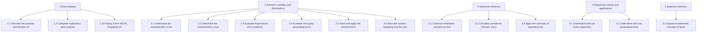

# Learner Knowledge Graph (CS1 certified)

```mermaid
flowchart TD
  node_f58907f55df8b703["1 Data analysis"]
  node_b58d1e8e9c0e3f95["1.1 Describe the purpose and function of"]
  node_f58907f55df8b703 --> node_b58d1e8e9c0e3f95
  node_0314347654ee97d6["1.2 Complete exploratory data analysis"]
  node_f58907f55df8b703 --> node_0314347654ee97d6
  node_27dc1ce4f2a0db13["1 Jln Kilang Timor #06-01 · Singapore 15"]
  node_f58907f55df8b703 --> node_27dc1ce4f2a0db13
  node_22fb4ce971c0124e["2 Random variables and distributions"]
  node_b560ca099d047472["2.1 Understand the characteristics of ba"]
  node_22fb4ce971c0124e --> node_b560ca099d047472
  node_1c896dd384c343bf["2.2 Determine the characteristics of joi"]
  node_22fb4ce971c0124e --> node_1c896dd384c343bf
  node_4d28e149228bc793["2.3 Evaluate expectations and conditiona"]
  node_22fb4ce971c0124e --> node_4d28e149228bc793
  node_4e9bcb0dd3851593["2.4 Evaluate and apply generating functi"]
  node_22fb4ce971c0124e --> node_4e9bcb0dd3851593
  node_c92260fdcbc56495["2.5 State and apply the central limit th"]
  node_22fb4ce971c0124e --> node_c92260fdcbc56495
  node_e3f41751f27a8a05["2.6 Describe random sampling and the sam"]
  node_22fb4ce971c0124e --> node_e3f41751f27a8a05
  node_4e426a3ee2d53154["3 Statistical inference"]
  node_71a1cb8b0dda0eaa["3.1 Construct estimators and discuss the"]
  node_4e426a3ee2d53154 --> node_71a1cb8b0dda0eaa
  node_402f25153310c25b["3.2 Calculate confidence intervals and p"]
  node_4e426a3ee2d53154 --> node_402f25153310c25b
  node_ba7a206a0c8a5655["3.3 Apply the concepts of hypothesis tes"]
  node_4e426a3ee2d53154 --> node_ba7a206a0c8a5655
  node_bb34726e2147cede["4 Regression theory and applications"]
  node_011388b39127eccc["4.1 Understand and use linear regression"]
  node_bb34726e2147cede --> node_011388b39127eccc
  node_4ca5aa5dab83f318["4.2 Understand and use generalised linea"]
  node_bb34726e2147cede --> node_4ca5aa5dab83f318
  node_ab7a6adccd8ba6c9["5 Bayesian statistics"]
  node_28eb829ce344fe82["5.1 Explain fundamental concepts of Baye"]
  node_ab7a6adccd8ba6c9 --> node_28eb829ce344fe82
```

Nodes: 93 · Edges: 175
