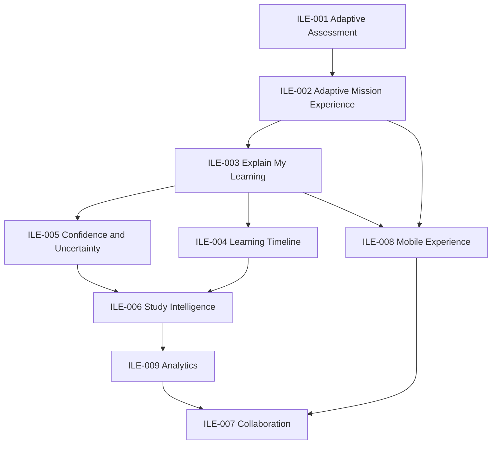

# Product Roadmap — Intelligent Learning Experience

**Programme:** ILE-000  
**Version:** 1.0  
**Status:** Active — programme roadmap (not a sprint backlog)  
**Effective:** 2026-07-28  

---

## Purpose

Organise future work as **product experience programmes** after platform certification and production readiness.

This roadmap does **not** prescribe architecture milestones. Engineering designs serve ILE outcomes and remain bound by Educational Constitution, Vision 2030, and architecture law.

Indicative sequencing only. Product Board may reorder on evidence (KSI gaps, Stage 1 findings, privacy gates).

---

## Roadmap principles

1. **Value over construction** — ship student-perceivable learning usefulness.  
2. **Surface certified intelligence** before inventing new engines.  
3. **Trust before breadth** — IFoA depth before multi-body sprawl.  
4. **Evidence creates features** — align with Version 2 evidence lifecycle.  
5. **One story on Home** — no competing educational authorities in UX.

---

## Programme catalogue

### ILE-001 — Adaptive Assessment

**Intent:** Make assessment feel like a learning instrument: capture evidence cleanly, interpret honestly, and feed the Twin without mastery theatre.

**Student outcome:** Attempts produce understandable feedback and visible effect on “what the system believes.”

**Depends on:** Assessment pipeline + Educational Intelligence orchestrator product wiring decisions; EQ/EVF honesty.

**Feeds:** ILE-002, ILE-003, ILE-005.

---

### ILE-002 — Adaptive Mission Experience

**Intent:** Complete the daily loop: one calm session, curriculum-bound, realistic duration, clear completion, bridge to tomorrow.

**Student outcome:** “I always know today’s session and why it exists.”

**Depends on:** Adaptive Mission Engine; Learning Experience Programme (LXP) intent; Home decision hygiene.

**Feeds:** ILE-004, ILE-006.

---

### ILE-003 — Explain My Learning

**Intent:** Student-facing explainability as a first-class experience — what / why / what next / uncertainty — for recommendations, readiness, and missions.

**Student outcome:** Trust through understanding, not through blind acceptance.

**Depends on:** Explainability Standard; Tutor explanation service; MES delivery patterns.

**Feeds:** Trust metrics, K8, recommendation acceptance quality.

---

### ILE-004 — Learning Timeline

**Intent:** A coherent history of study, evidence, decisions accepted/deferred, and syllabus position over the sitting.

**Student outcome:** “I can see my journey,” not a pile of disconnected charts.

**Depends on:** Decision Journal lite; evidence model; analytics depth honesty.

**Feeds:** ILE-006, ILE-009.

---

### ILE-005 — Confidence & Uncertainty Experience

**Intent:** Make provisional knowledge, confidence calibration, and uncertainty labels a usable part of daily study — never fake precision.

**Student outcome:** Confidence tracks evidence; students know what is unknown.

**Depends on:** Estimated knowledge visibility rules; readiness confidence UX; Educational Constitution mastery language.

**Feeds:** Readiness trust; burnout-safe pacing.

---

### ILE-006 — Study Intelligence

**Intent:** Higher-order insights: pacing vs exam date, revision load, workload sustainability, pattern summaries — still explainable and non-authoritative where required.

**Student outcome:** Better multi-week judgement without dashboard sprawl.

**Depends on:** ILE-003–005 foundations; burnout monitor; Personal Learning Profile boundaries.

**Feeds:** Premium analytics narrative; institution reporting later.

---

### ILE-007 — Collaboration

**Intent:** Bounded collaboration (mentor/provider/employer views, shared goals) that does not create a social network or dual educational truth.

**Student outcome:** Optional human support informed by the same Educational State.

**Depends on:** Privacy / DPA readiness; institution licensing direction; student data ownership principles.

**Feeds:** Enterprise monetisation.

---

### ILE-008 — Mobile Experience

**Intent:** Daily mission and explainability usable on phones with parity of educational truth (not a cut-down contradictory app).

**Student outcome:** Study decisions on the commute without losing honesty.

**Depends on:** Stable Home/Session IA (ILE-002/003); performance budgets.

**Feeds:** Retention for employed candidates.

---

### ILE-009 — Analytics

**Intent:** Student and (later) cohort analytics that measure learning usefulness — completion quality, calibration, recommendation follow-through — not vanity DAU.

**Student outcome / operator outcome:** Insight that improves study and product decisions.

**Depends on:** Telemetry honesty; Stage 1 metric catalogue (EP-003 M1–M9); privacy.

**Feeds:** KSI recalculation; commercial packaging evidence.

---

## Indicative sequencing

```
Foundation (complete / parallel ops)
  Platform certification + PR-001 readiness
  Version 1 gates / Stage 1 privacy & effectiveness (ongoing Board HOLD items)

Wave A — Daily trust loop
  ILE-002 Adaptive Mission Experience
  ILE-003 Explain My Learning
  ILE-001 Adaptive Assessment (may parallel where evidence capture blocks the loop)

Wave B — Continuity & honesty of state
  ILE-005 Confidence & Uncertainty Experience
  ILE-004 Learning Timeline

Wave C — Depth
  ILE-006 Study Intelligence
  ILE-009 Analytics (student-first slice)

Wave D — Reach
  ILE-008 Mobile Experience
  ILE-007 Collaboration (after privacy + institutional packaging)
```

**Parallel non-ILE work** (not replaced by this roadmap): Stage 1 evidence closure, KSI → 80 programmes, curriculum publishing quality, commercial packaging.

---

## Dependency sketch



---

## Explicit non-goals of this roadmap

- Rewriting Educational Intelligence architecture for novelty  
- LLM recommendation authority  
- Multi-profession catalogue explosion before IFoA proof  
- Social gamification home  
- Declaring Version 1 production-ready without P-002.1 gates  

---

## How programmes enter delivery

1. Evidence (blind review, Stage 1, KSI gap, dogfood)  
2. PRD subordinate to Vision / Constitution / ILE strategy  
3. Architecture review if structural  
4. Implementation + explainability / recommendation reviews when in scope  
5. Perception or cohort validation before strong effectiveness claims  

Related: `PRODUCT_STRATEGY.md`, `SUCCESS_METRICS.md`, `PRODUCT_BLUEPRINT.md`, `knowledge/product/roadmap/VERSION2_PRODUCT_STRATEGY.md`.

---

**End of PRODUCT_ROADMAP**
