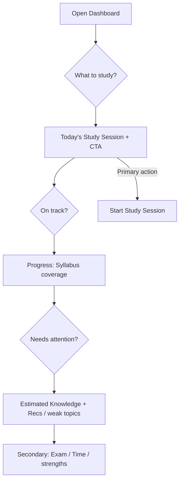

# PTP-004 — Information Architecture

**Capability ID:** PTP-004  
**Programme:** Product Trust Programme  
**Title:** Information Architecture (Dashboard Clarity)  
**Priority:** P0  
**Status:** Implemented — awaiting Architecture Review  
**Date:** 2026-07-15  
**Nature:** Product trust — Dashboard information architecture for student decisions (not a visual redesign)

---

## Executive Summary

Blind Internal Alpha Review v2 found that coverage percentages were no longer
contradictory, but students still faced **multiple related metrics**, unclear
hierarchy, and dashboard overload. PTP-003 clarified what metrics mean.
**PTP-004 decides which metrics deserve prominence.**

Version 1 Dashboard is reordered around three questions a student must answer
within ~10 seconds:

1. **What should I study?** → Today's Study Session (primary CTA)  
2. **Am I on track?** → Progress through Study Plan (one syllabus-coverage story)  
3. **Does anything need attention?** → Estimated Knowledge + Recommendations / Attention  

Competing coverage percentages, duplicate progress indicators, and non-actionable
chrome (Quick Actions, Daily Briefing, Decision Journal, Curriculum Roadmap dual %)
are removed from the Dashboard. Educational cores, Evidence Authority, Learning
Experience workflow, and Product Communication Standard speech are **preserved**.

---

## Product Trust Law

> Every screen should answer the student's most important question first.

---

## Authority (preserved)

Subordinate to / must not rewrite:

1. `KWALITEC_EDUCATIONAL_CONSTITUTION.md`  
2. `EDUCATIONAL_LOGIC_REGISTRY.md`  
3. Learning Experience Programme (LXP) — daily Study Session loop  
4. Educational Evidence Authority / EIP  
5. `PRODUCT_COMMUNICATION_STANDARD.md` (PTP-003)  
6. `PRODUCT_TRUST_PROGRAMME.md` (PTP-000)

Does **not** redesign readiness maths, recommendation algorithms, Digital Twin,
Mission generation, or navigation structure.

---

## 1. Dashboard Information Audit

Pre-PTP-004 components audited on `app/templates/dashboard/index.html`.

| Component | Purpose | Student question | Educational state | Primary action | Can remove? |
|-----------|---------|------------------|-------------------|----------------|-------------|
| Page header | Orient | Where am I? | None | None | No (trim copy) |
| Onboarding next card | Unlock product | How do I start? | No plan | Create Study Plan | No (gate) |
| Daily Briefing | Coaching narrative | What should I think today? | Advice / Observed patterns | None | **Yes** — competes with Mission |
| Study Tip | Coaching only | How should I study? | Advice (not engine) | None | Demote (supporting) |
| Exam card | Context | When is my exam? | Observed / schedule KPI | None | Demote (secondary) |
| Today's Mission | Authority for today | What to study? | Current Learning Topic / Mission | Start / Resume Session | **No** — promote to Primary |
| Learning Progress card | Mixed coverage OR readiness | Am I ready / covered? | Derived Fact **or** Estimate (conflated) | None | **Rewrite** — split stories |
| Curriculum Roadmap | Topic counts + **two** coverage % | How far through syllabus? | Derived Fact (duplicate) | None | **Yes** as card — merge into Progress |
| Time Status | Hours balance | Do I have enough hours? | Derived Fact / KPI | None | Demote (secondary) |
| Quick Actions | Shortcut links | Where else can I go? | None | Duplicate CTAs | **Yes** — nav already exists |
| Study pattern notice | Attention | Is load unhealthy? | Observed pattern (not prediction) | None | Keep under Attention |
| Weakest topics | Attention | What needs practice? | Estimated Knowledge | Explore | Keep under Attention |
| Strongest topics | Exploration | Where am I strong? | Estimated Knowledge | None | Demote (secondary) |
| Today's Recommendation (EI) | Advice | What else should I consider? | Educational Advice | Optional CTA | Keep under Attention |
| All Recommendations (legacy) | Advice list | What needs attention? | Advice | None | Keep under Attention when EI inactive |
| Decision Journal | Historical acceptance rates | Did I follow advice? | Meta / non-daily | None | **Yes** — not decision-critical |
| Recommendation empty | Onboarding | Why no advice? | Unavailable | Create plan | Keep when needed |

---

## 2. Element Classification

| Element | Class | Notes |
|---------|-------|-------|
| Today's Study Session + primary CTA | **Primary** | Answers “what to study” first |
| Progress through Study Plan (single Syllabus coverage %) | **Secondary** | Authoritative Study Progress story |
| Estimated Knowledge (practice-based) | **Secondary** | Distinct from coverage; PTP-003 labelled |
| Recommendations / study-pattern notice / weakest topics | **Supporting** (Attention band) | “Needs attention?” |
| Exam, Time Status, strongest topics | **Secondary exploration** | Useful; not first viewport priority |
| Study Tip | **Supporting** | Coaching only; after decision stack |
| Daily Briefing, Quick Actions, Curriculum Roadmap dual metrics, Decision Journal | **Removed / Decorative** | Cognitive load without unique decision value |

---

## 3. Information Hierarchy (Version 1)

Rendered order on Dashboard:

```
1. Today's Study Session     ← Primary CTA (Start / Resume / Review)
2. Progress through Study Plan  ← One Syllabus coverage % + topic counts
3. Estimated Knowledge       ← Practice-based estimate OR unavailable honesty
4. Recommendations / Attention  ← Pattern notice, EI/legacy recs, weakest topics
5. Secondary exploration     ← Exam, Time Status, strongest topics, Study Tip
```

### Authoritative metrics (student-facing)

| Decision | Metric | Source | Must not compete with |
|----------|--------|--------|------------------------|
| On track (coverage) | **Syllabus coverage %** | `ReadinessSummary.readiness_percentage` (weighted completed) or `StudentCurriculumSummary.weighted_completed_percentage` | Unweighted “Curriculum Coverage”, second “Weighted Coverage” label, Estimated Knowledge % |
| Understanding signal | **Estimated Knowledge** (avg) or Estimated readiness narrative when only that path exists | Practice-backed readiness aggregates | Syllabus coverage |
| What to do | **Today's Mission / Study Session** | Mission authority (LXP) | Recommendation as substitute authority |

Internal engineering may still compute unweighted coverage and weighted remaining; they are **not** dual-displayed on Dashboard.

---

## 4. Removal Justification

| Removed | Why |
|---------|-----|
| **Curriculum Coverage + Weighted Coverage side-by-side** | Same decision (“how far through the syllabus?”) with two unexplained percentages — Blind Review v2 residual blocker |
| **Curriculum Roadmap card** | Duplicate of Progress story (counts + coverage); progress counts merged into Progress through Study Plan |
| **Learning Progress card as conflated surface** | Alternated between coverage and estimated readiness → competing educational messages; split into Progress vs Estimated Knowledge |
| **Quick Actions** | Duplicated primary CTA and sidebar navigation; no unique decision |
| **Daily Briefing** | Third narrative above the fold competing with Mission and tip |
| **Decision Journal** | Acceptance/completion rates do not answer the three daily questions; analytics-adjacent |

**Not removed:** Mission authority, Study Session CTA path, EIP-003 explainability blocks, PTP-003 honesty phrases, LXP loop, Exam/Time as secondary context, Study Tip (demoted).

---

## 5. Migration Plan

| Step | Action | Risk |
|------|--------|------|
| 1 | Reorder Dashboard template into PTP-004 slots; mark `data-ptp004-*` for tests | Low — presentation only |
| 2 | Progress card shows **one** Syllabus coverage % | Low — uses existing `readiness_summary` / weighted summary |
| 3 | Estimated Knowledge card uses practice-based aggregates; never a second coverage % | Low — no algorithm change |
| 4 | Move Attention + secondary blocks below fold | Low |
| 5 | Remove Dual Coverage / Quick Actions / Briefing / Decision Journal from template | Low — services may still compute unused payloads |
| 6 | Regression tests (`tests/test_ptp004_information_architecture.py`) | Guards against reintroduction |
| 7 | Architecture Review | Required before Product Trust programme status promotion |

### Follow-up (out of scope)

- Stop fetching unused Dashboard payloads (`daily_briefing`, `decision_journal`) for performance — optional cleanup  
- Analytics surface may still show richer readiness composites — PTP-004 scope is Dashboard IA  
- PTP-005 may trim disclaimer fatigue across surfaces

---

## Student decision flow



---

## Testing

| Check | Verification |
|-------|----------------|
| No duplicated educational coverage metrics | Forbidden labels absent; ≤1 “Syllabus coverage” |
| Single authoritative progress story | Progress slot + `data-ptp004-metric="syllabus-coverage"` |
| Primary CTA visible immediately | `data-ptp004-cta="primary"` in Today's Study Session |
| Navigation unchanged | Sidebar endpoints preserved; `/dashboard/` still home |
| Hierarchy order | Slot markers appear in 1→5 order |

Command: `python -m pytest tests/test_ptp004_information_architecture.py -v`

---

## Implementation notes

- Template: `app/templates/dashboard/index.html`  
- Route composition unchanged in educational authority (`app/dashboard/routes.py`) — services still supply data; IA changes are presentation hierarchy  
- Existing `command-card` styles reused — **not** a visual redesign  
- Mission URL remains `mission.missions` (LXP entry)

---

## Known limitations

- Students with no plan still see onboarding before the full hierarchy.  
- Estimated Knowledge card may fall back to Estimated readiness narrative when average Estimated Knowledge is unavailable — still practice/estimate speech, never a second coverage %.  
- Secondary exploration can still feel dense on small screens; further reduction is PTP-005 / UX polish.  
- Engineering still computes dual coverage figures in `StudentCurriculumSummary`; only student display is consolidated.

---

**End of PTP-004 Information Architecture.**
