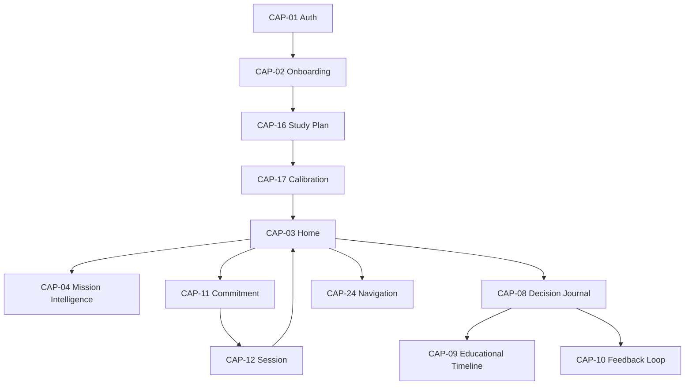

# RP-001.1 — Dependency Matrix

**Programme:** RP-001 — Alpha Readiness Certification  
**Work Package:** RP-001.1  
**Date:** 2026-07-28  
**Authority:** `ALPHA_PRODUCT_INVENTORY.md`

---

## Dependency categories

| Category | Meaning |
|----------|---------|
| Educational | Curriculum, recommendation, Twin, journal, assessment evidence |
| Technical | Services, ports, bridges, domain modules |
| UI | Templates, CSS, JS |
| Application | Routes, forms, view models, composers |
| Infrastructure | DB, migrations, env, hosting |
| External | Third parties (none material for Alpha student path) |

---

## Core daily loop

---

## Capability dependency table

| Capability | Educational | Technical | UI | Application | Infrastructure | External |
|------------|-------------|-----------|----|-------------|----------------|----------|
| CAP-01 Auth | — | Flask-Login, User | `auth/login.html` | `app/auth` | Session, `SECRET_KEY` | — |
| CAP-02 Onboarding | Orientation copy | `AlphaOnboardingService` | Alpha V1 templates | `app/alpha` | User flags | — |
| CAP-03 Home | Authorised recommendation / MES | Experience composition, durable store | `student/home.html` | student routes/VMs | Postgres (durable) | — |
| CAP-04 DMI | Same recommendation as Home | `daily_mission_intelligence_*` | Home `aside` | Home VM projection | — | — |
| CAP-05 Journey | Curriculum topics / readiness | Journey port/bridge | `journey.html` | Journey VM | DB reads | — |
| CAP-06 Revision | Adaptive decision port | Revision service | `revision.html` | begin_revision | — | — |
| CAP-07 History | Sessions, commitment narrative | History port/bridge | `history.html` | History VM | DB | — |
| CAP-08 Journal | Commitment/defer/outcome events | `decision_journal_service` | `decision_journal.html` | student journal routes | ORM | — |
| CAP-09 Timeline | Journal entries | `educational_timeline_service` | `educational_timeline.html` | timeline route | — | — |
| CAP-10 Feedback | Journal outcomes | `educational_feedback_loop_*` | Journal reflection form | reflect POST | Migration `202607280002` | — |
| CAP-11 Commitment | Recommendation present | Commitment service + persistence | Home chrome | commitment POSTs | DB | — |
| CAP-12 Session | Mission content | Session experience app | `templates/session/*` | session blueprint | Durable store | — |
| CAP-13 Quick Check | Assessment copy / evidence | Adaptive assessment app | adaptive_assessment templates | AA blueprint | Flags OFF in prod | — |
| CAP-14 Framing | Quick Check context | Framing modules | Framing cards | AA presentation | Framing flag | — |
| CAP-15 Learning Check | Assessment items | Assessment delivery | `student/assessment/*` | assessment blueprint | — | — |
| CAP-16 Study Plan | Curriculum engine V1/V2 | Study plan services | V1 study-plan templates | study_plan blueprint | DB | — |
| CAP-17 Calibration | Plan + Twin birth | Calibration coordinator, Twin repo | Calibration templates | calibration blueprint | Twin store | — |
| CAP-18 Profile | Goals / stats projection | Profile snapshot | `profile.html` | student.profile | — | — |
| CAP-19 Settings | Account / data ownership | Settings services, export | V1 settings templates | settings blueprint | Filesystem/PDF | — |
| CAP-20 Help/Feedback | — | Alpha feedback + telemetry | Alpha templates | alpha blueprint | — | — |
| CAP-21 Check-in | Distinct from ILE-005 | Research feedback service | Research templates | research blueprint | — | — |
| CAP-22 Welcome | Lifecycle phase | Welcome / lifecycle services | Welcome modal + `app.js` | dashboard POSTs | User prefs | — |
| CAP-23 Tutor | Twin present | `IntelligentTutorService` | Home + flash | tutor_explain_mission | Twin DI | — |
| CAP-24 Navigation | Surface map | `navigation.py` | EOS base | template context | Flags | — |
| CAP-25 Accessibility | Terminology honesty | Forbidden-term helpers | CSS/ARIA | a11y tests | — | — |
| CAP-26 Flags | Progressive honesty | Resolvers | — | config modules | Render env | — |
| CAP-27 Unified Journey | Stage language | unified_journey app | Nav labels | navigation builder | Flag OFF | — |
| CAP-28 Exp. Feedback | Evidence facts | Evidence read models | Home section | composition | Flags OFF | — |
| CAP-29 Runtime C | Published syllabus | Educational experience | educational templates | Runtime C page path | Flags OFF | — |
| CAP-30 Legacy A | V1 mission/analytics | Legacy services | V1 templates | dashboard/mission/analytics | Sole redirect | — |
| CAP-31 Notifications | — | Unwired port | Profile defaults only | — | — | — |
| CAP-32 Progress | Curriculum + sessions | Ports across surfaces | Cards/bars | Multiple VMs | DB | — |

---

## Hard blockers (Alpha)

| Dependent | Blocked by | Effect if missing |
|-----------|------------|-------------------|
| CAP-03 Home usefulness | Authorised recommendation | Empty mission story |
| CAP-04 DMI | CAP-03 recommendation | Panel absent |
| CAP-09 Timeline | CAP-08 entries | Empty timeline |
| CAP-10 Reflection | CAP-08 outcome entries | No reflect affordance |
| CAP-12 Session | Durable store (prod ON) | Persistence risk if unset |
| CAP-13/14 | Adaptive Assessment flags | Not in Alpha unless enabled |
| CAP-23 Tutor | Twin birth (CAP-17) | Soft-fail / hidden |
| CAP-28 | CAP-27 + feedback flag | Unavailable |
| CAP-10 persistence | Alembic migration applied | Reflection/reviews fail |

---

## Soft / degraded dependencies

| Capability | Degrades when | Behaviour |
|------------|---------------|-----------|
| CAP-05 Journey | Journey bridge/port thin | Empty/partial topics |
| CAP-06 Revision | Adaptive authority OFF | Empty/degraded options |
| CAP-07 History | No sessions yet | Empty archive |
| CAP-16 Study Plan | Discovery flags OFF | Standard subject list |
| CAP-18 Profile | — | Notifications display misleading defaults |
| CAP-19 Settings | Dual chrome | V1 shell under EOS nav |

---

## Infrastructure register (Alpha-critical)

| Asset | Required for | Notes |
|-------|--------------|-------|
| Postgres + durable store | Home, Session, Journal, Feedback | Prod ON |
| Alembic head including ILE-005 | CAP-10 | `202607280002_ile005_educational_feedback` |
| `SECRET_KEY` production-safe | Auth | Factory validates |
| Render env flag set | Scope of Alpha | See `FEATURE_FLAG_REGISTER.md` |
| Curriculum JSON V1/V2 | Study Plan, Journey | Both must remain loadable |

---

## External dependencies

No student-facing Alpha capability depends on live third-party LLM or external SaaS for core educational authority. Analytics event emission (if enabled) is optional and UI-neutral.
