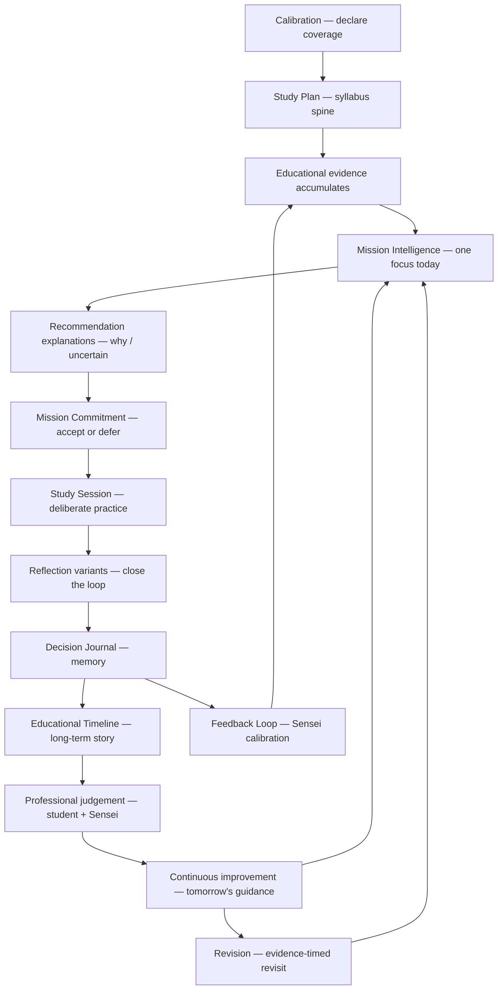
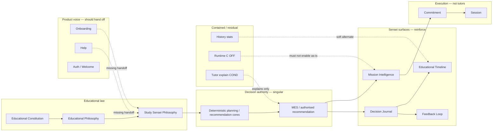

# RP-001.5 — Learning Model Map

**Programme:** RP-001 — Alpha Readiness Certification  
**Work Package:** RP-001.5 — Educational Consistency Certification  
**Date:** 2026-07-28  
**Status:** Complete (documentation map — no product changes)  
**Companions:** `EDUCATIONAL_CONSISTENCY_AUDIT.md`, `EDUCATIONAL_PRINCIPLES_MATRIX.md`, `EDUCATIONAL_DRIFT_REGISTER.md`

---

## Purpose

Map how Alpha educational capabilities fit **one coherent learning model** of professional preparation — and where the map fractures.

Canonical model (under test):

```
Learning through evidence
        ↓
   Reflection
        ↓
Deliberate practice
        ↓
Professional judgement
        ↓
Continuous improvement
        ↓
  Long-term mastery
```

This is the student-facing unfolding of Constitution / EDUCATIONAL_PHILOSOPHY / Study Sensei beliefs: evidence before certainty; one next action; explainable guidance; reflection closes the loop; sustainable progress toward professional competence.

---

## 1. Canonical learning model (intended)



**Sole educational authority:** Study Sensei (composing and remembering authorised educational decisions).  
**Product brand:** Kwalitec (OS, Alpha, support).  
**Not in the model:** engagement optimisation, chat as second brain, self-certified mastery.

---

## 2. Capability placement on the chain

| Stage | Primary capabilities | Supporting capabilities |
|-------|----------------------|-------------------------|
| **Learning through evidence** | Calibration · MES/MI supporting evidence · Journal observation | Study Plan position · History archive · Empty states (wait for evidence) |
| **Reflection** | Session reflection · Commitment ack · ILE-005 · Timeline questions | Home guided preview (orient only) · Help FAQ |
| **Deliberate practice** | Mission Commitment · Study Session | Revision (when warranted) · Success day-complete |
| **Professional judgement** | Defer reasons · Timeline reflection · ILE-005 “same decision again?” | Explanations alternatives · History review of choices |
| **Continuous improvement** | Continuity copy · Feedback Loop · tomorrow’s Mission | Success “return tomorrow” · Journey progress |
| **Long-term mastery** | Educational Timeline · Decision Journal | History bridges · Revision spaced revisit · Plan syllabus continuity |

---

## 3. Authority map



| Layer | May decide what to study? | May narrate as teacher? | Alpha status |
|-------|---------------------------|-------------------------|--------------|
| Deterministic cores + MES | **Yes** | Indirect via projection | Active |
| Mission Intelligence | No (composes) | Yes (Sensei on silence) | Active |
| Decision Journal / Timeline / Feedback | No | Yes (Sensei) | Active |
| Session / Commitment | No | Unnamed executor | Active |
| Help / Onboarding | No | Kwalitec product | Active — handoff gap |
| History stats | No | Soft score culture | Active — residual |
| Tutor explain | No | Conditional narrator | Soft-fail / COND |
| Runtime C | No | “the system” | **OFF** |

**Verification:** No default-path capability behaves as an **independent tutor** that invents ranking or mastery. Authority conflicts are **narrative**, not dual engines.

---

## 4. Student journey overlay (mental model)

Ideal student sentence at each stage:

| Moment | Intended student belief |
|--------|-------------------------|
| Onboarding | “Kwalitec is my Education OS; the Study Sensei will guide what to do next from my plan and evidence.” |
| Calibration / Plan | “I declare coverage honestly; that is not mastery.” |
| Home / MI | “Today I have one Mission, with reasons and uncertainty.” |
| Commitment | “I choose to practice this — or honestly defer.” |
| Session | “I practice deliberately, then reflect so tomorrow stays honest.” |
| Journal | “The Study Sensei remembers what was suggested and what I chose.” |
| Timeline | “I can see how my learning has evolved — not just scores.” |
| Feedback Loop | “I can tell the Sensei whether guidance helped.” |
| Revision | “When evidence warrants, I revisit — not for streaks.” |
| Empty | “Quiet means wait — not broken.” |
| Success | “Today is complete; return tomorrow.” |

**Observed fracture:** Onboarding/Help stop at “Kwalitec prepares missions / Today's Session,” so later Sensei-labelled Journal/Timeline can feel like a different product module (ED-01, ED-04).

---

## 5. Competing models (rejected or contained)

| Model | Status in Alpha | Why rejected / contained |
|-------|-----------------|--------------------------|
| Question-bank volume as success | Rejected | Sensei / philosophy: highest-value next action |
| Streak / engagement optimisation | Contained | Forbidden in MI/Feedback; legacy Low residual |
| Chatbot as educational brain | Rejected | No chat path as authority |
| Self-certified mastery | Rejected | Calibration + Constitution |
| Dual daily missions from two engines | Contained | MI composes MES; Tutor does not re-rank |
| Analytics dashboard as learning truth | Residual | History/Help stats vs Timeline narrative (ED-05) |

---

## 6. Reflection subsystem map

| Variant | Stage on chain | Recorded? | Authority |
|---------|----------------|-----------|-----------|
| Home Guided Reflection preview | Orient to Reflection | No | Unnamed (honesty post RR-001.1) |
| Commitment reflection ack | Practice → Continuous improvement | Ack | Unnamed |
| Session reflection | Practice → Evidence honesty | Optional | Unnamed |
| ILE-005 journal reflection | Reflection → Sensei continuous improvement | Optional answers | Study Sensei |
| Timeline reflection questions | Reflection → Professional judgement → Long-term mastery | Narrative | Study Sensei |
| Product Check-in | Outside model | Survey | Research |

**Gap:** No student-facing diagram of this table (ED-03).

---

## 7. Terminology → model binding (recommended future)

Not implemented in RP-001.5 — Board decision required.

| Concept in model | Preferred student noun (proposal) | Aliases to retire or demote |
|------------------|-----------------------------------|-----------------------------|
| Day’s authorised focus | **Today's Mission** *or* **Today's Session** (pick one) | tip · Mission tip · Today's Recommendation as primary |
| Persistent guidance memory | Decision Journal | — |
| Interpreted growth story | Educational Timeline | Archive (if UJ ON) |
| Sensei narrator | Study Sensei | “the system” |
| Product / company | Kwalitec | — |
| Estimated position | Estimated readiness / provisional readiness | Final grade language |

---

## 8. Map verdict

| Question | Answer |
|----------|--------|
| Does Alpha implement one learning model in behaviour? | **Yes** — evidence → guidance → practice → reflection → memory → improvement |
| Is that model taught with one voice and one lexicon? | **No** — Conditional |
| Do memory/feedback surfaces replace the Sensei? | **No** — they reinforce it |
| Do Help/Onboarding reinforce the Sensei? | **Insufficiently** — reinforce product philosophy without naming Sensei |

---

## End of LEARNING_MODEL_MAP
