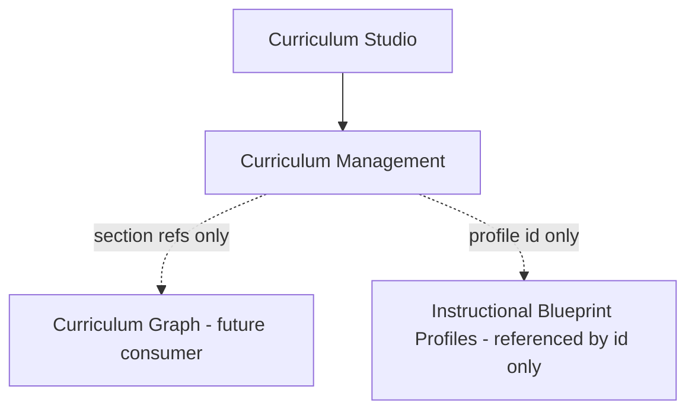
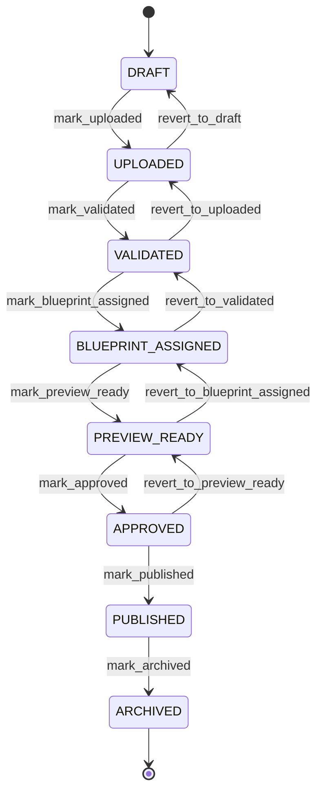

# Curriculum Management

**Document ID:** V2-011-CURRICULUM-MANAGEMENT  
**Milestone:** V2-011 — Curriculum Management Domain  
**Status:** Authoritative domain + application specification  
**Nature:** Framework-independent curriculum asset and publication management  

**Packages:**
- `app/domain/curriculum_management/`
- `app/application/curriculum_management/`

**Related:** [`VERSION2_ARCHITECTURE.md`](VERSION2_ARCHITECTURE.md) · [`CURRICULUM_GRAPH.md`](CURRICULUM_GRAPH.md) · [`CURRICULUM_MODEL.md`](CURRICULUM_MODEL.md) · [`EDUCATION_PLATFORM.md`](EDUCATION_PLATFORM.md)

---

## 1. Purpose

Curriculum Management is the bounded context responsible for **managing curriculum assets and publication**.

It is the foundation for:

- **Curriculum Studio** (authoring / review UI)
- **Curriculum Ingestion** (future import pipelines)

It does **not**:

- Parse PDFs
- Extract or ingest educational content
- Generate curriculum graphs, sessions, or missions
- Own educational progression rules
- Persist to a database (in-memory catalogue only in V2-011)
- Depend on Flask, EducationPlatform, Blueprint Engine, Journey, Activity, Session, or Mission packages

```text
Curriculum Studio / future Ingestion
              │
              ▼
   Curriculum Management (this package)
              │
    Subject → Version → Package / Assignments / Validation / Publication
```

Official traversable syllabus structure remains in the Curriculum Graph (`app/domain/curriculum/`). This package manages **product release lifecycle** around asset references and publication gates.

---

## 2. Architecture

### 2.1 Domain package

```text
app/domain/curriculum_management/
    __init__.py
    subject.py                  # educational product (CS1, CM1, …)
    subject_identifier.py       # product code value object
    subject_metadata.py         # title / tags / locale (no binaries)
    subject_version.py          # release (e.g. CS1 2026.1)
    curriculum_package.py       # uploaded asset references
    curriculum_asset.py         # single reference + metadata
    publication.py              # lifecycle carrier
    publication_state.py        # state machine
    blueprint_assignment.py     # section → blueprint profile
    approval.py                 # human gate record
    validation_report.py        # immutable readiness report
    release_notes.py            # educational change captions
    publication_history.py      # transition log
```

### 2.2 Application package

```text
app/application/curriculum_management/
    __init__.py
    subject_service.py
    version_service.py
    asset_service.py
    blueprint_assignment_service.py
    validation_service.py
    preview_service.py
    approval_service.py
    publication_service.py
    release_service.py
    exceptions.py
    _catalogue.py               # in-memory shared store
    _snapshots.py               # DTO projections
    dto/
        subject_snapshot.py
        subject_summary.py
        version_snapshot.py
        publication_snapshot.py
        validation_snapshot.py
        approval_snapshot.py
        preview_snapshot.py
        release_snapshot.py
    policies/
        publication_policy.py
        approval_policy.py
        version_policy.py
        validation_policy.py
```

### 2.3 Principles

1. **References only** — never store PDF bytes; reject data URIs and embedded `%PDF` payloads.
2. **Versioned subjects** — each release owns package, assignments, validation, publication, release notes.
3. **Explicit blueprint assignment** — no automatic recommendation.
4. **Immutable validation reports and previews** — re-validate / re-preview creates new artefacts.
5. **Lifecycle ≠ education** — publication advances gates; it does not teach or plan.
6. **Framework independence** — no Flask / SQLAlchemy / persistence / UI.

### 2.4 Dependency posture



Curriculum Management stores **identifiers** of blueprint profiles and curriculum sections. It does not import Blueprint Engine or Curriculum Graph application code.

---

## 3. Subject and version strategy

### Subject

A **Subject** is an educational product.

Examples: `CS1`, `CM1`, `CB2`.

Holds:

- `SubjectIdentifier` (canonical code)
- `SubjectMetadata` (title, description, exam board, year, locale, tags)
- Ordered `version_ids`
- Optional `active_version_id` (typically the published release)

### Subject version

A **SubjectVersion** is a specific release.

Examples: `CS1 2026.1`, `CS1 2027.1`.

Version labels match `YYYY.N`.

Each version owns:

| Ownership | Type |
|-----------|------|
| Curriculum Package | asset references |
| Blueprint Assignments | explicit section → profile |
| Validation Reports | immutable readiness history |
| Publication | lifecycle state + history |
| Release Notes | educational change captions |
| Approvals | human gate records |

---

## 4. Curriculum package and assets

A **CurriculumPackage** contains references only.

Recognised asset kinds:

| Kind | Role |
|------|------|
| `cmp` | Curriculum mapping package reference |
| `syllabus` | Syllabus document reference |
| `learning_objectives` | Objectives document reference |
| `formula_sheet` | Formula sheet reference |
| `supporting_document` | Other supporting reference |

**No parsing. No extraction. No ingestion.**

---

## 5. Publication lifecycle

### 5.1 States

```text
DRAFT
UPLOADED
VALIDATED
BLUEPRINT_ASSIGNED
PREVIEW_READY
APPROVED
PUBLISHED
ARCHIVED
```

### 5.2 State diagram



### 5.3 Typical workflow

1. **Create subject** (`CS1`) and **version** (`2026.1`) → `DRAFT`
2. **Add asset references** → `UPLOADED`
3. **Assign blueprint profiles** to sections (explicit)
4. **Validate** → immutable report; on pass → `VALIDATED` (and `BLUEPRINT_ASSIGNED` when assignments already exist)
5. **Preview** → immutable `PreviewSnapshot`; advances to `PREVIEW_READY` (never publishes)
6. **Approve** → `APPROVED`
7. **Publish** → `PUBLISHED` (optionally activates subject `active_version_id`)
8. **Archive** → `ARCHIVED`

### 5.4 Validation report

Captures readiness. Examples:

- Missing syllabus
- Missing blueprint assignment
- Duplicate topic / section
- Empty package
- Publication blocked

Reports are **immutable**. Re-validation appends a new report.

### 5.5 Preview

Preview produces an immutable snapshot for Curriculum Studio review.

- Preview only
- Never publishes
- Does not mutate educational content

### 5.6 Release notes

Capture educational changes, for example:

- Added prerequisite links
- Updated blueprint assignments
- Improved session estimates

---

## 6. Policies

| Policy | Responsibility |
|--------|----------------|
| `PublicationPolicy` | Lawful transitions; publish preconditions |
| `ApprovalPolicy` | Human gate readiness |
| `VersionPolicy` | Label format; mutability lock; activation |
| `ValidationPolicy` | Structural readiness checks (no PDF parsing) |

---

## 7. Success criteria (V2-011)

- Complete Curriculum Management domain
- Publication lifecycle
- Versioned subjects
- Immutable previews
- Framework independent
- Ready for Curriculum Studio
- Ready for Curriculum Ingestion

---

## 8. Non-goals (this milestone)

- Persistence / Alembic
- Flask routes or UI
- PDF parsing or content generation
- Session / mission / journey generation
- Modifications to EducationPlatform or educational engines
