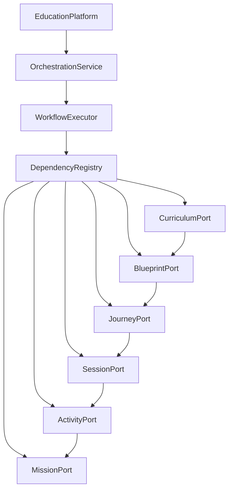
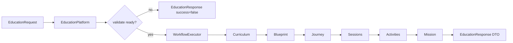

# Educational Composition Layer

**Document ID:** V2-010-EDUCATION-PLATFORM  
**Milestone:** V2-010 — Educational Composition Layer  
**Status:** Authoritative application-layer specification  
**Nature:** Framework-independent Educational Core orchestration  

**Package:** `app/application/education_platform/`

**Depends on:** injected ports only (Curriculum, Blueprint, Journey, Session, Activity, Mission). Does **not** construct concrete engines.

**Related:** [`VERSION2_ARCHITECTURE.md`](VERSION2_ARCHITECTURE.md) · [`MISSION_ADAPTER.md`](MISSION_ADAPTER.md) · [`MISSION_ENGINE_2.md`](MISSION_ENGINE_2.md) · [`LEARNING_JOURNEY_ENGINE.md`](LEARNING_JOURNEY_ENGINE.md) · [`LEARNING_SESSION_RUNTIME.md`](LEARNING_SESSION_RUNTIME.md) · [`LEARNING_ACTIVITY_ENGINE.md`](LEARNING_ACTIVITY_ENGINE.md) · [`CURRICULUM_GRAPH.md`](CURRICULUM_GRAPH.md)

---

## 1. Purpose

The Educational Composition Layer is the **sole public entry point** to the Version 2 Educational Core.

Everything outside the Educational Core communicates only with:

```text
EducationPlatform
```

Callers must **not** wire Journey Engine, Mission Engine, Activity Engine, and peers directly for product-facing flows.

The composition layer:

- owns **no** educational rules
- performs **no** content generation
- introduces **no** AI
- coordinates existing bounded contexts via **dependency injection**

```text
Dashboard / future API / Internal Alpha
              │
              ▼
      EducationPlatform   ← sole public interface
              │
    ┌─────────┼─────────┐
    ▼         ▼         ▼
 Orchestration  Validator  Health / Diagnostics
    │
    ▼
 WorkflowExecutor
    │
    ▼
 DependencyRegistry (ports only)
    │
    ├── CurriculumPort
    ├── BlueprintPort
    ├── JourneyPort
    ├── SessionPort
    ├── ActivityPort
    └── MissionPort
```

---

## 2. Architecture

### 2.1 Package layout

```text
app/application/education_platform/
    __init__.py
    platform.py                 # EducationPlatform facade
    composition_root.py         # DI assembly
    platform_context.py         # immutable composition view
    orchestration_service.py    # execution-order coordination
    dependency_registry.py      # port registration / replacement
    platform_validator.py       # composition integrity
    workflow_executor.py        # workflow step runner
    health_service.py           # read-only health
    diagnostics.py              # immutable diagnostic reports
    exceptions.py
    ports/
        curriculum_port.py
        blueprint_port.py
        journey_port.py
        session_port.py
        activity_port.py
        mission_port.py
    dto/
        education_request.py
        education_response.py
        subject_plan.py
        generated_session.py
        generated_mission.py
        platform_snapshot.py
        workflow_result.py
    policies/
        orchestration_policy.py
        validation_policy.py
```

### 2.2 Composition principles

1. **Single facade** — `EducationPlatform` is the only public API for composed Educational Core workflows.
2. **Ports, not engines** — the layer depends on Protocols; concrete engines are injected by callers.
3. **No educational reasoning** — progression, Topic Complete, readiness, and mastery stay in engines.
4. **Deterministic workflows** — same ports + same request → same structural response.
5. **Framework independence** — no Flask, SQLAlchemy, UI, migrations, or persistence.
6. **Replaceable dependencies** — `DependencyRegistry.replace` / `EducationPlatform.replace_port` swap implementations without rebuilding the facade.
7. **Observe without mutate** — health and diagnostics never alter registration or routing.

### 2.3 Dependency graph



Canonical chain:

```text
Curriculum → Blueprint → Journey → Session → Activity → Mission
```

Mission may be backed by Mission Engine 2.0 and/or Mission Adapter; the composition layer only sees `MissionPort`.

---

## 3. Workflows

| Workflow | Port steps | Role |
|----------|------------|------|
| `generate_subject` | curriculum | Resolve subject outline |
| `generate_journey` | curriculum → blueprint → journey | Create journey handle |
| `generate_learning_sessions` | … → session | Plan session structures |
| `generate_learning_activities` | … → activity | Plan activity id sequences |
| `generate_daily_missions` | full chain | Produce daily mission structures |
| `build_platform_snapshot` | full chain | Aggregate read-only snapshot |
| `validate_platform` | (none) | Composition integrity check |

### 3.1 Workflow diagram



Steps after the workflow's required prefix are skipped. Example: `generate_subject` stops after Curriculum.

---

## 4. Platform API

```python
from app.application.education_platform.platform import EducationPlatform
from app.application.education_platform.dto.education_request import EducationRequest

platform = EducationPlatform.create(
    curriculum=curriculum_port,
    blueprint=blueprint_port,
    journey=journey_port,
    session=session_port,
    activity=activity_port,
    mission=mission_port,
    require_complete=True,
)

req = EducationRequest(
    workflow="generate_daily_missions",  # overwritten by facade methods
    learner_id="learner-1",
    curriculum_id="curr-1",
    subject_id="subject-1",
    topic_id="topic-a",
)

response = platform.generate_daily_missions(req)
health = platform.health_status()
report = platform.diagnostics()
```

### 4.1 Public methods

| Method | Description |
|--------|-------------|
| `generate_subject` | Subject plan via CurriculumPort |
| `generate_journey` | Journey id via curriculum → blueprint → journey |
| `generate_learning_sessions` | Session structures |
| `generate_learning_activities` | Activity id sequences |
| `generate_daily_missions` | Mission structures |
| `build_platform_snapshot` | PlatformSnapshot aggregate |
| `validate_platform` | Composition validation |
| `health_status` | Read-only health payload |
| `diagnostics` | Immutable DiagnosticReport |
| `replace_port` | Hot-swap a registered port |

### 4.2 DTOs (immutable)

- `EducationRequest` / `EducationResponse`
- `SubjectPlan`
- `GeneratedSession` / `GeneratedMission`
- `PlatformSnapshot`
- `WorkflowResult`

Nested maps use `MappingProxyType`. Collections are tuples.

---

## 5. Composition root & registry

`CompositionRoot.assemble(...)` / `EducationPlatform.create(...)`:

- accept injected ports only
- never instantiate Instructional Blueprint Engine, Journey Engine, Session Runtime, Activity Engine, Mission Engine, or Mission Adapter
- register ports onto `DependencyRegistry` in canonical order

`DependencyRegistry`:

- registers / replaces / unregisters ports by name
- rejects unknown names and duplicates (unless replace)
- never constructs concrete services

---

## 6. Health & diagnostics

**HealthService** reports:

- registered components + versions
- missing dependencies
- per-workflow readiness
- platform status (`healthy` / `degraded` / `unhealthy`)
- dependency graph edges

**Diagnostics** produce immutable `DiagnosticReport` values including:

- workflow timings (from recent executions)
- dependency graph
- validation status
- registered engines
- canonical chain

Neither mutates the registry.

---

## 7. Explicit non-responsibilities

- No Flask routes / request / session access
- No SQLAlchemy / ORM / Alembic / persistence
- No UI / feature flags in controllers
- No educational reasoning (progression, Topic Complete, mastery)
- No curriculum / activity / content generation
- No AI / LLM calls
- No modification of Curriculum Graph, Blueprint, Journey, Session, Activity, Mission Engine, or Mission Adapter packages

---

## 8. Future extension strategy

1. **New port** — add a Protocol under `ports/`, extend `DEPENDENCY_CHAIN` only when the Educational Core lawfully gains a new bounded context, update OrchestrationPolicy step tables, and add regression tests.
2. **New workflow** — register a name in `ALL_WORKFLOWS`, define steps as a prefix/subset of the chain, expose a facade method on `EducationPlatform`.
3. **Adapters** — wrap existing engines behind ports in a thin adapter module *outside* this package (or in a dedicated adapters package) so composition remains engine-agnostic.
4. **HTTP surface** — future blueprints call `EducationPlatform` only; they must not import engines directly.
5. **Cutover** — Mission Adapter remains the mission routing authority; the composition layer treats it as `MissionPort` when operators inject it.

---

## 9. Testing

Target suite: `tests/application/education_platform/` (320–400 tests) covering composition root, DI, workflows, health, validation, diagnostics, DTO immutability, dependency replacement, framework independence, end-to-end orchestration, and regression against untouched Educational Core packages.

---

## 10. Closing

V2-010 delivers the composition spine that makes the Educational Core operable as one product surface without collapsing bounded-context ownership. Educational truth remains in curriculum, blueprint, journey, session, activity, and mission packages; this layer only assembles and sequences them.
