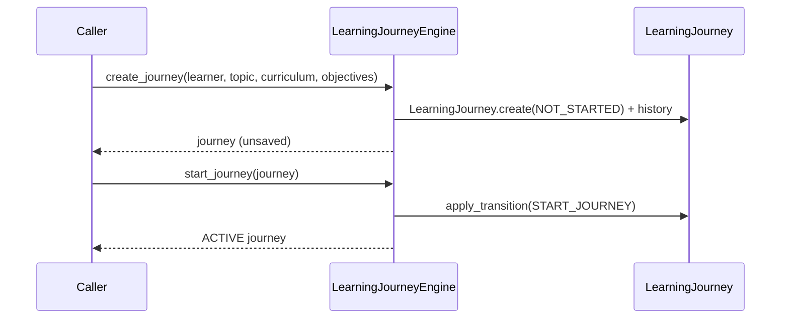
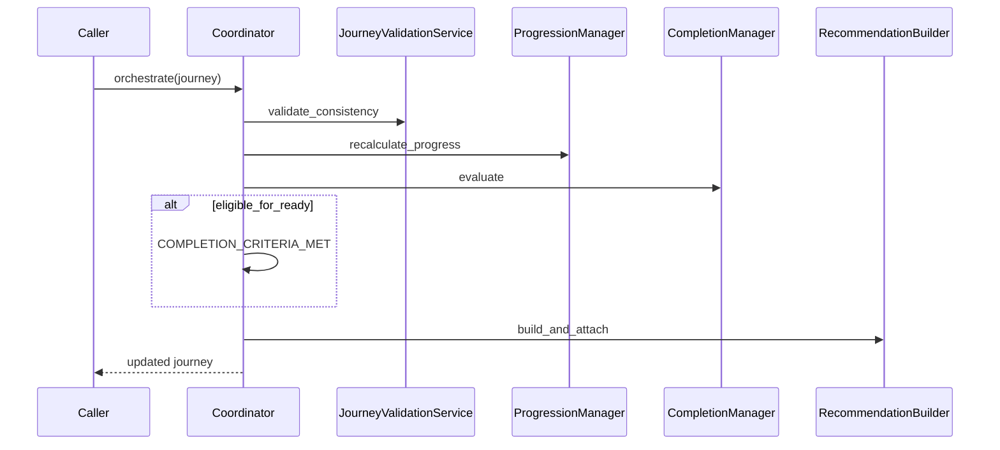
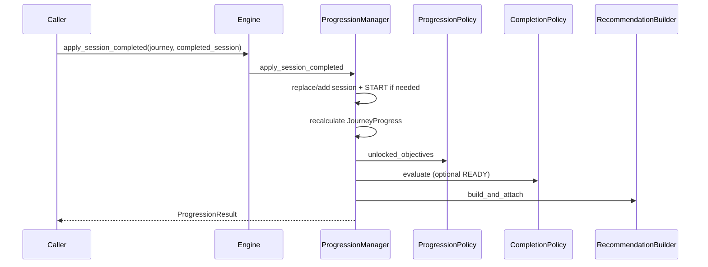
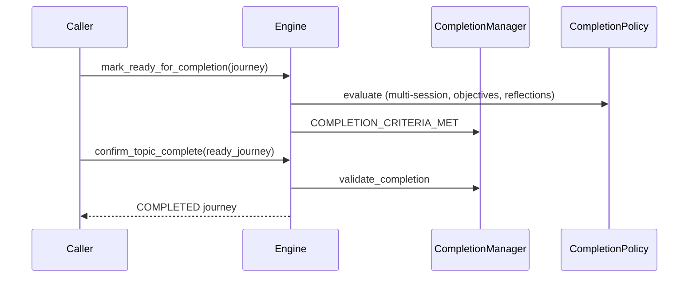

# Learning Journey Engine

**Document ID:** V2-003-ENGINE  
**Milestone:** V2-003 — Learning Journey Engine  
**Status:** Authoritative application-layer specification  
**Nature:** Framework-independent educational orchestration  

**Domain foundation:** [`LEARNING_JOURNEY_DOMAIN.md`](LEARNING_JOURNEY_DOMAIN.md) · [`DOMAIN_IMPLEMENTATION.md`](DOMAIN_IMPLEMENTATION.md)  
**State transitions:** [`STATE_MACHINE.md`](STATE_MACHINE.md)  
**Package:** `app/application/learning_journey/`

---

## 1. Purpose

The Learning Journey Engine is the **sole application authority** for educational progression within a Learning Journey.

It coordinates the Version 2 Learning Journey domain so that:

- journeys are created, paused, resumed, deferred, abandoned, and completed lawfully
- the current objective and learning session are determined deterministically
- recommendations are educational and explainable
- progression never invents mastery
- Topic Complete never follows from session finish, time spent, or percentage alone

Future Mission Engine 2.0, Student Digital Twin 2.0, Recommendation, Revision, and Analytics systems **must consume this engine** rather than re-implementing progression rules.

---

## 2. Responsibilities

| Component | Responsibility |
|-----------|----------------|
| `LearningJourneyEngine` | Public facade — lifecycle, queries, progression, snapshots |
| `LearningJourneyCoordinator` | Orchestration sequence (validate → progress → recommend → select → complete) |
| `SessionSelector` | Deterministic next / current session and `SessionPlan` |
| `RecommendationBuilder` | Explainable recommendation artefacts + `RecommendationResult` |
| `ProgressionManager` | Session/reflection-driven progression + history spine usage |
| `CompletionManager` | Completion eligibility and Topic Complete confirmation |
| Policies | Stateless educational rules (progression, completion, recommendation) |
| DTOs | Immutable snapshots / plans / results for consumers |

### Explicit non-responsibilities

- No Flask routes or request/session access
- No SQLAlchemy / ORM / migrations
- No UI rendering
- No feature flags
- No persistence writes (repository is optional **read-only** lookup)
- No AI / randomness
- No study content generation
- No Twin belief writes
- No Version 1 Study Progress mutation

---

## 3. Package structure

```
app/application/learning_journey/
    __init__.py
    engine.py
    coordinator.py
    session_selector.py
    recommendation_builder.py
    progression_manager.py
    completion_manager.py
    exceptions.py
    dto/
        journey_snapshot.py
        session_plan.py
        recommendation_result.py
        progression_result.py
    policies/
        progression_policy.py
        completion_policy.py
        recommendation_policy.py
```

---

## 4. Why educational logic belongs here (not in controllers)

Controllers (Flask blueprints) must remain thin HTTP adapters:

1. **Determinism** — the same journey artefacts must yield the same next session / recommendation regardless of which template rendered them.
2. **Reuse** — Mission Engine 2.0, Twin consumers, Revision, and Analytics all need identical progression rules.
3. **Explainability** — rationale tags and confidence explanations live with the educational decision, not in Jinja.
4. **Safety** — completion and progression guards cannot be bypassed by a route that “just marks complete”.
5. **Framework independence** — engines must be unit-testable without an application context.

Routes may call `LearningJourneyEngine`; they must not encode session ordering, completion floors, or recommendation priority.

---

## 5. Interaction with the domain

```
Domain (V2-002)                      Engine (V2-003)
─────────────────                    ────────────────
LearningJourney aggregate     ←──►   coordinates transitions
LearningSession / Objective   ←──►   SessionSelector focus rules
JourneyProgressService        ←──►   ProgressionManager recalculation
JourneyValidationService      ←──►   coordinator / progression gates
JourneyRecommendation         ←──►   RecommendationBuilder artefacts
JourneyHistory                ←──►   progression history spine entries
LearningJourneyRepository     ←──►   optional read-only load only
```

The engine **never** invents parallel meanings for Journey, Session, Evidence, Reflection, or Topic Complete. It applies V2-001 / V2-002 vocabulary.

---

## 6. Sequence diagrams

### 6.1 Create and start



### 6.2 Orchestration pass



### 6.3 Session completion progression



### 6.4 Topic Complete confirmation



---

## 7. Session selection rules

Deterministic, no AI, no randomness, no database:

1. Terminal / deferred journeys cannot select work sessions.
2. Prefer ACTIVE session, else PAUSED.
3. Else first `NOT_STARTED` by `sequence_index`.
4. Else plan a prospective next session (non-persisted `SessionPlan` with `is_existing_session=False`).

Activity tags are structural (e.g. `worked_example`) — never generated syllabus content.

---

## 8. Recommendation priority

1. Terminal / deferred → no recommendation  
2. `READY_FOR_COMPLETION` → `confirm_topic_complete`  
3. Pending reflection → `capture_reflection`  
4. Active / paused session → `continue_current_session`  
5. Paused journey → pause advice  
6. Thin / low evidence after prior work → revise / review (**no mastery claim**)  
7. Next unaddressed objective → `begin_next_objective`  
8. Else planned / further practice  

Certainty is always `suggested` / `provisional` / `conditional` — never absolute.

---

## 9. Completion rules

Completion **must not** follow solely from:

- a single session completing
- time spent
- percentage of sessions finished

Default educational floors (aligned with domain `JourneyProgressService`):

- at least two completed sessions
- all bound objectives addressed
- captured reflections on completed sessions

`CompletionPolicy` / `CompletionManager` enforce these before `READY_FOR_COMPLETION` and Topic Complete confirmation.

---

## 10. Interaction with future Mission Engine 2.0

Mission Engine 2.0 (V2-004) should:

- read journey state / snapshot / recommendations from this engine
- produce daily commitments that **continue** active journeys
- accept/dismiss recommendation lifecycle without inventing Topic Complete
- never bypass `LearningJourneyEngine` for “what session next?”

The Mission Engine advises and schedules; the Journey Engine owns progression truth.

---

## 11. Interaction with Student Digital Twin 2.0

The Twin:

- may **inform** advice (capacity, consistency, evidence confidence)
- must **not** auto-complete journeys from mastery thresholds
- must **not** replace `JourneyProgress` with belief scores

Engine → Twin direction (future): emit progression / evidence / reflection events as Twin update inputs. Twin → Engine direction: optional capacity or focus signals as **inputs** to recommendation policy — never as silent completion authority.

---

## 12. Interaction with Revision Engine

Revision Engine (future) should:

- consume `RecommendationKind.REVISE_EARLIER_EVIDENCE` / `REVIEW_PREVIOUS_CONCEPT`
- schedule revision sessions within the same Learning Journey
- return completed revision sessions through `apply_session_completed`

Revision does not own Topic Complete; it contributes evidence and sessions that the Journey Engine evaluates.

---

## 13. Persistence boundary

```
Caller / Application Service
    │
    ├─ engine.create_journey(...) → LearningJourney
    ├─ engine.orchestrate(journey) → LearningJourney
    └─ repository.save(journey)     ← caller only
```

Optional `LearningJourneyRepository` on the engine supports **read** (`load_journey`). The engine never calls `save` / `delete`.

---

## 14. Exceptions

| Exception | When |
|-----------|------|
| `JourneyNotFound` | Load miss / no repository |
| `InvalidJourneyState` | Unlawful lifecycle operation |
| `InvalidProgression` | Consistency or progression rule failure |
| `JourneyAlreadyCompleted` | Operation on COMPLETED journey |
| `SessionOrderingViolation` | Duplicate / invalid session ordering |

---

## 15. Testing posture

Application-layer tests under `tests/application/learning_journey/`:

- no Flask app context required
- no database
- in-memory repository mock for load tests only
- deterministic clocks / id factories where needed

---

## 16. Version 1 coexistence

V2-003 does **not** change Version 1 Study Plan, Mission, Dashboard, or Recommendation behaviour. Dual-run reconciliation with Study Progress remains a later design concern (roadmap). This engine is additive and isolated under `app/application/learning_journey/`.
