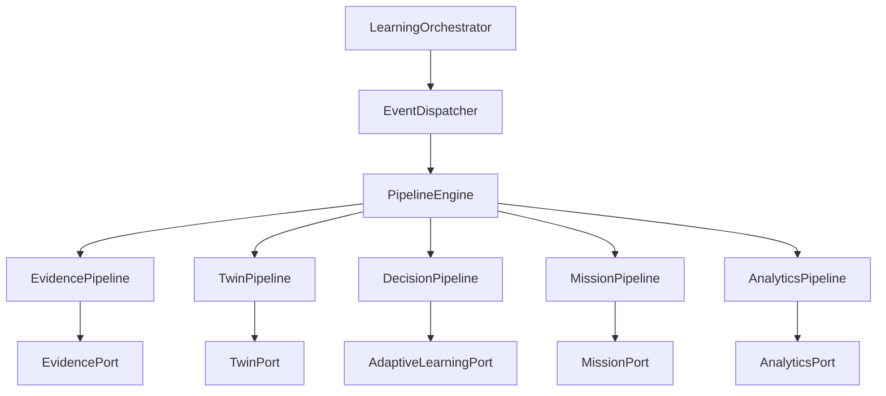

# Learning Orchestrator

**Document ID:** V2-015-LEARNING-ORCHESTRATOR  
**Milestone:** V2-015 — Learning Orchestrator  
**Status:** Authoritative domain + application specification  
**Authority:** Architectural  
**Nature:** Framework-independent live-learner event coordination  

**Packages:**
- `app/domain/learning_orchestrator/`
- `app/application/learning_orchestrator/`

**Depends on:** injected ports only (Evidence, Twin, Adaptive Learning, Mission, Analytics). Does **not** construct concrete engines.

**Related:** [`EDUCATION_PLATFORM.md`](EDUCATION_PLATFORM.md) · [`STUDENT_DIGITAL_TWIN.md`](STUDENT_DIGITAL_TWIN.md) · [`ADAPTIVE_DECISION_ENGINE.md`](ADAPTIVE_DECISION_ENGINE.md) · [`MISSION_ENGINE_2.md`](MISSION_ENGINE_2.md) · [`VERSION2_ARCHITECTURE.md`](VERSION2_ARCHITECTURE.md) · [`ADR-003-Education-Platform.md`](ARCHITECTURE_DECISIONS/ADR-003-Education-Platform.md)

---

## 1. Purpose

The Learning Orchestrator coordinates **live learner interactions** across Version 2 bounded contexts.

It answers:

> Given a student educational event —  
> which independent pipelines must run, in what order, and what was the outcome?

It does **not**:

- Own educational state (Twin beliefs, mastery, readiness)
- Mutate curriculum structure or content
- Select interventions (Adaptive Decision Engine)
- Schedule missions (Mission Engine)
- Persist data
- Use Flask or SQLAlchemy
- Introduce AI / LLM reasoning

Education Platform composes **structural Educational Core workflows** (Curriculum → Blueprint → Journey → Session → Activity → Mission).  
The Learning Orchestrator coordinates **runtime event reactions** after learner activity:

```text
Student Event
      │
      ▼
LearningOrchestrator
      │
      ├─ Evidence Pipeline
      ├─ Digital Twin
      ├─ Adaptive Decision Engine
      ├─ Mission Engine
      └─ Analytics Pipeline
      │
      ▼
Execution Summary
```

---

## 2. Responsibilities

| Responsibility | Owns? |
|----------------|-------|
| Event dispatch | Yes |
| Pipeline stage ordering | Yes |
| Failure isolation / reporting | Yes |
| Immutable execution observability | Yes |
| Twin belief updates | **No** (TwinPort) |
| Intervention selection | **No** (AdaptiveLearningPort) |
| Mission educational reasoning | **No** (MissionPort) |
| Curriculum mutation | **Never** |
| Persistence | **Never** |

---

## 3. Architecture

### 3.1 Package layout

```text
app/domain/learning_orchestrator/
    __init__.py
    orchestration_context.py
    orchestration_event.py
    orchestration_state.py
    orchestration_result.py
    orchestration_snapshot.py
    pipeline_stage.py
    pipeline_result.py

app/application/learning_orchestrator/
    __init__.py
    learning_orchestrator.py      # public facade
    pipeline_engine.py            # ordered stage runner
    evidence_pipeline.py
    twin_pipeline.py
    decision_pipeline.py
    mission_pipeline.py
    analytics_pipeline.py
    event_dispatcher.py
    health_service.py
    diagnostics.py
    exceptions.py
    ports/
        evidence_port.py
        twin_port.py
        adaptive_learning_port.py
        mission_port.py
        analytics_port.py
    dto/
        orchestration_request.py
        orchestration_response.py
        pipeline_snapshot.py
        execution_summary.py
    policies/
        orchestration_policy.py
        retry_policy.py
        pipeline_policy.py
```

### 3.2 Composition principles

1. **Single facade** — `LearningOrchestrator` is the public API for live-event coordination.
2. **Ports, not engines** — depends on Protocols; concrete engines are injected by callers.
3. **No educational reasoning** — Twin math, priority/ROI, and mission policy stay in engines.
4. **Deterministic pipelines** — same ports + same request → same structural outcomes.
5. **Framework independence** — no Flask, SQLAlchemy, UI, migrations, or persistence.
6. **Replaceable dependencies** — `bind_ports` / `replace_port` swap implementations.
7. **Observe without mutate** — health and diagnostics never alter bindings or educational state.

### 3.3 Dependency graph



Canonical chain:

```text
Evidence → Twin → Adaptive Decision → Mission → Analytics
```

---

## 4. Pipeline lifecycle

```text
PENDING → RUNNING → {COMPLETED | PARTIAL | FAILED | CANCELLED}
```

| State | Meaning |
|-------|---------|
| `pending` | Accepted, not yet executing |
| `running` | Stages in progress |
| `completed` | All executed stages succeeded |
| `partial` | At least one stage failed; others may have succeeded |
| `failed` | All executed stages failed (or fail-fast stopped with no successes) |
| `cancelled` | No stages executed |

Each stage returns an isolated `PipelineResult`:

- **Success** / **Warning**
- **Failure**
- **Skipped**
- Diagnostics + duration + attempt count

The orchestrator **reports** outcomes. It does **not** recover educational state.

---

## 5. Execution sequence

```text
Student Event
    ↓
EventDispatcher (validate event type)
    ↓
PipelineEngine
    ↓
EvidencePipeline        → EvidencePort.process_evidence
    ↓
TwinPipeline            → TwinPort.update_from_evidence
    ↓
DecisionPipeline        → AdaptiveLearningPort.decide
    ↓
MissionPipeline         → MissionPort.apply_decision
    ↓
AnalyticsPipeline       → AnalyticsPort.record_execution
    ↓
OrchestrationResponse + ExecutionSummary
```

### 5.1 Supported events

| Event | Pipeline |
|-------|----------|
| Learning Activity Completed | Full chain |
| Knowledge Check Completed | Full chain |
| Reflection Submitted | Full chain |
| Session Completed | Full chain |
| Mission Completed | Full chain |
| Manual Confidence Update | Evidence → Twin → Decision → Analytics (no Mission) |

Future event types extend `OrchestrationEventType` and the `OrchestrationPolicy` stage table — no pipeline redesign required.

---

## 6. Failure model

1. **Isolation default** — `PipelinePolicy.isolated()` continues later stages after a failure.
2. **Fail-fast option** — `PipelinePolicy.fail_fast()` skips remaining stages.
3. **Technical retries only** — `RetryPolicy` may retry port unavailability / port errors; never used to “fix” educational outcomes.
4. **No educational recovery** — the orchestrator never rolls back Twin beliefs, undoes decisions, or rewrites curriculum.
5. **Reporting** — `ExecutionSummary` records executed stages, timings, dependency status, warnings, and failures.

---

## 7. Observability

Immutable reports include:

- Executed stages
- Execution duration (`duration_ms`, per-stage timings)
- Pipeline diagnostics (`PipelineSnapshot` per stage)
- Dependency status (bound / available / version)
- Warnings

`HealthService.status()` and `Diagnostics.report()` are read-only.

---

## 8. Public API

```python
orchestrator = LearningOrchestrator.create(
    evidence=evidence_port,
    twin=twin_port,
    adaptive_learning=adaptive_port,
    mission=mission_port,
    analytics=analytics_port,
)

response = orchestrator.orchestrate(request)
# or
response = orchestrator.handle_learning_activity_completed(request)

health = orchestrator.health_status()
report = orchestrator.diagnostics()
```

Primary DTOs: `OrchestrationRequest`, `OrchestrationResponse`, `PipelineSnapshot`, `ExecutionSummary`.

---

## 9. Future extension strategy

1. **New event type** — add `OrchestrationEventType` member; map stages in `OrchestrationPolicy`; add regression tests.
2. **New pipeline stage** — add `PipelineStageName`, port Protocol, stage runner, bind into `PipelineEngine`, update canonical chain + docs.
3. **Production adapters** — implement ports against Twin / Adaptive / Mission engines outside this package (never import concrete engines here).
4. **Do not** fold Education Platform structural workflows into this layer, or absorb Twin / Adaptive educational authority.

---

## 10. Testing

Target suite: `tests/application/learning_orchestrator/` + `tests/domain/learning_orchestrator/` (**700–850** collected cases) covering:

- Pipeline execution and ordering guarantees
- Dependency isolation and port substitution
- Failure handling (isolated / fail-fast / retries)
- Deterministic orchestration
- DTO immutability
- Framework independence (no Flask / SQLAlchemy / forbidden sibling imports)
- Regression / e2e event matrices

---

## 11. Constraints and success criteria

**Must not** modify Education Platform, Student Digital Twin, Adaptive Decision Engine, Mission Engine, Curriculum Management, Curriculum Ingestion, or educational logic inside those packages.

**Success**

- Deterministic orchestration
- Pipeline execution with independent bounded contexts
- Explainable execution flow
- Framework independence
- Ready for production integration via ports
