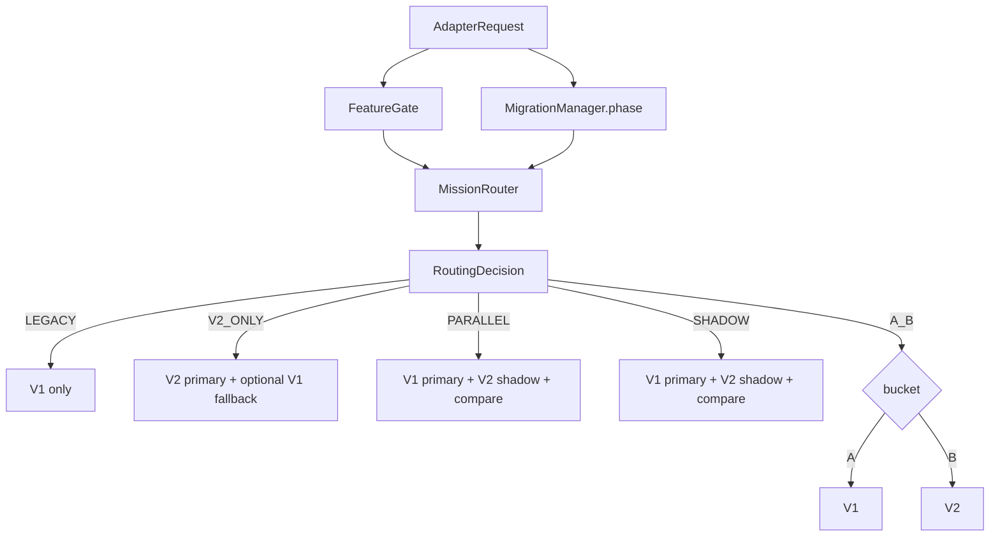

# Mission Adapter Layer

**Document ID:** V2-006-MISSION-ADAPTER  
**Milestone:** V2-006 — Mission Adapter Layer  
**Status:** Authoritative application-layer specification  
**Nature:** Framework-independent routing / comparison / audit / migration safety  

**Package:** `app/application/mission_adapter/`

**Depends on:** engine contracts only (injected). Does **not** construct Mission Engine V1 or Mission Engine 2.0.

**Related:** [`MISSION_ENGINE_2.md`](MISSION_ENGINE_2.md) · [`MIGRATION_STRATEGY.md`](MIGRATION_STRATEGY.md) · [`VERSION2_ARCHITECTURE.md`](VERSION2_ARCHITECTURE.md)

---

## 1. Purpose

The Mission Adapter is the **only public entry point** for mission generation and lifecycle operations.

Neither the Dashboard nor any future API should communicate directly with:

- Version 1 `MissionService` / mission generation
- Mission Engine 2.0 (`app/application/mission_engine_v2/` — authoritative; early parallel package also at `app/application/mission_engine/`)

The adapter is responsible **only** for:

- routing
- comparison
- auditing
- migration safety
- health observation

It contains **no educational logic**.

```
Dashboard / future API
        │
        ▼
  MissionAdapter  ← sole public interface
        │
        ├── MissionRouter (deterministic)
        ├── FeatureGate (rollout)
        ├── MigrationManager (phase)
        ├── ComparisonService (structural)
        ├── AuditService (immutable)
        └── HealthMonitor (observe only)
                │
        ┌───────┴───────┐
        ▼               ▼
 MissionEnginePort  MissionEnginePort
     (V1)               (V2)
```

---

## 2. Architecture

### 2.1 Package layout

```
app/application/mission_adapter/
    __init__.py
    adapter.py              # MissionAdapter facade
    router.py               # MissionRouter
    comparison_service.py
    audit_service.py
    feature_gate.py
    migration_manager.py
    health_monitor.py
    contracts.py            # MissionEnginePort
    exceptions.py
    dto/
        adapter_request.py
        adapter_result.py
        routing_decision.py
        comparison_result.py
        audit_record.py
        mission_snapshot.py   # structural engine output
    policies/
        routing_policy.py
        comparison_policy.py
        rollout_policy.py
```

### 2.2 Public operations

| Method | Role |
|--------|------|
| `generate_mission` | Route mission generation |
| `resume_mission` | Route resume |
| `pause_mission` | Route pause |
| `skip_mission` | Route skip |
| `archive_mission` | Route archive |
| `health_status` | Read-only health payload |
| `comparison_summary` | Aggregate structural comparison stats |

### 2.3 Explicit non-responsibilities

- No Flask routes / request / session access
- No SQLAlchemy / ORM / Alembic / persistence writes
- No UI / feature flags in controllers
- No educational reasoning (progression, Topic Complete, mastery)
- No storage of comparison data in a database
- No direct construction of Mission Engine V1 or V2

---

## 3. Routing

### 3.1 Modes

| Mode | Primary | Secondary | Compare | Expose V2 |
|------|---------|-----------|---------|-----------|
| `LEGACY` | V1 | — | No | No |
| `V2_ONLY` | V2 | — | No | Yes |
| `PARALLEL` | V1 | V2 | Yes | No |
| `SHADOW` | V1 | V2 | Yes (if V2 up) | No |
| `A_B` | V1 or V2 (cohort) | — | No | Only bucket B |

Routing decisions are **deterministic** given the same request, migration phase, feature gate, and engine availability. A/B uses a stable hash of `learner_id` + salt.

### 3.2 Routing diagram



### 3.3 Default mode from migration phase

| Phase | Default mode |
|-------|--------------|
| `LEGACY_ONLY` | `LEGACY` |
| `PARALLEL_VALIDATION` | `PARALLEL` |
| `LIMITED_V2` | `A_B` |
| `FULL_V2` | `V2_ONLY` |
| `RETIRED_V1` | `V2_ONLY` (V1 treated unavailable) |

Operators may override mode on the router for controlled experiments; health monitoring never changes routing.

---

## 4. Migration lifecycle

```
LEGACY_ONLY
    ↓
PARALLEL_VALIDATION
    ↓
LIMITED_V2
    ↓
FULL_V2
    ↓
RETIRED_V1
```

### Lawful transitions

- Forward along the path above
- Rollback toward `LEGACY_ONLY` from `PARALLEL_VALIDATION`, `LIMITED_V2`, and `FULL_V2`
- From `RETIRED_V1`, emergency step back to `FULL_V2` (re-enables V1 as fallback path)

`MigrationManager` owns phase state only (in-memory). It does not persist and does not contain educational rules.

---

## 5. Parallel validation

When `PARALLEL` (or `SHADOW`) is active and V2 is gated on:

1. Execute V1 (primary — returned to callers)
2. Execute V2 (shadow — never exposed unless routing selects V2)
3. Compare **structural** dimensions only
4. Record comparison + audit

### Comparison dimensions

| Dimension | Field |
|-----------|--------|
| Journey selected | `journey_id` |
| Topic selected | `topic_id` |
| Session selected | `session_id` |
| Estimated effort | `effort` |
| Mission type | `mission_type` |
| Revision recommendation | `is_revision` |
| Ordering | `sequence_index` |
| Explanation metadata | sorted `explanation_keys` |

**Never compare** generated educational content (`title`, `body`, `content`, explanation prose, study text).

Comparison results are **in-memory only** — not written to a database.

---

## 6. Feature gate

`FeatureGate` enables Version 2 participation via:

- global mode
- user cohort
- organisation
- environment

Combined with `RolloutPolicy` (stateless) and the current `MigrationPhase`. Empty allow-lists mean “all”. No UI. Pure application service.

---

## 7. Rollback strategy

1. **Immediate:** `FeatureGate.set_global_enabled(False)` — V2 stops participating; parallel/shadow degrade to V1.
2. **Phase rollback:** `MigrationManager.rollback_to_legacy()` or `transition_to(LEGACY_ONLY)` when lawful.
3. **Engine fallback:** `V2_ONLY` / A_B bucket B keep V1 as `fallback_engine` while V1 is not retired.
4. **Health:** observe fallback frequency and comparison failures — never auto-flip routing.

---

## 8. Engine replacement strategy

1. Implement `MissionEnginePort` for V1 and V2 wrappers (outside this package).
2. Inject ports into `MissionAdapter.create(...)` or `MissionRouter.bind_engines(...)`.
3. Advance migration phases under governance.
4. When `RETIRED_V1`, unbind V1; adapter routes V2 only.
5. Dashboard / API remain pointed at `MissionAdapter` throughout — engines are swappable behind the port.

The adapter **never** instantiates engines. Dependency injection only.

---

## 9. Audit model

Every lifecycle invocation produces an immutable `AuditRecord`:

| Field | Purpose |
|-------|---------|
| `timestamp` | Clock-injected |
| `routing_mode` | Active mode |
| `selected_engine` | Engine whose result was used |
| `fallbacks` | Engines used after primary failure |
| `duration_ms` | Execution duration |
| `comparison_executed` | Whether comparison ran |
| `comparison_id` | Link to in-memory comparison |
| `engine_versions` | Adapter + bound engine versions |
| `learner_id` / `organisation_id` | Stable internal ids only |

No student-identifying PII beyond stable internal identifiers. Audit history is in-memory for this process — not persisted by this milestone.

---

## 10. Health monitoring

`HealthMonitor` observes:

- engine availability
- execution failures
- fallback frequency
- routing consistency counters
- comparison failures / divergences

It **never alters routing**. `health_status()` is a read-only payload for operators / future dashboards.

---

## 11. DTOs and policies

**DTOs (frozen dataclasses):** `AdapterRequest`, `AdapterResult`, `RoutingDecision`, `ComparisonResult`, `AuditRecord`, `MissionSnapshot`

**Policies (stateless):** `RoutingPolicy`, `ComparisonPolicy`, `RolloutPolicy`

**Exceptions:** `MissionAdapterError`, `RoutingError`, `ComparisonFailure`, `MigrationStateError`, `EngineUnavailable`, `AuditFailure`

---

## 12. Future extensibility

- Persist audit / comparison summaries in a later infrastructure milestone (not this package’s job).
- Wire Flask blueprints exclusively through `MissionAdapter`.
- Add new routing modes only via `RoutingPolicy` + docs — keep educational logic out.
- Twin 2.0 / analytics may consume audit and comparison summaries as telemetry, not as educational authority.

---

## 13. Testing

Suite: `tests/application/mission_adapter/` (target 220–260 tests)

Covers: routing, parallel, shadow, fallback, comparison, audit, migration transitions, DTO immutability, policies, feature gate, health, DI, framework independence.

---

## 14. Authority note

Mission Adapter routes and validates cutover safety. Mission Engine 2.0 schedules missions. Learning Journey Engine owns progression truth. Learning Session Runtime owns session execution. Version 1 remains production-authoritative until migration phases lawfully retire it.
