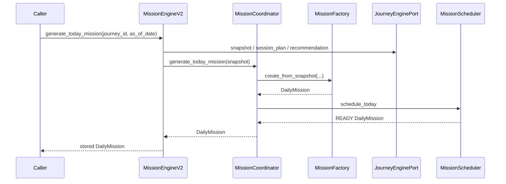
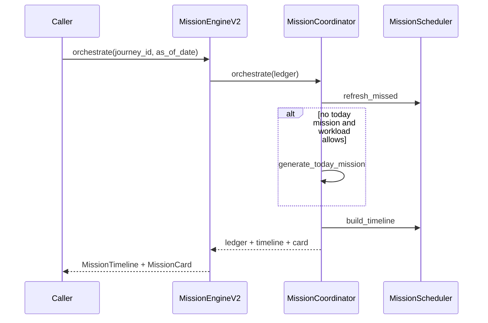
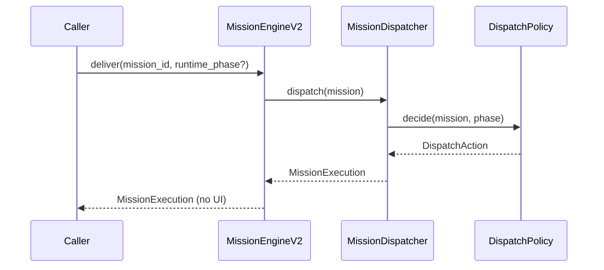

# Mission Engine 2.0

**Document ID:** V2-007-MISSION-ENGINE  
**Milestone:** V2-007 — Mission Engine 2.0  
**Status:** Authoritative application-layer specification  
**Nature:** Framework-independent mission orchestration  

**Package:** `app/application/mission_engine_v2/`

**Depends on:** [`LEARNING_JOURNEY_ENGINE.md`](LEARNING_JOURNEY_ENGINE.md) · [`LEARNING_SESSION_RUNTIME.md`](LEARNING_SESSION_RUNTIME.md) · [`CURRICULUM_GRAPH.md`](CURRICULUM_GRAPH.md) · [`MISSION_ADAPTER.md`](MISSION_ADAPTER.md)

---

## 1. Purpose

Mission Engine 2.0 is a pure orchestration layer that composes a **Daily Mission** from Version 2 educational services.

It must **not** contain educational decision-making.

```
Curriculum Navigation
      ↓
Learning Journey Engine
      ↓
Learning Session Runtime
      ↓
Daily Mission
      ↓
Student Dashboard DTOs / Mission Adapter
```

Educational reasoning (what to study next, progression, Topic Complete, session completion) belongs in the Journey Engine and Session Runtime.

Mission Engine 2.0 owns only:

- mission creation
- mission scheduling
- mission lifecycle
- dashboard-ready mission DTOs

---

## 2. Mission model

A **Mission** represents **ONE** executable learning session.

Never:

- an entire topic
- an entire chapter
- an entire study day

The Learning Session Runtime owns execution. Mission Engine owns scheduling and the mission wrapper lifecycle.

---

## 3. Package structure

```
app/application/mission_engine_v2/
    __init__.py
    engine.py
    mission_factory.py
    scheduler.py
    coordinator.py
    lifecycle.py
    validator.py
    dispatcher.py
    workload_balancer.py
    exceptions.py
    ports/
        journey_engine_port.py
        session_runtime_port.py
        curriculum_navigation_port.py
    dto/
        daily_mission.py
        mission_card.py
        mission_dashboard.py
        mission_timeline.py
        mission_execution.py
    policies/
        scheduling_policy.py
        workload_policy.py
        dispatch_policy.py
        lifecycle_policy.py
```

---

## 4. Responsibilities

| Component | Responsibility |
|-----------|----------------|
| `MissionEngineV2` | Public facade — generate, lifecycle, schedule, dashboard, adapter port |
| `MissionFactory` | Journey Snapshot → Topic → Session Plan → Recommendation → Mission DTO |
| `MissionScheduler` | Today / deferred / revision / missed / future queues |
| `MissionCoordinator` | Journey → Runtime → Factory → Mission DTO orchestration |
| `WorkloadBalancer` | Structural workload gates (effort, reflections, revision debt, continuity) |
| `MissionValidator` | Exactly one active, valid session / journey / topic |
| `MissionDispatcher` | Immutable payloads for dashboard / notifications / future APIs |
| Policies | Stateless scheduling, workload, dispatch, lifecycle rules |
| DTOs | Immutable `DailyMission`, `MissionCard`, `MissionDashboard`, `MissionTimeline`, `MissionExecution` |
| Ports | Injected interfaces only — no concrete engine imports required |

### Explicit non-responsibilities

- No Flask routes or request/session access
- No SQLAlchemy / ORM / migrations / persistence writes
- No UI rendering
- No AI / randomness / optimisation heuristics
- No Topic Complete / journey progression / mastery scores
- No Version 1 `MissionService` mutation
- No study content generation
- No modifications to Mission Adapter, Journey Engine, Session Runtime, or Curriculum Graph

---

## 5. Dependencies (interfaces only)

Mission Engine V2 consumes **only** injected ports:

| Port | Source contract |
|------|-----------------|
| `JourneyEnginePort` | Learning Journey Engine reads (`snapshot`, `session_plan_for`, `recommendation_for`) |
| `SessionRuntimePort` | Learning Session Runtime reads (`runtime_phase_for`, `has_outstanding_reflection`) |
| `CurriculumNavigationPort` | Curriculum Navigation structural topic confirmation |
| `MissionEnginePort` | **Implemented by** `MissionEngineV2` for Mission Adapter routing |

No direct dependency on concrete Journey Engine, Session Runtime, or Navigation implementations is required at construction time — callers inject fakes or adapters.

---

## 6. Mission factory flow

```
Journey Snapshot
      ↓
Current Topic (structural confirmation)
      ↓
Session Plan
      ↓
Recommendation (rationale keys only)
      ↓
Mission DTO
```

The factory never selects the next topic or invents educational content. Titles are structural labels from objectives / session ordinals.

---

## 7. Lifecycle

Mission wrapper states (lifecycle applies **only** to the mission wrapper):

```
PLANNED
   ↓ prepare
READY
   ↓ activate
ACTIVE
   ↓ pause / complete
PAUSED ⇄ ACTIVE
   ↓ complete
COMPLETED
   ↓ archive
ARCHIVED
```

Completing or archiving a mission **never** completes a Learning Journey or Topic.

Schedule slots are orthogonal to lifecycle:

| Slot | Meaning |
|------|---------|
| `TODAY` | Today's primary commitment |
| `DEFERRED` | Learner-deferred incomplete mission |
| `REVISION` | Explicit revision commitment (does not claim ACTIVE) |
| `MISSED` | Past incomplete mission |
| `FUTURE` | Future mission queue |

---

## 8. Scheduling

Deterministic only. No optimisation heuristics.

Produces:

- Today's mission
- Deferred mission
- Revision mission
- Missed mission
- Future mission queue

Ordering priority: today → missed → deferred → revision → future, then date, then state, then mission id.

---

## 9. Workload balancer

Balances educational workload using **structural signals only**:

- Estimated effort bands
- Outstanding reflections
- Revision debt
- Journey continuity

Never infers mastery. Never ranks educational priority.

Default caps: 1 active, 20 open, 10 deferred, 10 missed, 5 revision, 14 future.

---

## 10. Validator

Ensures:

- Exactly one active mission (`ACTIVE` / `PAUSED`)
- Mission references a valid session
- Journey state permits scheduling
- Curriculum topic is available (when navigation port is injected)

---

## 11. Dispatcher

Produces immutable `MissionExecution` payloads suitable for:

- Dashboard assemblers
- Notifications
- Future APIs

No UI rendering. Action tags: today / resume / continue / review / revision / deferred.

---

## 12. Component interactions

### 12.1 Generate today's mission



### 12.2 Orchestration pass



### 12.3 Dispatch



---

## 13. Integration with Mission Adapter

`MissionEngineV2` implements the adapter's `MissionEnginePort`:

- `generate_mission`
- `resume_mission`
- `pause_mission`
- `skip_mission` (maps to defer)
- `archive_mission`
- `is_available`

Dashboard / future APIs must call `MissionAdapter`, not engines directly. The adapter remains the sole public cutover / routing entry point — this milestone does **not** modify the adapter package.

Structural comparison uses `MissionSnapshot` fields only (ids, effort, type, revision, sequence, explanation keys).

---

## 14. Future API surface

Immutable DTOs are designed for future HTTP / notification adapters:

| DTO | Consumer |
|-----|----------|
| `DailyMission` | Ledger / schedule |
| `MissionCard` | Dashboard cards |
| `MissionDashboard` | Assembled dashboard posture |
| `MissionTimeline` | Ordered schedule view |
| `MissionExecution` | Notifications / APIs |

No Flask blueprints are introduced in this milestone.

---

## 15. Persistence boundary

```
Caller / Mission Adapter
        │
        ▼
MissionEngineV2 (in-memory ledger + archive)
        │
        ├── reads Journey / Session / Navigation ports
        └── returns DTOs (caller owns persistence)
```

No repository writes. No ORM models.

---

## 16. Testing

Suite: `tests/application/mission_engine_v2/` (~220–280 tests)

Covers: mission generation, scheduling, lifecycle, coordinator, validator, workload balancing, dispatcher, DTO immutability, framework independence, dependency injection, adapter port, regression.

---

## 17. Authority note

Mission Engine advises and schedules. Learning Journey Engine owns progression truth. Learning Session Runtime owns session execution. Curriculum Graph / Navigation owns structural sequencing. Mission Adapter owns cutover routing.

---

## 18. Coexistence with prior package

An earlier parallel package may exist at `app/application/mission_engine/`. The authoritative Mission Engine 2.0 package for this milestone is **`app/application/mission_engine_v2/`**. Callers integrating with the Mission Adapter should inject `MissionEngineV2` as the V2 engine port.
